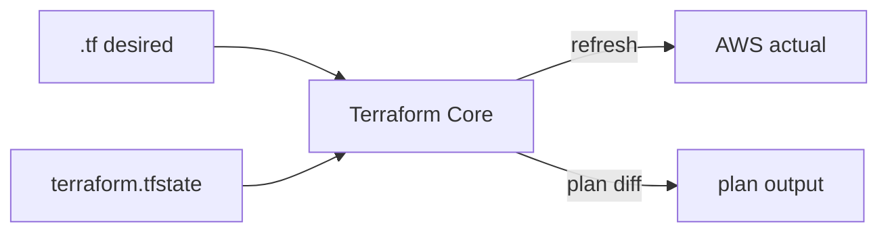
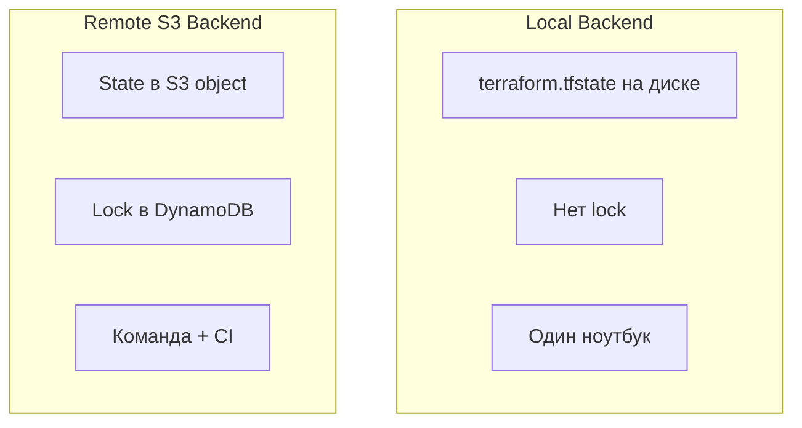
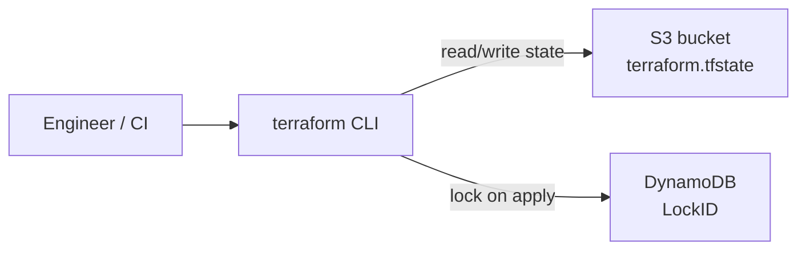
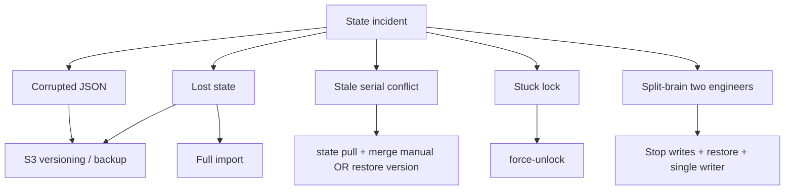
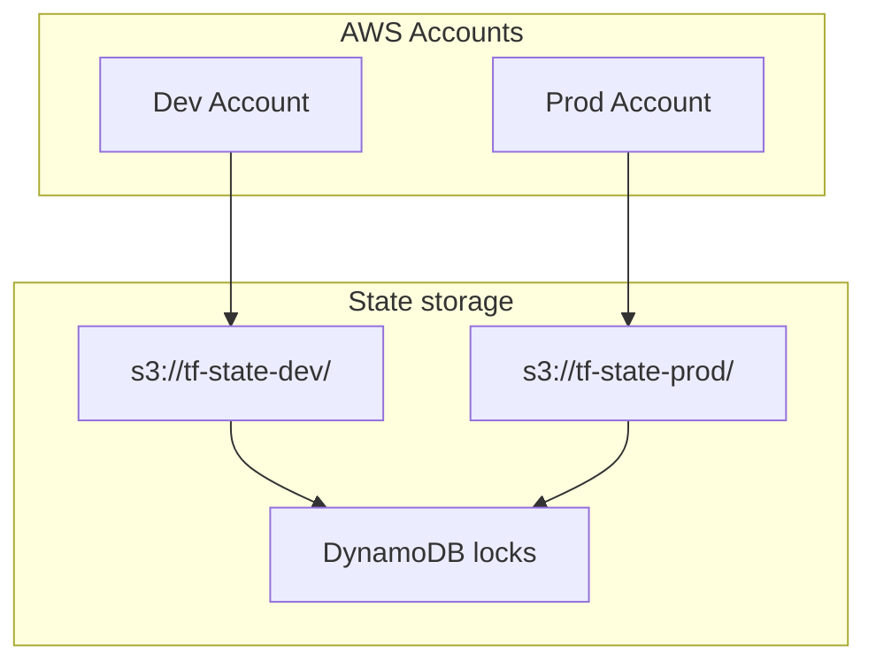

# Terraform State Management - remote backend и восстановление (AWS)

## 1. Устройство terraform.tfstate

### 1.1. Зачем state

Terraform **declarative**: вы описываете desired state в `.tf`, Core сравнивает его с **actual** (AWS API) через **recorded state**.



State отвечает на три вопроса (Brikman, гл. 3):

1. Какие ресурсы **управляются** этим root module?
2. Какой **ID** у `module.network.aws_vpc.this`?
3. Какие атрибуты нужны для **следующего diff**?

**State - источник правды для Terraform**, не для финансового аудита или CMDB.

### 1.2. Структура JSON (упрощённо)

```json
{
  "version": 4,
  "terraform_version": "1.5.7",
  "serial": 42,
  "lineage": "a1b2c3d4-e5f6-7890-abcd-ef1234567890",
  "outputs": {
    "vpc_id": { "value": "vpc-0abc123", "type": "string" }
  },
  "resources": [
    {
      "mode": "managed",
      "type": "aws_vpc",
      "name": "this",
      "module": "module.network",
      "provider": "provider[\"registry.terraform.io/hashicorp/aws\"]",
      "instances": [
        {
          "schema_version": 1,
          "attributes": {
            "id": "vpc-0abc123",
            "cidr_block": "10.20.0.0/16",
            "tags": { "Name": "devops-lab-vpc" }
          }
        }
      ]
    }
  ]
}
```

| Поле          | Назначение                                        |
| ------------- | ------------------------------------------------- |
| `resources[]` | Все managed/data resources с атрибутами           |
| `outputs`     | Значения output после last apply                  |
| `module`      | Путь child module (если не root)                  |
| `mode`        | `managed` или `data`                              |
| `instances`   | Поддержка `count`/`for_each` (несколько instance) |

### 1.3. version


**`version`** - формат **сериализации state file** (сейчас обычно `4`), не версия Terraform CLI.

- Меняется редко (major migration Terraform).
- При upgrade CLI Terraform мигрирует формат автоматически при записи state.

### 1.4. serial

**`serial`** - монотонно **растущий счётчик** каждой записи state.

```text
apply #1 → serial: 1
apply #2 → serial: 2
plan (без записи) → serial не меняется
```

**Зачем:** remote backend отклоняет **stale write** - если у вас serial=5, а в S3 уже serial=6, push/apply не перезапишет свежий state старым.

Симптом конфликта:

```text
Error: Error saving state: state serial mismatch
```

### 1.5. lineage

**`lineage`** - UUID, идентификатор **логической цепочки** state одного стека.

- Создаётся при **первом** `terraform apply` нового проекта.
- Сохраняется при migrate local → S3 (тот же стек).
- **Новый** `lineage` = Terraform считает это **другим** state → риск duplicate resources, если `.tf` тот же.

**Правило:** не смешивать state файлы от разных проектов; при полной потере - recovery через import, не «подкладывание» чужого state.

---

## 2. Backend: local, S3, lock, workspaces

### 2.1. Local vs Remote Backend



| | Local | Remote S3 |
|--|-------|-----------|
| Файл | `./terraform.tfstate` | `s3://bucket/key` |
| Совместная работа | ❌ | ✅ |
| Lock | ❌ | ✅ DynamoDB |
| Backup | ваша ответственность | S3 **versioning** |
| Git | **никогда** не коммитить | только `.tf`, backend config |
| Lab 14.1 | ✅ | - |
| Lab 14.2 main | - | ✅ |
| Bootstrap | local (курица/яйцо) | - |

### 2.2. S3 Backend - архитектура



Конфигурация (в `versions.tf` - partial config; секреты в `backend.hcl`):

```hcl
terraform {
  backend "s3" {
    bucket         = "devops-tf-state-UNIQUE"
    key            = "state/terraform.tfstate"
    region         = "eu-central-1"
    dynamodb_table = "devops-terraform-locks"
    encrypt        = true
    # profile / role - через backend.hcl или env
  }
}
```

| Параметр | Смысл |
|----------|-------|
| `bucket` | S3 bucket **только для state** (не app data) |
| `key` | Путь к объекту; разные env → разные key |
| `dynamodb_table` | Lock table (string hash key `LockID`) |
| `encrypt` | SSE-S3/SSE-KMS на object |

Инициализация:

```bash
terraform init -backend-config=backend.hcl
```

### 2.3. State Locking

При **`terraform apply`** (и некоторых других операциях записи):

1. Core пытается **захватить lock** в DynamoDB.
2. Выполняет изменения AWS.
3. Пишет новый state в S3 (`serial++`).
4. **Освобождает lock**.

```text
LockID ≈ bucket/key/path (зависит от backend)
```

**Конфликт двух инженеров:**

```text
Engineer A: apply running → lock held
Engineer B: apply → Error acquiring the state lock
Engineer A: finished → lock released
Engineer B: retry → OK
```

CI + human на одном backend - та же механика; pipeline должен retry или queue jobs.

### 2.4. Terraform Workspaces

Workspaces - **несколько state** в одном backend config, разные **key prefix**:

```bash
terraform workspace list
terraform workspace new staging
terraform workspace select default
```

S3 key становится примерно:

```text
env:/default/14.2/modules-state/terraform.tfstate
env:/staging/14.2/modules-state/terraform.tfstate
```

| Плюсы | Минусы / enterprise caveat |
|-------|------------------------------|
| Быстро поднять env | Легко перепутать workspace |
| Один backend block | Prod часто = **отдельный AWS account** |
| | Многие orgs: **отдельный bucket/key**, не workspaces |

**Middle+ правило:** dev/staging/prod → разные **key** или **account**; workspaces - для ephemeral/dev sandboxes.

---

## 3. CLI - справочник команд

### 3.1. terraform state list

Список **адресов** в state:

```bash
terraform state list
terraform state list 'module.network.*'
```

Вывод:

```text
module.network.aws_vpc.this
module.network.aws_subnet.public[0]
module.security.aws_security_group.this
```

### 3.2. terraform state show

Детали **одного** ресурса (attributes):

```bash
terraform state show 'module.network.aws_vpc.this'
```

Показывает то, что Terraform **знает** из last refresh - удобно для import/recovery.

### 3.3. terraform state pull

Скачать **raw JSON** state на stdout:

```bash
terraform state pull > backup-$(date +%Y%m%d).tfstate
```

**Use case:** backup перед рискованной операцией; audit; offline diff.

Не редактируйте вручную без крайней необходимости.

### 3.4. terraform state push

Загрузить JSON **в remote backend**:

```bash
terraform state push backup-20250615.tfstate
```

| ⚠️ | Риск |
|----|------|
| Перезапись | Стирает изменения коллег |
| serial/lineage | Несовпадение → ошибка или corruption |

**Production:** только через runbook, после review, с backup; предпочтительнее `state mv` / `import`, не push.

### 3.5. terraform state rm

Удалить ресурс **из state**, **не удаляя** в AWS:

```bash
terraform state rm 'module.network.aws_vpc.this'
```

| После rm | Эффект |
|----------|--------|
| В AWS | ресурс **остаётся** |
| Следующий plan | `+ create` (duplicate!) |

**Use case:** перестать manage ресурс; подготовка к import на другой address; **lab simulation** потери state.

### 3.6. terraform state mv

Переименовать **адрес** в state **без** destroy/create в AWS:

```bash
terraform state mv \
  'module.network.aws_security_group.old' \
  'module.security.aws_security_group.web'
```

**Use case:** refactor modules, rename resource block, split files.

Terraform ≥ 1.1 - декларативный **`moved`** block (предпочтительно в коде):

```hcl
moved {
  from = module.network.aws_vpc.this
  to   = module.vpc_core.aws_vpc.this
}
```

### 3.7. terraform import

Привязать **существующий** AWS ресурс к адресу в `.tf`:

```bash
terraform import 'module.network.aws_vpc.this' vpc-0abc123
```

| import делает | import НЕ делает |
|---------------|------------------|
| Запись в state | `.tf` конфигурацию |
| Refresh attributes | Import всех dependent resources |

После import - **обязательно** `terraform plan` (ожидание: 0 add или только `~`).

### 3.8. terraform force-unlock

Снять **зависший** lock:

```bash
terraform force-unlock a1b2c3d4-e5f6-7890-abcd-ef1234567890
```

| Когда OK | Когда НЕ OK |
|----------|-------------|
| Apply CI **упал**, lock остался | Apply **ещё идёт** |
| Процесс убит `-9` | Коллега реально apply |

Неверный unlock → **два apply одновременно** → corrupted state.

---

## 4. Лабораторные работы (AWS)

**Каталог:** `lab/terraform-modules-state/`

```bash
cd lab/terraform-modules-state
cp terraform.tfvars.example terraform.tfvars
# aws_profile = "default"
```

---

### Lab 1 - Remote State Backend (bootstrap)

**Цель:** S3 bucket + DynamoDB lock table.

```bash
cd bootstrap
cp terraform.tfvars.example terraform.tfvars
# state_bucket_name = devops-tf-state-<account-id>-<suffix>

terraform init
terraform plan
terraform apply
```

**Проверка enterprise baseline:**

```bash
terraform output
aws s3api get-bucket-versioning --bucket "$(terraform output -raw state_bucket)"
# Status: Enabled - критично для recovery
aws dynamodb describe-table --table-name "$(terraform output -raw lock_table)"
cd ..
```

Bootstrap state остаётся **локальным** - это нормально.

---

### Lab 2 - Миграция state (local → S3)

**Цель:** подключить backend и мигрировать state.

```bash
cp backend.hcl.example backend.hcl
# bucket = <state_bucket from Lab 1>
# profile = default

terraform init -backend-config=backend.hcl
```

Terraform спросит:

```text
Do you want to copy existing state to the new backend? yes
```

**Проверка:**

```bash
aws s3 cp s3://<bucket>/14.2/modules-state/terraform.tfstate - | jq '.serial, .lineage, .version'
terraform plan -out=tfplan
terraform apply tfplan
```

После migrate **lineage сохраняется** - тот же логический стек.

**Смена backend key** (другой env):

```bash
terraform init -reconfigure -backend-config=backend.hcl
# осторожно: новый key = пустой state
```

---

### Lab 3 - Workspaces

**Цель:** два изолированных state на одном backend.

```bash
terraform workspace list
terraform workspace new dev-sandbox
terraform workspace select dev-sandbox

terraform plan
# Plan: N to add - пустой workspace, ресурсов нет

terraform apply   # поднимет стек в sandbox
terraform state list

terraform workspace select default
terraform state list
# другой набор (или пусто)
```

**Проверка S3 keys:**

```bash
aws s3 ls s3://<bucket>/ --recursive | grep terraform.tfstate
# env:/default/... и env:/dev-sandbox/...
```

**Cleanup sandbox:**

```bash
terraform workspace select dev-sandbox
terraform destroy
terraform workspace select default
terraform workspace delete dev-sandbox
```

---

### Lab 4 - state list, show, pull (backup)

```bash
terraform workspace select default   # основной lab stack
terraform state list
terraform state show 'module.network.aws_vpc.this'

terraform state pull > backup-before-risk.tfstate
jq '.serial, .lineage, (.resources | length)' backup-before-risk.tfstate
```

**Практика Senior:** backup перед каждым `state rm` / `push` / массовым `mv`.

---

### Lab 5 - Lock и force-unlock

**Сценарий A - нормальный lock:**

Терминал 1: `terraform apply` → stop на confirmation.  
Терминал 2: `terraform apply` → `Error acquiring the state lock` + **Lock ID**.

**Сценарий B - зависший lock (симуляция):**

Терминал 1: `terraform apply` → **Ctrl+C** во время apply (не на prompt).

Если lock остался:

```bash
terraform plan
# still locked

terraform force-unlock <LOCK_ID>
```

**Проверка DynamoDB:**

```bash
aws dynamodb scan --table-name devops-terraform-locks --max-items 3
```

> В production: runbook + проверка, что CI job мёртв, прежде чем force-unlock.

---

### Lab 6 - Import существующих ресурсов

**Симуляция:** VPC есть в AWS, записи нет в state.

```bash
VPC_ID=$(terraform output -raw vpc_id)

terraform state rm 'module.network.aws_vpc.this'
terraform plan | grep aws_vpc
# + create  ← ОПАСНО, apply нельзя

terraform import 'module.network.aws_vpc.this' "$VPC_ID"
terraform state show 'module.network.aws_vpc.this'
terraform plan
# 0 to add (ideal)
```

**Import SG (дополнительно): **

```bash
SG_ID=$(terraform output -raw web_security_group_id)
terraform state rm 'module.security.aws_security_group.this'
terraform import 'module.security.aws_security_group.this' "$SG_ID"
terraform plan
```

---

### Lab 7 - Перенос между модулями (state mv + moved)

**Цель:** refactor без destroy.

**Вариант A - CLI mv** (быстрый lab):

```bash
# Пример: если resource был module.network.aws_internet_gateway.this
terraform state list | grep igw
terraform state mv \
  'module.network.aws_internet_gateway.this' \
  'module.network.aws_internet_gateway.this'
# (demo mv на тот же адрес - no-op; в реальности - новый адрес)
```

**Вариант B - moved block** (рекомендуется в Git):

В [main.tf](lab/terraform-modules-state/main.tf) раскомментируйте/добавьте:

```hcl
# moved {
#   from = module.security.aws_security_group.this
#   to   = module.security.aws_security_group.web
# }
```

После rename в module - `terraform plan` без `-/+` destroy/create.

**Перенос между root modules** (enterprise pattern):

```bash
# stack A → stack B: terraform state mv + remote state pull/push
# или terraform import в новом root
```

---

### Checkpoint

```bash
git tag 14.2-state-management
```

---

## 5. Terraform State Corruption and Recovery

### 5.1. Типы инцидентов



### 5.2. Сценарий: потеря state (удалили файл / bucket)

**Симптомы:**

- `terraform plan` → все ресурсы `+ create`
- Apply **уничтожит** или **задублирует** (CIDR conflict, BucketAlreadyExists)

**Runbook:**

1. **STOP** - не делать `apply`.
2. Проверить **S3 versioning**:

```bash
aws s3api list-object-versions \
  --bucket devops-tf-state-UNIQUE \
  --prefix 14.2/modules-state/terraform.tfstate
```

3. Восстановить предыдущую версию:

```bash
aws s3api copy-object \
  --bucket devops-tf-state-UNIQUE \
  --copy-source devops-tf-state-UNIQUE/14.2/modules-state/terraform.tfstate?versionId=VERSION_ID \
  --key 14.2/modules-state/terraform.tfstate
```

4. `terraform state pull` → проверить `serial`, `resources`.
5. `terraform plan` → должно быть 0 или минимальный drift.

### 5.3. Сценарий: повреждение state (invalid JSON, ручная правка)

**Симптомы:**

- `terraform plan` → `Error loading state`
- JSON parse error

**Runbook:**

1. `terraform state pull` (если частично читается) или S3 version restore.
2. Восстановить **последний валидный** backup (`backup-*.tfstate`).
3. `terraform state push backup.tfstate` - **только** если уверены в serial/lineage и никто не писал state после backup.
4. `terraform plan` - reconcile.

**Профилактика:** S3 versioning + periodic `state pull` в secure storage; **никогда** не править JSON руками в prod.

### 5.4. Сценарий: потеря lock / зависший lock

**Симптомы:**

- `Error acquiring the state lock` бесконечно
- В DynamoDB запись LockID, apply не идёт

**Runbook:**

1. Убедиться: нет активного CI job / коллеги (`ps`, GitLab pipeline).
2. Записать Lock ID из ошибки.
3. `terraform force-unlock LOCK_ID`
4. `terraform plan` - read-only проверка.

### 5.5. Сценарий: конфликт двух инженеров

**Симптомы:**

- Engineer A и B apply параллельно (B без lock - старая версия / race).
- `serial mismatch`, часть ресурсов в state, часть нет.

**Runbook:**

1. **Один** writer - остальные stop.
2. `terraform state pull` от обоих → сравнить (diff JSON).
3. Restore **новый serial** из S3 (latest version).
4. `terraform refresh` + `plan` - выявить drift.
5. Post-mortem: lock не bypass; CI queue; `-lock-timeout`.

```bash
terraform plan -lock-timeout=5m -out=tfplan
terraform apply -lock-timeout=10m tfplan
```

### 5.6. Сценарий: полное восстановление через import

Когда **нет** usable backup (bucket без versioning, state уничтожен).

**Runbook:**

1. Inventory AWS ресурсов (tags `Managed=terraform`, naming convention).
2. `.tf` / modules актуальны в Git.
3. **Новый** state: `terraform init` (пустой remote state).
4. Import **по одному** (dependency order):

```text
VPC → IGW → subnets → route tables → SG → ...
```

```bash
terraform import 'module.network.aws_vpc.this' vpc-xxx
terraform import 'module.network.aws_internet_gateway.this' igw-xxx
# ...
```

5. После каждого batch - `terraform plan` (сужать diff).
6. Документировать gaps (ресурсы не в Git - orphan или import).

**Senior tip:** для large scale - **terraformer**, **former2**, **import blocks** (TF 1.5+):

```hcl
import {
  to = module.network.aws_vpc.this
  id = "vpc-0abc123"
}
```

---

## 6. Enterprise Best Practices

### 6.1. Архитектура state



| Practice | Реализация |
|----------|------------|
| **Dedicated state bucket** | Отдельный bucket, не app data |
| **Versioning ON** | Обязательно на state bucket |
| **Encryption** | SSE-KMS + bucket policy |
| **Least privilege IAM** | CI role: s3:Get/Put object, dynamodb lock only on prefix |
| **Separate state per env** | Разный `key` или account |
| **No state in Git** | `.gitignore` + policy |
| **Backup** | Versioning + scheduled `state pull` |
| **Drift detection** | Scheduled `terraform plan -detailed-exitcode` in CI |
| **Lock timeout** | `-lock-timeout=10m` в CI |
| **Runbooks** | Recovery, force-unlock approval |

### 6.2. backend.hcl и secrets

```hcl
# backend.hcl - не в Git
bucket         = "devops-tf-state-prod-123456789"
key            = "network/vpc/terraform.tfstate"
region         = "eu-central-1"
dynamodb_table = "terraform-locks"
encrypt        = true
profile        = "devops-lab-admin"
```

### 6.3. Git hygiene

| Коммитить | Не коммитить |
|-----------|--------------|
| `*.tf`, `.terraform.lock.hcl` | `terraform.tfstate`, `*.backup` |
| `backend.hcl.example` | `backend.hcl`, `terraform.tfvars` |

---

## 7. Домашнее задание

1. **Versioning drill:** удалите state object в S3 (lab bucket), восстановите из version history, проверьте `plan`.
2. **Workspace:** создайте workspace `hw-staging`, apply минимальный change (tag), destroy, delete workspace.
3. **Import:** создайте S3 bucket в Console, опишите в `.tf`, import, plan = 0 changes.
4. **moved:** переименуйте output в root module, добавьте `moved` для output (или resource), plan без destroy.
5. **Runbook:** одностраничный doc «Lost state recovery» для вашего lab stack (VPC + SG) - порядок import.

---

## 8. Troubleshooting

| Ошибка | Решение |
|--------|---------|
| `Error acquiring the state lock` | Wait / `force-unlock` если job мёртв |
| `state serial mismatch` | Restore S3 version; не push старый backup |
| `Backend configuration changed` | `init -reconfigure -backend-config=...` |
| `NoSuchBucket` | Lab 1 bootstrap |
| Plan all `+` | State пуст/потерян - **не apply**, recovery |
| `Error loading state` | Corrupt JSON - restore version |
| Import `already managed` | Address уже в state |
| Duplicate VPC CIDR on apply | Forgot import after `state rm` |


## 10. Чеклист

- [ ] Понимаю `version`, `serial`, `lineage` в state JSON
- [ ] Bootstrap S3 + DynamoDB + versioning enabled
- [ ] Migrate local → remote state успешно
- [ ] Workspaces: создал, apply, destroy, delete
- [ ] `state list` / `show` / `pull` - backup перед риском
- [ ] Lock conflict + `force-unlock` (controlled)
- [ ] `state rm` + `import` - recovery одного ресурса
- [ ] Знаю runbook: S3 version restore + full import
- [ ] State не в Git

