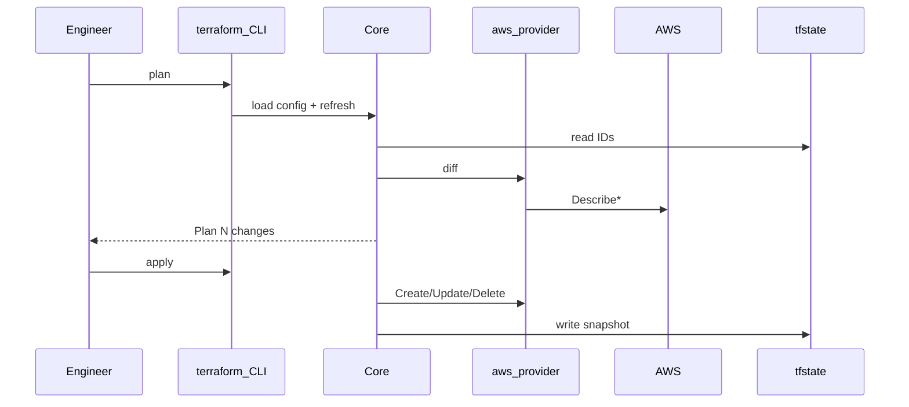

# 1. Теория
**DevOps** — культура и практики коротких циклов delivery: автоматизация, мониторинг, обратная связь. **Infrastructure as Code (IaC)** — часть DevOps: инфраструктура описана в **версионируемых файлах**, изменения проходят review и автоматическое применение.
## Пять типов IaC (Brikman)

| Тип | Что делает | Примеры |
|-----|------------|---------|
| **Ad hoc scripts** | «Вызови API A, потом B» | bash + AWS CLI, boto3 |
| **Configuration management** | Состояние **существующего** сервера (ОС) | Ansible, Puppet, Chef |
| **Server templating** | Образ (AMI, Docker) | Packer |
| **Orchestration** | Runtime контейнеров | Kubernetes |
| **Provisioning** | Создать/изменить/удалить **облачные ресурсы** | **Terraform**, CloudFormation |

**Terraform — provisioning tool.** Он создаёт VPC, S3, IAM, EC2 через API облака. Ansible на уже созданной EC2 ставит nginx — это **CM**, не замена Terraform.


#### Benefits IaC

| Benefit | В Terraform |
|---------|-------------|
| Documentation | `.tf` = живая документация |
| Version control | Git history изменений SG, bucket |
| Validation | `terraform plan` до apply |
| Automation | CI: plan на MR ([14.4](../14.4%20CI%20with%20terrafom/14.4%20План.md)) |
| Security | Review; секреты не в Git |

#### CM vs Provisioning

| | CM | Provisioning |
|--|-----|--------------|
| Объект | Пакеты, файлы, службы | S3, SG, EC2, VPC |
| Plan | `--check` (частично) | **`terraform plan`** |

#### Mutable vs Immutable

- **Mutable:** патчи на месте (CM).
- **Immutable:** новый инстанс, старый удалён (Packer + ASG → [14.3](../14.3%20HA%20in%20terraform/14.3%20План.md)).

#### Procedural vs Declarative

**CLI/boto3 (procedural):**

```bash
aws s3api create-bucket --bucket my-bucket --region eu-central-1 \
  --create-bucket-configuration LocationConstraint=eu-central-1
```

**Terraform (declarative):**

```hcl
resource "aws_s3_bucket" "lab" {
  bucket = var.bucket_name
}
```

Вы описываете **желаемое состояние**; Core вычисляет шаги.

#### Сравнение инструментов

| | Terraform | Ansible | CloudFormation |
|--|-----------|---------|----------------|
| Класс | Provisioning | CM | Provisioning (AWS) |
| State | tfstate / remote | Нет | AWS Stack |
| Multi-cloud | Да | Частично | Нет |

**OpenTofu** — форк с совместимым HCL. Курс: HashiCorp Terraform ≥ 1.5.

**Частая ошибка:** пытаться «накатить nginx» только Terraform — для ПО на VM нужен CM или user-data (web server — [14.3](../14.3%20HA%20in%20terraform/14.3%20План.md)).

**→ Практика:** §3 Step 1 (S3 как первый ресурс).

---

### 2.2. Как работает Terraform (гл. 1)

```text
.tf (desired state)
    → terraform CLI
        → Core (DAG, plan, apply)
            → Provider plugin → AWS API
            → State (terraform.tfstate) — mapping address → real ID
```



## Цикл plan → apply (sequence-диаграмма)

Plan — «что будет, но ещё не делать».

1. Вы запускаете `terraform plan` (в lab — часто `plan -out=tfplan`).
2. CLI передаёт Core конфигурацию и команду plan.
3. Core читает state: какие ID уже известны.
4. Core просит provider обновить картину реальности — refresh через AWS API (`Describe*`: bucket есть? SG совпадает?).
5. Core сравнивает desired (`.tf`) + actual (облако) + recorded (state) и строит план: «2 to add», «1 to change» и т.д.
6. Вы видите план и решаете, применять ли его.

На Step 0 plan показывает `0 to add` — конфигурация есть, managed resources ещё нет. На Step 1 — `2 to add` (bucket + public access block).

Apply — «выполнить план».

1. `terraform apply` (или `apply tfplan` — ровно сохранённый plan).
2. Core снова загружает config и state, идёт по графу зависимостей.
3. Provider выполняет Create / Update / Delete в AWS.
4. После каждого успешного шага Core обновляет state — записывает новые ID и атрибуты.

После Step 1 в state появляются `aws_s3_bucket.lab` и `aws_s3_bucket_public_access_block.lab`; `terraform state list` это показывает.

---


#### Команды

| Команда                    | Результат                                   |
| -------------------------- | ------------------------------------------- |
| `terraform init`           | `Successfully initialized`                  |
| `terraform fmt -recursive` | форматирование HCL                          |
| `terraform validate`       | `The configuration is valid`                |
| `terraform plan`           | `Plan: N to add, M to change, K to destroy` |
| `terraform apply`          | `Apply complete!`                           |
| `terraform destroy`        | удаление по state                           |

**Exit codes `plan`:** 0 — no changes, 2 — есть изменения, 1 — ошибка.

#### Saved plan (production pattern)

```bash
terraform plan -out=tfplan
terraform apply tfplan
```

Apply **ровно** того, что утвердили на plan. После изменения `.tf` — новый `plan -out`.

**→ Практика:** §3 каждый Step использует `plan -out` + `apply tfplan`.

---

### 2.4. Terraform Syntax — HCL (гл. 2)

**Подробный разбор каждого файла:** [14.1.2 — структура файлов, HCL и модули](14.1.2%20Terraform%20—%20структура%20файлов%2C%20HCL%20и%20модули.md) · **язык HCL:** [14.1.3](14.1.3%20Terraform%20—%20язык%20HCL.md) · аннотированный код: [lab/reference](lab/terraform-getting-started/reference/)

#### Структура lab (нарастающая)

```text
terraform-getting-started/
├── versions.tf, provider.tf, variables.tf   # Step 0 — всегда
├── outputs.tf                               # растёт по этапам
├── s3.tf                                    # Step 1 — добавить
├── security_group.tf                        # Step 2 — добавить
├── ec2.tf                                   # Step 3 — добавить
└── steps/                                   # эталоны для копирования
```

Terraform **склеивает все `.tf`** в одну конфигурацию. Brikman: не один giant `main.tf`, а файлы по смыслу.

#### Блоки HCL

| Блок | Роль |
|------|------|
| `terraform { }` | Версии, backend |
| `provider "aws" { }` | region, profile, default_tags |
| `resource` | Управляемый ресурс |
| `data` | Read-only (VPC, AMI) |
| `variable` | Input |
| `output` | Export после apply |

#### Implicit dependency


Terraform строит **DAG** (направленный ациклический граф):

- **Implicit** — из ссылок: `vpc_id = aws_vpc.this.id`.
- **Explicit** — `depends_on = [aws_s3_bucket.logs]` когда порядок не виден из атрибутов.

`create_before_destroy` в `lifecycle` — сначала создать новый SG, потом удалить старый (избегает downtime при смене имени).


```hcl
resource "aws_s3_bucket_public_access_block" "lab" {
  bucket = aws_s3_bucket.lab.id
}
```

Bucket создаётся **до** public access block — без явного `depends_on`.

#### Variables и tfvars

```bash
cp terraform.tfvars.example terraform.tfvars
```

`terraform.tfvars` — **не в Git**. Auto-load при `plan`/`apply`.

#### Provider

```hcl
provider "aws" {
  region  = var.aws_region
  profile = var.aws_profile
  default_tags { tags = { Project = var.project, Managed = "terraform" } }
}
```

**→ Практика:** §3.1 Step 0 — только provider; §3.2 — первый `resource`.

---
