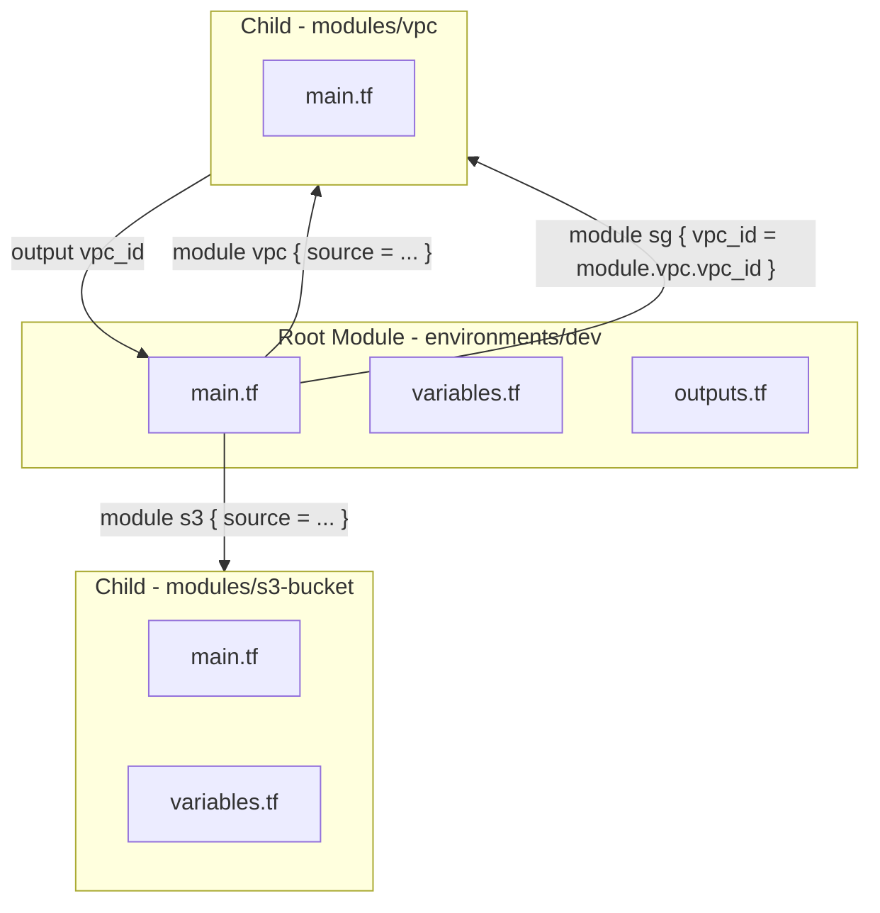
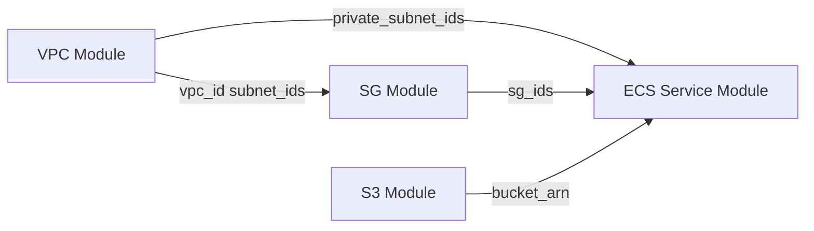
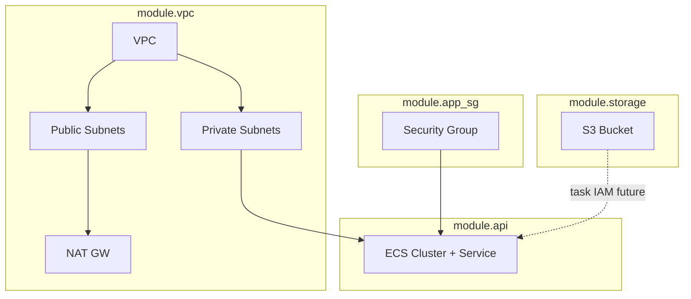

# Terraform Modules

## 2. Базовые понятия

### 2.1. Root Module vs Child Module



| Понятие | Что это | Где запускаете CLI |
|---------|---------|-------------------|
| **Root module** | Каталог с `terraform init/plan/apply` | `environments/dev/`, `live/prod/` |
| **Child module** | Подпапка, вызывается через `module "name" { }` | `modules/vpc/`, Registry |

**Root** оркестрирует: передаёт параметры окружения, связывает модули через outputs → inputs.

**Child** инкапсулирует одну зону ответственности: «VPC», «S3 bucket», «ECS service».

Адрес в state:

```text
Root:     aws_s3_bucket.x
Child:    module.storage.aws_s3_bucket.this
Nested:   module.app.module.network.aws_vpc.this
```

### 2.2. Inputs - `variable`

Inputs - **публичный API** модуля. Caller (root) обязан или может передать значения.

```hcl
variable "name_prefix" {
  description = "Prefix for all resource names in this module"
  type        = string

  validation {
    condition     = can(regex("^[a-z0-9-]+$", var.name_prefix))
    error_message = "name_prefix: lowercase letters, digits, hyphen only."
  }
}
```

Правило Middle+: **минимум обязательных inputs** - всё остальное через `default` или `optional()` (TF ≥ 1.3).

### 2.3. Outputs - `output`

Outputs - **экспорт наружу**. Root и другие модули читают `module.vpc.vpc_id`.

```hcl
output "vpc_id" {
  description = "VPC ID for SG and ECS modules"
  value       = aws_vpc.this.id
}
```

Не экспортируйте «всё подряд» - каждый output = обещание стабильного контракта (semver модуля).

### 2.4. Locals - `locals`

**Внутренние** вычисления модуля. Не задаются снаружи.

```hcl
locals {
  common_tags = merge(var.tags, { Module = "vpc", ManagedBy = "terraform" })
  azs         = slice(data.aws_availability_zones.available.names, 0, var.az_count)
}
```

Используйте locals, чтобы **не раздувать** список variables (например, derived tags, CIDR offsets).

### 2.5. Data Sources - `data`

Read-only lookup **существующего** в AWS (или другого provider). Не создают ресурсы.

```hcl
data "aws_availability_zones" "available" {
  state = "available"
}

data "aws_caller_identity" "current" {}
```

Типично в root: AZs, AMI, caller identity. В child - когда модулю нужен контекст аккаунта/региона без передачи из root.

### 2.6. Вызов модуля

```hcl
module "vpc" {
  source = "../../modules/vpc"

  name_prefix = var.name_prefix
  vpc_cidr    = "10.20.0.0/16"
  az_count    = 2

  tags = var.common_tags
}
```

После добавления/смены `source` → **`terraform init`** (скачивает модуль / обновляет `.terraform/modules`).

---

## 3. Module Sources, Versioning, Registry

### 3.1. Типы source

| source     | Пример                                                                        | Когда                        |
| ---------- | ----------------------------------------------------------------------------- | ---------------------------- |
| Local path | `source = "../../modules/vpc"`                                                | Разработка, monorepo         |
| Git        | `source = "git::https://github.com/org/tf-modules.git//vpc?ref=v1.2.0"`       | Shared modules команды       |
| Registry   | `source = "terraform-aws-modules/vpc/aws"`                                    | Community / private registry |
| S3         | `source = "s3::https://s3-eu-central-1.amazonaws.com/bucket/modules/vpc.zip"` | Air-gapped / policy          |

### 3.2. Versioning

```hcl
module "vpc" {
  source  = "terraform-aws-modules/vpc/aws"
  version = "~> 5.0"   # >= 5.0, < 6.0
}
```

Для **своих** Git-модулей - **Git tags** (`ref=v1.0.0`), не `main`.

В monorepo часто: все env на одном commit → версия = commit SHA в CI.

### 3.3. Terraform Registry

- **Public:** [registry.terraform.io](https://registry.terraform.io) - `namespace/name/provider`
- **Private (Terraform Cloud / HCP):** те же syntax, org-scoped modules
- Registry хранит **версии**, README, examples, dependencies

Перед написанием VPC с нуля - оцените `terraform-aws-modules/vpc/aws`. В курсе **пишем сами**, чтобы понять internals.

---

## 4. Best practices интерфейса модуля

### 4.1. Минимизация входных параметров

Плохо: 40 scalar variables (`subnet_1_cidr`, `subnet_2_cidr`, …).

Хорошо: структурированные типы:

```hcl
variable "subnets" {
  type = map(object({
    cidr = string
    az   = string
    public = bool
  }))
}
```

Caller передаёт map - модуль делает `for_each`.

### 4.2. object / map вместо «простыни»

```hcl
variable "ingress_rules" {
  type = list(object({
    description = string
    from_port   = number
    to_port     = number
    protocol    = string
    cidr_blocks = list(string)
  }))
  default = []
}
```

### 4.3. for_each vs count

| | `count` | `for_each` |
|--|---------|------------|
| Ключ | `0`, `1`, … | строка map/set |
| Адрес | `aws_subnet.this[0]` | `aws_subnet.this["public-a"]` |
| Удаление элемента | индексы **сдвигаются** → replace | ключ стабилен |

**Правило:** именованные ресурсы (subnets, rules, services) → **`for_each`**. `count = var.enabled ? 1 : 0` - OK для optional singleton.

### 4.4. validation

```hcl
validation {
  condition     = var.vpc_cidr == "0.0.0.0/0" ? false : can(cidrhost(var.vpc_cidr, 0))
  error_message = "vpc_cidr must be a valid IPv4 CIDR, not 0.0.0.0/0."
}
```

Ловит ошибки **до** `apply`.

### 4.5. dynamic blocks

Когда nested block повторяется (SG rules, ingress):

```hcl
dynamic "ingress" {
  for_each = var.ingress_rules
  content {
    description = ingress.value.description
    from_port   = ingress.value.from_port
    to_port     = ingress.value.to_port
    protocol    = ingress.value.protocol
    cidr_blocks = ingress.value.cidr_blocks
  }
}
```

### 4.6. sensitive variables

```hcl
variable "db_password" {
  type      = string
  sensitive = true
}
```

`sensitive` скрывает значение в CLI log; **в state значение может остаться** - секреты лучше через AWS Secrets Manager + data source.

---

## 5. Схема связей модулей (итоговая lab)



Поток данных только через **outputs → inputs**, не через `data.aws_vpc` внутри SG «угадывая» VPC (кроме явного data by id).

---

## 6. Практические лабораторные (Lab 1–4)

**Готовый код:** [lab/terraform-modules-workshop](lab/terraform-modules-workshop/) - все модули с комментариями и root `environments/dev/`.

```bash
cd lab/terraform-modules-workshop/environments/dev
cp terraform.tfvars.example terraform.tfvars
terraform init && terraform plan
```

Структура:

```text
terraform-modules-workshop/
├── modules/
│   ├── s3-bucket/
│   ├── vpc/
│   ├── security-group/
│   └── ecs-service/
└── environments/
    └── dev/          # root для пошаговых проверок
```

Каждый модуль: `versions.tf`, `variables.tf`, `locals.tf`, `main.tf`, `outputs.tf`.

---

### Lab 1 - S3 Module

#### Архитектура

Модуль создаёт **один bucket** с block public access, versioning (optional), encryption. Экспортирует `bucket_id`, `bucket_arn` для ECS task role / policies.

#### Структура

```text
modules/s3-bucket/
├── versions.tf
├── variables.tf
├── locals.tf
├── main.tf
└── outputs.tf
```

#### `versions.tf`

```hcl
terraform {
  required_version = ">= 1.5.0"
  required_providers {
    aws = {
      source  = "hashicorp/aws"
      version = "~> 5.0"
    }
  }
}
```

| Строка | Смысл |
|--------|-------|
| `required_version` | Минимальная версия CLI для consistency |
| `required_providers.aws` | Модуль объявляет зависимость от AWS provider |
| `~> 5.0` | Допускает 5.x, блокирует breaking 6.0 |

#### `variables.tf`

```hcl
variable "bucket_name" {
  description = "Globally unique S3 bucket name"
  type        = string

  validation {
    condition     = length(var.bucket_name) >= 3 && length(var.bucket_name) <= 63
    error_message = "bucket_name length must be 3..63."
  }
}

variable "enable_versioning" {
  description = "Enable S3 versioning"
  type        = bool
  default     = true
}

variable "tags" {
  description = "Tags applied to bucket"
  type        = map(string)
  default     = {}
}
```

| Строка | Смысл |
|--------|-------|
| `bucket_name` без default | **Обязательный** input - caller задаёт уникальное имя |
| `validation` | Проверка длины до обращения к AWS API |
| `tags` map | Типичный optional input с default `{}` |

#### `locals.tf`

```hcl
locals {
  merged_tags = merge(var.tags, {
    Name    = var.bucket_name
    Module  = "s3-bucket"
  })
}
```

| Строка | Смысл |
|--------|-------|
| `merge` | Caller tags + обязательные системные tags модуля |

#### `main.tf`

```hcl
resource "aws_s3_bucket" "this" {
  bucket = var.bucket_name
  tags   = local.merged_tags
}

resource "aws_s3_bucket_versioning" "this" {
  count  = var.enable_versioning ? 1 : 0
  bucket = aws_s3_bucket.this.id

  versioning_configuration {
    status = "Enabled"
  }
}

resource "aws_s3_bucket_server_side_encryption_configuration" "this" {
  bucket = aws_s3_bucket.this.id

  rule {
    apply_server_side_encryption_by_default {
      sse_algorithm = "AES256"
    }
  }
}

resource "aws_s3_bucket_public_access_block" "this" {
  bucket                  = aws_s3_bucket.this.id
  block_public_acls       = true
  block_public_policy     = true
  ignore_public_acls      = true
  restrict_public_buckets = true
}
```

| Строка | Смысл |
|--------|-------|
| `"this"` | Convention: единственный ресурс типа в модуле |
| `count = var.enable_versioning ? 1 : 0` | Optional singleton - versioning можно выключить |
| `aws_s3_bucket.this.id` | Implicit dependency: bucket создаётся первым |
| `public_access_block` | Security baseline - bucket не публичный |

#### `outputs.tf`

```hcl
output "bucket_id" {
  description = "Bucket name (S3 id)"
  value       = aws_s3_bucket.this.id
}

output "bucket_arn" {
  description = "ARN for IAM policies"
  value       = aws_s3_bucket.this.arn
}
```

#### Проверка (root `environments/dev`)

```hcl
module "storage" {
  source = "../../modules/s3-bucket"
  bucket_name = "devops-mod-lab-s3-${data.aws_caller_identity.current.account_id}"
  tags = { Environment = "dev" }
}
```

```bash
cd environments/dev
terraform init && terraform plan
# Plan: 4 to add (bucket + versioning + encryption + public access block)
```

---

### Lab 2 - VPC Module

#### Архитектура

VPC, IGW, **public и private subnets** в 2 AZ, route tables, **NAT Gateway** (1 NAT на lab для экономии; в prod - NAT per AZ).

#### Структура

```text
modules/vpc/
├── versions.tf      # аналогично Lab 1
├── variables.tf
├── locals.tf
├── main.tf
└── outputs.tf
```

#### `variables.tf` (фрагмент - object/map)

```hcl
variable "name_prefix" {
  type = string
}

variable "vpc_cidr" {
  type = string

  validation {
    condition     = can(cidrhost(var.vpc_cidr, 0))
    error_message = "vpc_cidr must be valid CIDR."
  }
}

variable "azs" {
  description = "List of AZ names, e.g. [eu-central-1a, eu-central-1b]"
  type        = list(string)
}

variable "public_subnet_cidrs" {
  type = list(string)
}

variable "private_subnet_cidrs" {
  type = list(string)
}

variable "tags" {
  type    = map(string)
  default = {}
}
```

#### `locals.tf`

```hcl
locals {
  tags = merge(var.tags, { Module = "vpc" })

  public_subnets = {
    for idx, cidr in var.public_subnet_cidrs :
    "public-${idx}" => {
      cidr = cidr
      az   = var.azs[idx]
    }
  }

  private_subnets = {
    for idx, cidr in var.private_subnet_cidrs :
    "private-${idx}" => {
      cidr = cidr
      az   = var.azs[idx]
    }
  }
}
```

| Строка | Смысл |
|--------|-------|
| `for idx, cidr in ...` | Превращаем list CIDR в **map** для `for_each` |
| ключ `"public-${idx}"` | Стабильный ключ (лучше чем count при изменении списка) |

#### `main.tf` (ключевые ресурсы)

```hcl
resource "aws_vpc" "this" {
  cidr_block           = var.vpc_cidr
  enable_dns_hostnames = true
  enable_dns_support   = true
  tags                 = merge(local.tags, { Name = "${var.name_prefix}-vpc" })
}

resource "aws_internet_gateway" "this" {
  vpc_id = aws_vpc.this.id
  tags   = merge(local.tags, { Name = "${var.name_prefix}-igw" })
}

resource "aws_subnet" "public" {
  for_each                = local.public_subnets
  vpc_id                  = aws_vpc.this.id
  cidr_block              = each.value.cidr
  availability_zone       = each.value.az
  map_public_ip_on_launch = true
  tags = merge(local.tags, { Name = "${var.name_prefix}-${each.key}" })
}

resource "aws_subnet" "private" {
  for_each          = local.private_subnets
  vpc_id            = aws_vpc.this.id
  cidr_block        = each.value.cidr
  availability_zone = each.value.az
  tags = merge(local.tags, { Name = "${var.name_prefix}-${each.key}" })
}

resource "aws_eip" "nat" {
  domain = "vpc"
  tags   = merge(local.tags, { Name = "${var.name_prefix}-nat-eip" })
}

resource "aws_nat_gateway" "this" {
  allocation_id = aws_eip.nat.id
  subnet_id     = values(aws_subnet.public)[0].id
  tags          = merge(local.tags, { Name = "${var.name_prefix}-nat" })
  depends_on    = [aws_internet_gateway.this]
}

resource "aws_route_table" "public" {
  vpc_id = aws_vpc.this.id
  route {
    cidr_block = "0.0.0.0/0"
    gateway_id = aws_internet_gateway.this.id
  }
  tags = merge(local.tags, { Name = "${var.name_prefix}-public-rt" })
}

resource "aws_route_table" "private" {
  vpc_id = aws_vpc.this.id
  route {
    cidr_block     = "0.0.0.0/0"
    nat_gateway_id = aws_nat_gateway.this.id
  }
  tags = merge(local.tags, { Name = "${var.name_prefix}-private-rt" })
}

resource "aws_route_table_association" "public" {
  for_each       = aws_subnet.public
  subnet_id      = each.value.id
  route_table_id = aws_route_table.public.id
}

resource "aws_route_table_association" "private" {
  for_each       = aws_subnet.private
  subnet_id      = each.value.id
  route_table_id = aws_route_table.private.id
}
```

| Строка | Смысл |
|--------|-------|
| `for_each = local.public_subnets` | По одной subnet на ключ map |
| `values(aws_subnet.public)[0].id` | NAT в **первой** public subnet (lab shortcut) |
| `depends_on = [aws_internet_gateway.this]` | NAT требует IGW attached |
| private route `0.0.0.0/0` → NAT | Исходящий интернет из private subnets |

#### `outputs.tf`

```hcl
output "vpc_id" {
  value = aws_vpc.this.id
}

output "public_subnet_ids" {
  value = [for s in aws_subnet.public : s.id]
}

output "private_subnet_ids" {
  value = [for s in aws_subnet.private : s.id]
}
```

**Cost warning:** NAT Gateway ~$0.045/ч + traffic. После lab - `destroy`.

---

### Lab 3 - Security Group Module

#### Архитектура

Один SG с **dynamic ingress/egress** из list(object). Caller передаёт правила; модуль не знает про «web» или «db» - только порты и CIDR.

#### `variables.tf`

```hcl
variable "name_prefix" {
  type = string
}

variable "vpc_id" {
  type = string
}

variable "description" {
  type    = string
  default = "Managed by Terraform"
}

variable "ingress_rules" {
  type = list(object({
    description = string
    from_port   = number
    to_port     = number
    protocol    = string
    cidr_blocks = list(string)
  }))
  default = []
}

variable "egress_rules" {
  type = list(object({
    description = string
    from_port   = number
    to_port     = number
    protocol    = string
    cidr_blocks = list(string)
  }))
  default = [{
    description = "Allow all outbound"
    from_port   = 0
    to_port     = 0
    protocol    = "-1"
    cidr_blocks = ["0.0.0.0/0"]
  }]
}

variable "tags" {
  type    = map(string)
  default = {}
}
```

#### `main.tf`

```hcl
resource "aws_security_group" "this" {
  name        = "${var.name_prefix}-sg"
  description = var.description   # ASCII only for AWS API
  vpc_id      = var.vpc_id
  tags        = merge(var.tags, { Name = "${var.name_prefix}-sg" })

  dynamic "ingress" {
    for_each = var.ingress_rules
    content {
      description = ingress.value.description
      from_port   = ingress.value.from_port
      to_port     = ingress.value.to_port
      protocol    = ingress.value.protocol
      cidr_blocks = ingress.value.cidr_blocks
    }
  }

  dynamic "egress" {
    for_each = var.egress_rules
    content {
      description = egress.value.description
      from_port   = egress.value.from_port
      to_port     = egress.value.to_port
      protocol    = egress.value.protocol
      cidr_blocks = egress.value.cidr_blocks
    }
  }
}
```

| Строка | Смысл |
|--------|-------|
| `dynamic "ingress"` | 0..N правил без копипасты блоков |
| `ingress.value` | Текущий элемент list/object |
| `protocol = "-1"` | All traffic (egress default) |

#### `outputs.tf`

```hcl
output "security_group_id" {
  value = aws_security_group.this.id
}
```

#### Вызов из root

```hcl
module "app_sg" {
  source      = "../../modules/security-group"
  name_prefix = "devops-app"
  vpc_id      = module.vpc.vpc_id

  ingress_rules = [
    {
      description = "HTTP from VPC"
      from_port   = 80
      to_port     = 80
      protocol    = "tcp"
      cidr_blocks = [var.vpc_cidr]
    }
  ]
}
```

---

### Lab 4 - ECS Service Module

#### Архитектура

- **ECS Cluster** (Fargate)
- **Task definition** (nginx demo image)
- **Service** в private subnets, SG от Lab 3
- Optional: log group

Модуль **не** создаёт VPC - получает `subnet_ids`, `security_group_ids`.

#### `variables.tf` (основное)

```hcl
variable "name_prefix" { type = string }

variable "cluster_name" {
  type    = string
  default = null   # null → use name_prefix
}

variable "subnet_ids" {
  type = list(string)
}

variable "security_group_ids" {
  type = list(string)
}

variable "container_image" {
  type    = string
  default = "public.ecr.aws/nginx/nginx:latest"
}

variable "container_port" {
  type    = number
  default = 80
}

variable "desired_count" {
  type    = number
  default = 1
}

variable "assign_public_ip" {
  description = "false for private subnets + NAT"
  type        = bool
  default     = false
}

variable "tags" {
  type    = map(string)
  default = {}
}
```

#### `locals.tf`

```hcl
locals {
  cluster_name = coalesce(var.cluster_name, "${var.name_prefix}-cluster")
  tags         = merge(var.tags, { Module = "ecs-service" })
}
```

#### `main.tf`

```hcl
resource "aws_ecs_cluster" "this" {
  name = local.cluster_name
  tags = local.tags
}

resource "aws_cloudwatch_log_group" "this" {
  name              = "/ecs/${local.cluster_name}"
  retention_in_days = 7
  tags              = local.tags
}

resource "aws_ecs_task_definition" "this" {
  family                   = "${var.name_prefix}-task"
  requires_compatibilities = ["FARGATE"]
  network_mode             = "awsvpc"
  cpu                      = "256"
  memory                   = "512"
  execution_role_arn       = aws_iam_role.execution.arn
  task_role_arn            = aws_iam_role.task.arn

  container_definitions = jsonencode([{
    name      = "app"
    image     = var.container_image
    essential = true
    portMappings = [{
      containerPort = var.container_port
      protocol      = "tcp"
    }]
    logConfiguration = {
      logDriver = "awslogs"
      options = {
        awslogs-group         = aws_cloudwatch_log_group.this.name
        awslogs-region        = data.aws_region.current.name
        awslogs-stream-prefix = "ecs"
      }
    }
  }])
}

resource "aws_ecs_service" "this" {
  name            = "${var.name_prefix}-service"
  cluster         = aws_ecs_cluster.this.id
  task_definition = aws_ecs_task_definition.this.arn
  desired_count   = var.desired_count
  launch_type     = "FARGATE"

  network_configuration {
    subnets          = var.subnet_ids
    security_groups  = var.security_group_ids
    assign_public_ip = var.assign_public_ip
  }
}

data "aws_region" "current" {}

# IAM roles - минимальный trust + AWS managed policy для execution
resource "aws_iam_role" "execution" {
  name = "${var.name_prefix}-ecs-exec"
  assume_role_policy = jsonencode({
    Version = "2012-10-17"
    Statement = [{
      Effect    = "Allow"
      Principal = { Service = "ecs-tasks.amazonaws.com" }
      Action    = "sts:AssumeRole"
    }]
  })
}

resource "aws_iam_role_policy_attachment" "execution" {
  role       = aws_iam_role.execution.name
  policy_arn = "arn:aws:iam::aws:policy/service-role/AmazonECSTaskExecutionRolePolicy"
}

resource "aws_iam_role" "task" {
  name = "${var.name_prefix}-ecs-task"
  assume_role_policy = aws_iam_role.execution.assume_role_policy
}
```

| Строка | Смысл |
|--------|-------|
| `requires_compatibilities = ["FARGATE"]` | Serverless containers |
| `network_mode = "awsvpc"` | Обязателен для Fargate |
| `execution_role` | ECR pull, CloudWatch logs |
| `task_role` | Права приложения (S3 и т.д. - расширяете в prod) |
| `assign_public_ip = false` | Private subnets, egress через NAT |

#### `outputs.tf`

```hcl
output "cluster_id" {
  value = aws_ecs_cluster.this.id
}

output "service_name" {
  value = aws_ecs_service.this.name
}
```

---

## 7. Итоговая lab - production-ready стек

### 7.1. Архитектура



### 7.2. Структура root

```text
environments/dev/
├── versions.tf
├── provider.tf
├── variables.tf
├── locals.tf
├── main.tf
├── outputs.tf
└── terraform.tfvars
```

### 7.3. Root `main.tf` (сборка)

```hcl
data "aws_availability_zones" "available" {
  state = "available"
}

data "aws_caller_identity" "current" {}

locals {
  azs = slice(data.aws_availability_zones.available.names, 0, 2)
}

module "storage" {
  source      = "../../modules/s3-bucket"
  bucket_name = "${var.name_prefix}-assets-${data.aws_caller_identity.current.account_id}"
  tags        = var.common_tags
}

module "vpc" {
  source = "../../modules/vpc"

  name_prefix           = var.name_prefix
  vpc_cidr              = var.vpc_cidr
  azs                   = local.azs
  public_subnet_cidrs   = var.public_subnet_cidrs
  private_subnet_cidrs  = var.private_subnet_cidrs
  tags                  = var.common_tags
}

module "app_sg" {
  source      = "../../modules/security-group"
  name_prefix = "${var.name_prefix}-app"
  vpc_id      = module.vpc.vpc_id
  ingress_rules = var.app_ingress_rules
  tags        = var.common_tags
}

module "api" {
  source = "../../modules/ecs-service"

  name_prefix          = "${var.name_prefix}-api"
  subnet_ids           = module.vpc.private_subnet_ids
  security_group_ids   = [module.app_sg.security_group_id]
  assign_public_ip     = false
  tags                 = var.common_tags
}
```

### 7.4. Root `outputs.tf`

```hcl
output "vpc_id" {
  value = module.vpc.vpc_id
}

output "s3_bucket_id" {
  value = module.storage.bucket_id
}

output "ecs_cluster" {
  value = module.api.cluster_id
}
```

### 7.5. `terraform.tfvars` (пример)

```hcl
name_prefix = "devops-mod"
aws_region  = "eu-central-1"
aws_profile = "default"

vpc_cidr             = "10.30.0.0/16"
public_subnet_cidrs  = ["10.30.1.0/24", "10.30.2.0/24"]
private_subnet_cidrs = ["10.30.11.0/24", "10.30.12.0/24"]

common_tags = {
  Environment = "dev"
  Project     = "modules-workshop"
}

app_ingress_rules = [
  {
    description = "HTTP from VPC CIDR"
    from_port   = 80
    to_port     = 80
    protocol    = "tcp"
    cidr_blocks = ["10.30.0.0/16"]
  }
]
```

### 7.6. Запуск

```bash
cd environments/dev
terraform init
terraform plan -out=tfplan
terraform apply tfplan
terraform output
```

**Ожидаемо:** VPC + NAT + subnets + SG + ECS + S3; plan на десятки ресурсов - норма для composed stack.

**Связь с lab курса:** упрощённый вариант уже есть в [terraform-modules-state](lab/terraform-modules-state/) (network + security без NAT/ECS). Итоговая lab - **расширение** для самостоятельной сборки.

```bash
git tag 14.2-modules-workshop
```

---

## 8. Типичные ошибки Terraform Module Design

| Ошибка | Почему плохо | Как правильно |
|--------|--------------|---------------|
| **God module** - один модуль «вся инфра» | Нет reuse, огромный plan, сложный review | Декомпозиция: network / security / app |
| **Слишком много required variables** | Caller устаёт, copy-paste между env | Defaults, `object`, locals |
| **Outputs всего подряд** | Ломает semver, coupling | Минимальный стабильный контракт |
| **`count` для named subnets** | Replace при удалении элемента списка | `for_each` на map |
| **Hardcoded env** (`prod`, `eu-central-1`) в child | Модуль не переиспользуется | Только через variables |
| **SG rules только inline в модуле** | Нельзя настроить без fork | `ingress_rules` list(object) + dynamic |
| **Нет `versions.tf` в модуле** | Drift provider version | `required_providers` в каждом модуле |
| **Circular modules** | A → B → A - Terraform запретит | Зависимость только root → child |
| **Secrets в variables без SM** | Утечка в state | Secrets Manager / SSM Parameter Store |
| **Пин `ref=main` на Git source** | Непредсказуемые изменения | Git tags semver |
| **Игнор `description` ASCII в SG** | `InvalidParameterValue` | Только ASCII в API strings |

---

## 9. Как проектируют модули

###  Принципы

1. **Separation of concerns** - platform team: `modules/network`, product team: `modules/service-x`.
2. **Contract-first** - README + examples + CHANGELOG + semver tag.
3. **Composition over inheritance** - root glue, не mega-module.
4. **Policy as code** - `tflint`, `checkov`, OPA в CI на каждый MR.
5. **Remote state per env** - `dev/staging/prod` разные keys, один bucket или разные accounts (Landing Zone).
6. **Registry** - private modules опубликованы; env pin `version = "1.4.2"`.


###  Versioning strategy

| Артеfact | Стратегия |
|----------|-----------|
| **Module** | Semver Git tag `v1.2.0`; breaking → major |
| **Environment** | Pin module `version` / `ref=v1.2.0` |
| **Provider** | `.terraform.lock.hcl` в Git |
| **Rollout** | dev → staging → prod; plan в MR обязателен |


---

##  Домашнее задание

1. **Semver:** форкните `modules/security-group`, добавьте optional egress lock-down; tag `v1.1.0`; обновите root pin.
2. **for_each:** переведите один `count` в workshop на `for_each` (subnet или rule map); покажите `plan` без replace.
3. **moved:** переименуйте `module "api"` → `module "backend"`; добавьте `moved` block; `plan` без destroy.
4. **Registry read:** сравните ваш VPC module с `terraform-aws-modules/vpc/aws` - список из 5 inputs, которые добавили бы из community module.
5. **Lint:** `tflint --init && tflint` + `checkov -d modules/` - исправьте 1 finding.

---


## Troubleshooting

| Ошибка | Решение |
|--------|---------|
| `Module not found` | Путь `source` относительно `.tf` файла |
| `Unsupported argument` | Версия module API изменилась - проверьте variables |
| ECS service не стартует | SG блокирует; subnets без NAT при `assign_public_ip=false` |
| `Error creating NAT Gateway` | Нет EIP / subnet не public |
| Duplicate S3 bucket | Уникальное имя + account id suffix |

## Чеклист

- [ ] Понимаю Root vs Child и адрес `module.*` в state
- [ ] Модули S3, VPC, SG, ECS - созданы и вызываются из root
- [ ] Использовал `for_each`, `dynamic`, `validation`
- [ ] Итоговый stack: VPC + public/private + NAT + SG + ECS + S3
- [ ] Могу описать enterprise repo layout и versioning
- [ ] `terraform destroy` выполнен

