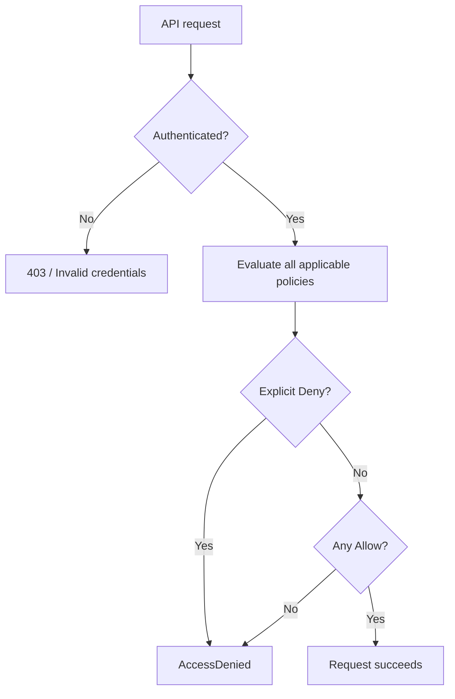
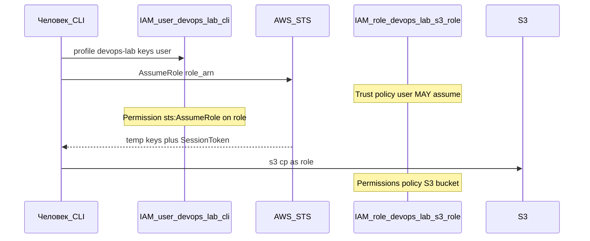
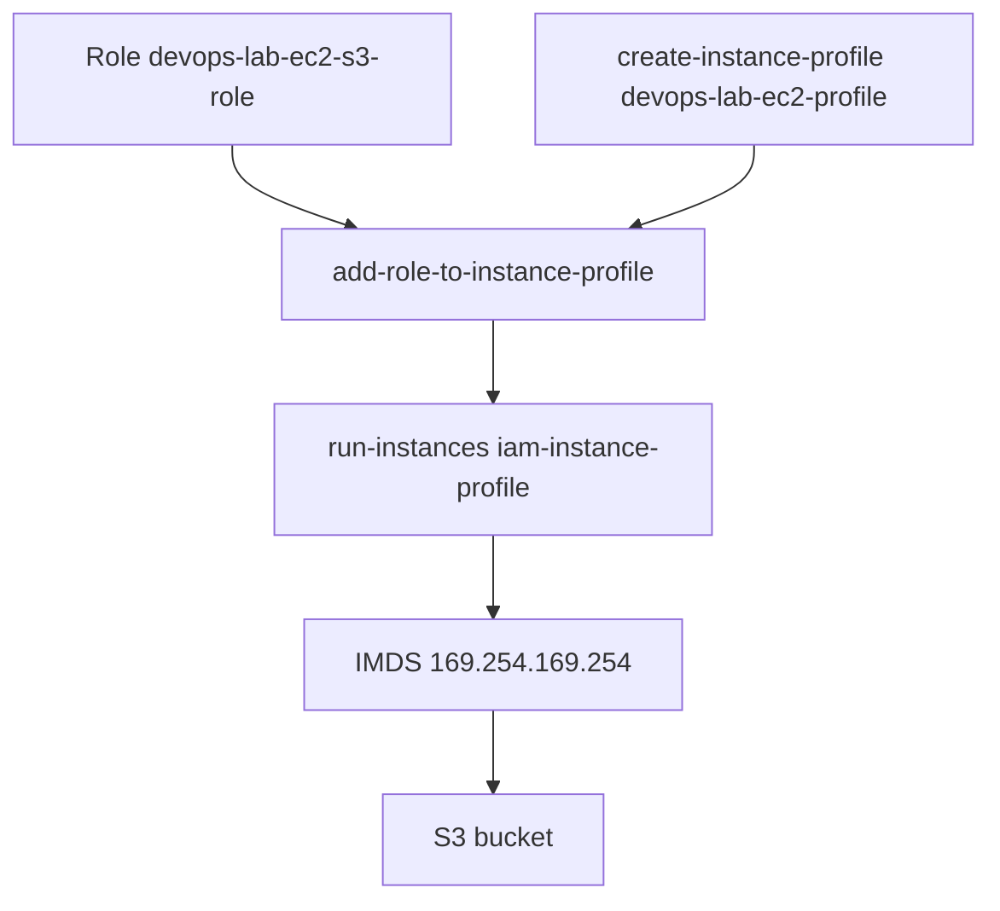

# AWS - IAM (Identity and Access Management)

Цель занятия - **понять IAM** и научиться самостоятельно создавать users, roles, policies, привязывать их к CLI и к EC2. Без этого любая работа с AWS превращается в случайные ошибки `AccessDenied`.

---

## Зачем нужен IAM

**IAM (Identity and Access Management)** - глобальный сервис AWS, который отвечает на два вопроса:

1. **Кто** делает запрос? (authentication - «докажи, что ты это ты»)
2. **Что** этому субъекту разрешено? (authorization - «можно ли это действие?»)

Console, AWS CLI, Terraform, boto3, Lambda, EC2 - все они в итоге вызывают **AWS API**. Каждый такой вызов проходит через IAM (или связанные механизмы вроде bucket policy).

**IAM бесплатен.** Платите только за ресурсы, к которым получаете доступ (S3 storage, EC2 hours и т.д.).

IAM **глобален** для account: users и roles не привязаны к региону. Но ресурсы (S3 bucket, EC2 instance) - региональные, и в policy вы указываете их ARN с регионом или без (S3).

## Как AWS принимает решение о доступе

При каждом API-запросе AWS собирает контекст:

| Элемент | Пример | Где смотреть при ошибке |
|---------|--------|-------------------------|
| **Principal** | `arn:aws:iam::123456789012:user/devops-lab-cli` | `aws sts get-caller-identity` |
| **Action** | `s3:PutObject` | текст ошибки `AccessDenied` |
| **Resource** | `arn:aws:s3:::my-bucket/file.txt` | ARN в policy и в запросе |
| **Policies** | identity-based + resource-based | IAM Console, `aws iam get-policy` |



**Default deny:** если ни одна policy не разрешает действие - доступ **запрещён**.
**Explicit Deny побеждает Allow:** даже если десять policies говорят «Allow», одна с `Effect: Deny` блокирует действие.

## Root account vs IAM identities

**Root user** - владелец account, логин по email при регистрации. Имеет неограниченные права. Используется только для:
- первичной настройки account;
- billing и закрытия account;
- операций, которые нельзя делегировать IAM (редко).
Root **не должен** использоваться для повседневной работы и **не должен** иметь access keys.
**IAM identities** - users, groups, roles - для всей рабочей деятельности.

## IAM User

**IAM user** - долгоживущая identity для человека или legacy-интеграции.

У user может быть:

| Credential | Назначение | Срок жизни |
|------------|------------|------------|
| Console password | вход в AWS Console | пока не отозван |
| Access Key ID + Secret Access Key | CLI, SDK, API | пока не удалён |

**Когда user допустим:** учебная лаборатория, старые системы без поддержки roles.
**Почему в production предпочитают roles:** access keys не rotatable автоматически, их легко утекут в Git, они не имеют session token и MFA-session context так же гибко, как STS.
Создание user - это только половина: без **policy** user не может ничего делать (default deny).

## IAM Group

**IAM group** - контейнер для policies. Удобно назначать одни и те же права нескольким людям:

```text
Group "Developers"  → policy S3ReadWriteDev
Group "ReadOnly"    → policy ReadOnlyAccess
User alice          → member of Developers
User bob            → member of Developers, ReadOnly
```

**Group не является principal.** AWS API не «вызывается от имени группы». При запросе principal - это **user** или **role**, а group лишь **добавляет** policies user'у.

## IAM Role

**IAM role** - identity **без** постоянного password и **без** долгоживущих access keys. Роль **принимают** (assume) и получают **временные** credentials через STS.
У роли две независимые части:

| Часть | Вопрос | Где хранится |
|-------|--------|--------------|
| **Trust policy** | Кто может вызвать `sts:AssumeRole`? | `AssumeRolePolicyDocument` роли |
| **Permissions policy** | Что можно делать **после** assume? | attached / inline policies роли |

Trust policy **не даёт** доступ к S3 или EC2. Она только отвечает: «EC2-сервис (или user Alice) может стать этой ролью».
Permissions policy **не отвечает**, кто может стать ролью. Она только перечисляет разрешённые actions.

**Где используются roles**

- **EC2 instance profile** - приложение на VM ходит в S3 без keys на диске;
- **Lambda execution role** - функция вызывает DynamoDB, S3;
- **Cross-account** - account A assume role в account B;
- **CI/CD** - GitHub Actions через OIDC assume role без static keys;
- **Human access** - admin assume role `PowerUser` вместо постоянных admin keys.

## IAM Policy + разбор JSON

Policy - документ JSON с массивом `Statement`. Минимальный рабочий пример для S3:

```json
{
  "Version": "2012-10-17",
  "Statement": [
    {
      "Sid": "ListOneBucket",
      "Effect": "Allow",
      "Action": ["s3:ListBucket"],
      "Resource": "arn:aws:s3:::devops-lab-bucket"
    },
    {
      "Sid": "ReadWriteObjects",
      "Effect": "Allow",
      "Action": ["s3:GetObject", "s3:PutObject", "s3:DeleteObject"],
      "Resource": "arn:aws:s3:::devops-lab-bucket/*"
    }
  ]
}
```

### Поля Statement

| Поле | Обязательно | Значение |
|------|-------------|----------|
| `Effect` | да | `Allow` или `Deny` |
| `Action` | да* | API-операция: `s3:GetObject`, `ec2:DescribeInstances`, `iam:CreateUser` |
| `Resource` | да* | ARN ресурса |
| `Condition` | нет | IP, MFA, tags, `StringEquals`, `DateLessThan` и др. |
| `Sid` | нет | удобный идентификатор statement в документе |

\* Для некоторых actions (например, `iam:CreateUser`) resource может быть `*`.

ARN для S3 - частая ошибка новичков

| Resource в policy | Что покрывает |
|-------------------|---------------|
| `arn:aws:s3:::my-bucket` | сам bucket (нужен для `s3:ListBucket`) |
| `arn:aws:s3:::my-bucket/*` | **объекты** внутри (нужен для `GetObject`, `PutObject`) |

Если разрешить только `arn:aws:s3:::my-bucket/*`, команда `aws s3 ls s3://my-bucket/` вернёт **AccessDenied** - не хватает `ListBucket` на bucket ARN.

### Managed vs inline policies

| Тип | Описание | Переиспользование |
|-----|----------|-------------------|
| **AWS managed** | готовые policies от AWS (`ReadOnlyAccess`, `PowerUserAccess`) | attach к many identities |
| **Customer managed** | вы создали через Console/CLI/Terraform | attach к many identities |
| **Inline** | встроена в одного user/role/group | только эта identity |

На практике для лаборатории удобны **customer managed** - их видно в списке policies и легко версионировать.

## Identity-based и resource-based policies

**Identity-based policy** - привязана к user, group или role. «Что может делать Alice?»
**Resource-based policy** - привязана к ресурсу (S3 bucket policy, SQS queue policy, Lambda resource policy). «Кто может обращаться к **этому** bucket?»
Для успешного доступа должны совпасть **обе** стороны (если resource-based policy существует), плюс Block Public Access, SCP и permission boundaries.
Пример: user имеет `s3:GetObject`, но bucket policy явно `Deny` для этого user - доступ будет запрещён.

## STS и временные credentials

**STS (Security Token Service)** выдаёт credentials вида:

- `AccessKeyId`
- `SecretAccessKey`
- **`SessionToken`** (обязателен для временных ключей)

Срок жизни - от 15 минут до нескольких часов (зависит от способа assume).

| Источник credentials | Как получить |
|----------------------|--------------|
| IAM user access keys | долгоживущие, через Console «Create access key» |
| `aws sts assume-role` | временные, после assume role |
| EC2 instance metadata | временные, автоматически для instance profile |
| Lambda / ECS | временные, платформа inject'ит env |

Проверка текущего principal:

```bash
aws sts get-caller-identity --profile lab
```

Ответ:

```json
{
  "UserId": "AIDAXXXXXXXXXXXXXXXXX",
  "Account": "123456789012",
  "Arn": "arn:aws:iam::123456789012:user/lab"
}
```

После assume role в `Arn` будет `...:role/devops-lab-s3-role` (или `:assumed-role/...`).

## Instance profile

**Instance profile** - контейнер, который связывает **IAM role** с **EC2 instance**. Технически это IAM resource типа `instance-profile`; внутри - одна role.

При запуске EC2 с instance profile:
1. EC2 вызывает STS от имени role (trust policy разрешает `ec2.amazonaws.com`).
2. Credentials доступны на instance через **Instance Metadata Service (IMDS)** по адресу `169.254.169.254`.
3. AWS CLI и SDK на instance подхватывают credentials **без** файла `~/.aws/credentials`.

```text
EC2 instance
    │
    ▼
Instance profile ──► IAM Role ──► Permissions policy (s3:GetObject, ...)
    │
    ▼
IMDS (169.254.169.254) ──► temporary AccessKey + Secret + Token
```
**Не кладите access keys на EC2.** Используйте instance profile.

## Least privilege и типичные ошибки

**Least privilege** - давать минимум прав, достаточный для задачи.

| Ошибка | Симптом | Исправление |
|--------|---------|-------------|
| `"Action": "*", "Resource": "*"` | user может удалить production | сузить action и resource |
| Забыли `ListBucket` | `ls s3://bucket` - AccessDenied | добавить action на bucket ARN |
| Путаница bucket vs object ARN | `GetObject` работает, `ls` - нет | два statement в policy |
| Access keys в Git | компрометация account | roles, Secrets Manager, git-secrets |
| Admin keys для приложения | blast radius | отдельная role с минимумом прав |
| Не удалили lab user | audit noise, risk | cleanup после занятия |

### Как читать AccessDenied

Чеклист диагностики:

1. **Principal** - `aws sts get-caller-identity`. Тот user/role, которого вы ожидаете?
2. **Action** - какой API вызван? (`s3:PutObject`, `ec2:RunInstances`)
3. **Resource** - правильный ARN в policy?
4. **Identity policy** - есть ли Allow для этого action+resource?
5. **Resource policy** - bucket policy, KMS key policy?
6. **Explicit Deny** - в любой из policies?
7. **Permission boundary** - ограничивает максимум прав user/role?
8. **SCP (Organizations)** - guardrail на уровне OU/account (упоминание для enterprise)?
9. **Block Public Access (S3)** - блокирует public ACL/policy?

Команды для инспекции:

```bash
aws iam list-attached-user-policies --user-name devops-lab-cli
aws iam get-policy-version --policy-arn POLICY_ARN --version-id v1
aws iam simulate-principal-policy \
  --policy-source-arn arn:aws:iam::ACCOUNT:user/devops-lab-cli \
  --action-names s3:PutObject \
  --resource-arns arn:aws:s3:::BUCKET/test.txt
```

---

# Практика

## Предусловия

- AWS account из MFA root, budget, выбран `COURSE_REGION`.
- Установлен [AWS CLI](13.2.2%20AWS%20-%20CLI%20и%20API.md#31-установить-aws-cli) (`aws --version`).
- Есть **admin IAM user** (не root) с правами создавать IAM и S3 - или временно используйте admin access keys **только для лабы**.

Создайте admin user через Console (если ещё нет): IAM → Users → Create user → attach `AdministratorAccess` (только для учебного account) → Security credentials → Create access key → CLI.

Настройте admin profile:

```bash
aws configure --profile devops-lab-admin
# Access Key, Secret, region = eu-central-1 (или ваш COURSE_REGION), output = json
```

Переменные для всей практики:

```bash
export AWS_PROFILE=devops-lab-admin
export AWS_REGION=eu-central-1
export ACCOUNT_ID=$(aws sts get-caller-identity --query Account --output text)
export BUCKET_NAME=devops-lab-${ACCOUNT_ID}-$(date +%s)
echo "Account: $ACCOUNT_ID  Bucket: $BUCKET_NAME  Region: $AWS_REGION"
```

Создайте рабочую директорию для JSON policies:

```bash
mkdir -p ~/devops-lab-iam && cd ~/devops-lab-iam
```

---

## IAM user, policy, CLI profile (человек → S3)

### Создать S3 bucket (admin)

**Цель:** подготовить ресурс, к которому будем выдавать права.

```bash
aws s3api create-bucket \
  --bucket "$BUCKET_NAME" \
  --region "$AWS_REGION" \
  --profile lab \
  --create-bucket-configuration LocationConstraint="$AWS_REGION"
```

**Ожидаемый результат:** JSON с `Location` и HTTP 200.
**Если ошибка `BucketAlreadyExists`:** bucket names глобально уникальны - измените `BUCKET_NAME`.

Закройте публичный доступ:

```bash
aws s3api put-public-access-block \
  --bucket "$BUCKET_NAME" \
  --public-access-block-configuration \
  --profile lab \ BlockPublicAcls=true,IgnorePublicAcls=true,BlockPublicPolicy=true,RestrictPublicBuckets=true
```

### Customer managed policy - read/write одного bucket

**Цель:** policy с least privilege на один bucket.
Файл `s3-rw-one-bucket.json` (замените имя bucket):

```json
{
  "Version": "2012-10-17",
  "Statement": [
    {
      "Sid": "ListLabBucket",
      "Effect": "Allow",
      "Action": ["s3:ListBucket"],
      "Resource": "arn:aws:s3:::BUCKET_NAME_PLACEHOLDER"
    },
    {
      "Sid": "ObjectRW",
      "Effect": "Allow",
      "Action": ["s3:GetObject", "s3:PutObject", "s3:DeleteObject"],
      "Resource": "arn:aws:s3:::BUCKET_NAME_PLACEHOLDER/*"
    }
  ]
}
```

Подставьте bucket name:

```bash
sed "s/BUCKET_NAME_PLACEHOLDER/$BUCKET_NAME/g" s3-rw-one-bucket.json > s3-rw-policy.json
```

Создайте policy:

```bash
aws iam create-policy \
  --policy-name devops-lab-s3-rw-one-bucket \
  --profile lab \
  --policy-document file://s3-rw-policy.json \
  --description "RW access to single lab S3 bucket"
```

Сохраните ARN:

```bash
export S3_RW_POLICY_ARN=$(aws iam list-policies --profile lab --scope Local \
  --query "Policies[?PolicyName=='devops-lab-s3-rw-one-bucket'].Arn" --output text)
echo "$S3_RW_POLICY_ARN"
```

**Ожидаемый результат:** `arn:aws:iam::ACCOUNT_ID:policy/devops-lab-s3-rw-one-bucket`

### IAM user и access key

```bash
aws iam create-user --user-name devops-lab-cli

aws iam attach-user-policy \
  --user-name devops-lab-cli \
  --profile lab \
  --policy-arn "$S3_RW_POLICY_ARN"

aws iam create-access-key --profile lab --user-name devops-lab-cli
```

**Сохраните** `AccessKeyId` и `SecretAccessKey` из вывода - Secret показывается один раз.

### CLI profile `devops-lab`

```bash
aws configure --profile devops-lab
# Введите ключи devops-lab-cli, region, json
```

Или вручную в `~/.aws/credentials`:

```ini
[devops-lab]
aws_access_key_id = AKIA...
aws_secret_access_key = ...
```

И в `~/.aws/config`:

```ini
[profile devops-lab]
region = eu-central-1
output = json
```

### Проверка identity и S3

```bash
aws sts get-caller-identity --profile devops-lab
```

**Ожидаемый Arn:** `arn:aws:iam::ACCOUNT_ID:user/devops-lab-cli`

```bash
echo "hello from devops-lab-cli" > lab-test.txt

aws s3 cp lab-test.txt "s3://$BUCKET_NAME/lab-test.txt" --profile devops-lab
aws s3 ls "s3://$BUCKET_NAME/" --profile devops-lab
```

**Ожидаемый результат:** файл загружен, виден в listing.

### Read-only policy и AccessDenied

**Цель:** увидеть default deny при недостаточных правах.

Файл `s3-readonly-one-bucket.json`:

```json
{
  "Version": "2012-10-17",
  "Statement": [
    {
      "Effect": "Allow",
      "Action": ["s3:ListBucket"],
      "Resource": "arn:aws:s3:::BUCKET_NAME_PLACEHOLDER"
    },
    {
      "Effect": "Allow",
      "Action": ["s3:GetObject"],
      "Resource": "arn:aws:s3:::BUCKET_NAME_PLACEHOLDER/*"
    }
  ]
}
```

```bash
sed "s/BUCKET_NAME_PLACEHOLDER/$BUCKET_NAME/g" s3-readonly-one-bucket.json > s3-ro-policy.json

aws iam create-policy \
  --policy-name devops-lab-s3-readonly-one-bucket \
  --policy-document file://s3-ro-policy.json --profile lab

export S3_RO_POLICY_ARN=$(aws iam list-policies --profile lab --scope Local \
  --query "Policies[?PolicyName=='devops-lab-s3-readonly-one-bucket'].Arn" --output text)

aws iam detach-user-policy --profile lab --user-name devops-lab-cli --policy-arn "$S3_RW_POLICY_ARN"
aws iam attach-user-policy --profile lab --user-name devops-lab-cli --policy-arn "$S3_RO_POLICY_ARN"
```

Проверка:

```bash
aws s3 cp "s3://$BUCKET_NAME/lab-test.txt" ./downloaded.txt --profile devops-lab   # OK
aws s3 cp lab-test.txt "s3://$BUCKET_NAME/should-fail.txt" --profile devops-lab  # AccessDenied
```

Разберите ошибку по чеклисту, представленному ранее.

Верните RW policy для следующих блоков:

```bash
aws iam detach-user-policy --profile lab --user-name devops-lab-cli --policy-arn "$S3_RO_POLICY_ARN"
aws iam attach-user-policy --profile lab --user-name devops-lab-cli --policy-arn "$S3_RW_POLICY_ARN"
```

---

## IAM Role для CLI (assume role человеком)

### Что такое assume role человеком

**Assume role** - когда вы (человек с IAM user и access keys) **временно становитесь другой identity** - IAM **role** - и дальше запросы к AWS идут **от имени роли**, а не user.

Это не второй пароль и не новый user. Это вызов API **`sts:AssumeRole`**: STS выдаёт **временные** credentials (`AccessKeyId`, `SecretAccessKey`, **`SessionToken`**) с правами из policies **роли**. Срок жизни сессии - от ~15 минут до нескольких часов.

#### Зачем это нужно

| Без assume role | С assume role |
|-----------------|---------------|
| User `devops-lab-cli` всегда ходит со своими policies | User только **разрешён войти** в роль |
| Чтобы расширить права - меняют policies user | Права на задачу - в **роли**; user может оставаться «слабым» |
| Долгоживущие keys несут все права постоянно | «Тяжёлые» права - на время сессии роли |

В production так делают admin (`BreakGlassAdmin`), read-only смены, доступ в другой account (cross-account). В этой лабе user `devops-lab-cli` **assume** роль `devops-lab-s3-role` - доступ к S3 тот же, но в CloudTrail и `get-caller-identity` principal **другой**.

#### Три части - без каждой assume не сработает



| № | Что | Где | Вопрос, на который отвечает |
|---|-----|-----|------------------------------|
| 1 | **Trust policy роли** | `AssumeRolePolicyDocument` при `create-role` | Кто **может стать** этой ролью? |
| 2 | **Permission на user** | inline / managed policy user | Кто **имеет право вызвать** `sts:AssumeRole` на ARN роли? |
| 3 | **Permissions policy роли** | attach к роли | Что можно делать **после** assume (S3, EC2…)? |

**Trust policy не открывает S3.** Она только говорит STS: «user `devops-lab-cli` может попросить credentials роли».

**Permission на user не дублирует trust.** Даже если в trust указан ваш user, без `sts:AssumeRole` на user вы получите **AccessDenied** при assume.

**Permissions на роли не заменяют шаги 1–2.** После успешного assume вы ещё должны иметь Allow на `s3:PutObject` и т.д. на самой роли.

#### Trust policy vs permission user - на примере лабы

**1. Trust policy роли** - «роль доверяет только этому user»:

```json
"Principal": { "AWS": "arn:aws:iam::ACCOUNT_ID:user/devops-lab-cli" },
"Action": "sts:AssumeRole"
```

**2. Policy на user** - «user может вызвать AssumeRole для этой роли»:

```json
"Action": "sts:AssumeRole",
"Resource": "arn:aws:iam::ACCOUNT_ID:role/devops-lab-s3-role"
```

**3. S3 policy на роли** - «под ролью можно читать/писать bucket».

#### Как это выглядит в CLI

**Profile с auto-assume** - в `~/.aws/config`:

```ini
[profile devops-lab]
# Access Key user devops-lab-cli в ~/.aws/credentials

[profile devops-lab-s3-role]
role_arn = arn:aws:iam::ACCOUNT_ID:role/devops-lab-s3-role
source_profile = devops-lab
region = eu-central-1
```

CLI: логин как user → `AssumeRole` → подставляет временные ключи.

```bash
aws sts get-caller-identity --profile devops-lab-cli
# Arn: arn:aws:iam::ACCOUNT_ID:user/devops-lab-cli

aws sts get-caller-identity --profile devops-lab-s3-role
# Arn: arn:aws:sts::ACCOUNT_ID:assumed-role/devops-lab-s3-role/...
```

**Явный `aws sts assume-role`** (шаг B4, альтернатива) - чтобы увидеть сырой ответ STS: `AccessKeyId`, `SecretAccessKey`, `SessionToken`. Для ручной отладки их экспортируют в env; в работе удобнее profile выше.

#### Assume role человеком vs EC2

| | Человек (блок B) | EC2 (блок C) |
|--|------------------|--------------|
| Кто assume | IAM user с keys | сервис EC2 |
| Principal в trust | `arn:aws:iam::...:user/devops-lab-cli` | `ec2.amazonaws.com` |
| Откуда credentials | CLI / profile | Instance Metadata `169.254.169.254` |
| Зачем | разделение прав, audit, смена «шляпы» | приложение на VM **без** keys на диске |

Механизм один - **STS AssumeRole** - отличается только **Principal** в trust policy.

#### Частые ошибки при assume role

| Симптом | Причина |
|---------|---------|
| `AccessDenied` на `assume-role` | нет `sts:AssumeRole` на user **или** user не в trust policy роли |
| S3 работает под user, не под role | используете `--profile devops-lab`, а не `devops-lab-s3-role` |
| `SignatureDoesNotMatch` после ручного assume | не передали **SessionToken** (третье поле credentials) |
| Путают trust и S3 policy | trust не даёт `s3:GetObject` - только право **стать** ролью |

**Кратко:** вы остаётесь тем же человеком, но для AWS API на время сессии вы - **роль**. User только «открывает дверь»; STS выдаёт временные ключи; все действия проверяются по policies **роли**.

---

### Trust policy - user может assume role

Файл `trust-user-assume-role.json`:

```json
{
  "Version": "2012-10-17",
  "Statement": [
    {
      "Effect": "Allow",
      "Principal": {
        "AWS": "arn:aws:iam::ACCOUNT_ID_PLACEHOLDER:user/devops-lab-cli"
      },
      "Action": "sts:AssumeRole"
    }
  ]
}
```

```bash
sed "s/ACCOUNT_ID_PLACEHOLDER/$ACCOUNT_ID/g" trust-user-assume-role.json > trust-user.json

aws iam create-role \
  --role-name devops-lab-s3-role \
  --assume-role-policy-document file://trust-user.json \
  --description "Role for CLI assume - S3 access to lab bucket"
```

**Permissions policy на role**

```bash
aws iam attach-role-policy \
  --role-name devops-lab-s3-role \
  --policy-arn "$S3_RW_POLICY_ARN"
```

**Разрешить user вызывать AssumeRole**

User должен иметь право `sts:AssumeRole` на ARN роли (отдельно от trust policy):
Файл `user-can-assume-s3-role.json`:

```json
{
  "Version": "2012-10-17",
  "Statement": [
    {
      "Effect": "Allow",
      "Action": "sts:AssumeRole",
      "Resource": "arn:aws:iam::ACCOUNT_ID_PLACEHOLDER:role/devops-lab-s3-role"
    }
  ]
}
```

```bash
sed "s/ACCOUNT_ID_PLACEHOLDER/$ACCOUNT_ID/g" user-can-assume-s3-role.json > user-assume.json

aws iam put-user-policy \
  --profile lab \
  --user-name devops-lab-cli \
  --policy-name devops-lab-assume-s3-role \
  --policy-document file://user-assume.json
```

**Profile с assume role**

Добавьте в `~/.aws/config`:

```ini
[profile devops-lab-s3-role]
role_arn = arn:aws:iam::034697644340:role/devops-lab-s3-role
source_profile = devops-lab
region = eu-central-1
```

Замените `ACCOUNT_ID` на ваш.

```bash
aws sts get-caller-identity --profile devops-lab-s3-role
```

**Ожидаемый Arn:** `arn:aws:sts::ACCOUNT_ID:assumed-role/devops-lab-s3-role/...`

Альтернатива - явный assume (полезно для понимания STS):

```bash
aws sts assume-role \
  --role-arn "arn:aws:iam::${ACCOUNT_ID}:role/devops-lab-s3-role" \
  --role-session-name manual-cli-session \
  --profile devops-lab
```

В ответе - временные ключи и `SessionToken`. Их можно экспортировать в env (для отладки; в работе удобнее profile выше).

### Работа под role - S3 и EC2 read

```bash
aws s3 cp lab-test.txt "s3://$BUCKET_NAME/from-role.txt" --profile devops-lab-s3-role
```

Добавьте EC2 read на role (через inline policy):
Файл `ec2-describe.json`:

```json
{
  "Version": "2012-10-17",
  "Statement": [
    {
      "Effect": "Allow",
      "Action": ["ec2:DescribeInstances", "ec2:DescribeInstanceStatus"],
      "Resource": "*"
    }
  ]
}
```

```bash
aws iam put-role-policy \
  --role-name devops-lab-s3-role \
  --profile lab \
  --policy-name devops-lab-ec2-describe \
  --policy-document file://ec2-describe.json

aws ec2 describe-instances --profile devops-lab-s3-role --region "$AWS_REGION" \
  --query 'Reservations[].Instances[].[InstanceId,State.Name]' --output table
```

**Ожидаемый результат:** таблица instances (может быть пустой) без AccessDenied.

---

## Role для EC2 → S3 (без access keys на instance)

### Role с trust для EC2

Файл `trust-ec2.json`:

```json
{
  "Version": "2012-10-17",
  "Statement": [
    {
      "Effect": "Allow",
      "Principal": { "Service": "ec2.amazonaws.com" },
      "Action": "sts:AssumeRole"
    }
  ]
}
```

```bash
aws iam create-role \
  --role-name devops-lab-ec2-s3-role \
  --profile lab \
  --assume-role-policy-document file://trust-ec2.json \
  --description "EC2 instance profile - S3 access to lab bucket"

aws iam attach-role-policy \
  --profile lab \
  --role-name devops-lab-ec2-s3-role \
  --policy-arn "$S3_RW_POLICY_ARN"
```

### Instance profile - что делать и зачем

Ранее был создан **IAM role** `devops-lab-ec2-s3-role`: trust для EC2 и permissions на S3. Роль сама по себе **не крепится** к виртуальной машине. EC2 при запуске принимает не role, а **instance profile** - отдельный объект IAM, внутри которого указано имя роли.

```text
C1: IAM Role (trust ec2.amazonaws.com + S3 policy)
         │
C2–C3:  Instance profile (мост Role ↔ EC2)
         │
C4:     run-instances --iam-instance-profile Name=...
```

| Сущность | Назначение |
|----------|------------|
| **IAM Role** | что можно делать (S3) + кто может assume (`ec2.amazonaws.com`) |
| **Instance profile** | «упаковка» роли для привязки к EC2 |
| **EC2 instance** | при старте получает временные keys роли через IMDS |



### Сопостовление роли для человека и instance profile

| | Блок B (человек) | Блок C (EC2) |
|--|------------------|--------------|
| Кто assume role | IAM user + CLI profile | сервис EC2 при старте VM |
| Trust Principal | `user/devops-lab-cli` | `ec2.amazonaws.com` |
| «Мост» | profile `devops-lab-s3-role` в `~/.aws/config` | **instance profile** |
| Откуда credentials | STS через CLI | IMDS на instance |

Механизм один - **роль + STS**; для EC2 обязателен слой **instance profile**.

---

### Создать instance profile

```bash
aws iam create-instance-profile  \
  --instance-profile-name devops-lab-ec2-profile \
  --profile lab
```

**Цель:** создать пустой контейнер `devops-lab-ec2-profile`.
**Ожидаемый результат:** JSON с `InstanceProfileName` и пустым или отсутствующим списком `Roles`.
**Проверка (опционально):**

```bash
aws iam get-instance-profile \
  --instance-profile-name devops-lab-ec2-profile \
  --profile lab
```

**Если ошибка:**

| Симптом | Что проверить |
|---------|---------------|
| `EntityAlreadyExists` | profile уже создан - переходите к C3 |
| `AccessDenied` | у profile `lab` есть `iam:CreateInstanceProfile` |

---

### Привязать роль к profile

```bash
aws iam add-role-to-instance-profile \
  --instance-profile-name devops-lab-ec2-profile \
  --role-name devops-lab-ec2-s3-role \
  --profile lab
```

**Цель:** положить роль из **C1** внутрь profile.
**Важно:**
- `--role-name` - **имя роли** (`devops-lab-ec2-s3-role`), не ARN;
- `--instance-profile-name` - **имя profile** (`devops-lab-ec2-profile`);
- имена **могут отличаться** - это нормально.

**Проверка:**

```bash
aws iam get-instance-profile \
  --instance-profile-name devops-lab-ec2-profile \
  --profile lab
```

В `Roles` должна быть роль `devops-lab-ec2-s3-role` с ARN `arn:aws:iam::ACCOUNT_ID:role/devops-lab-ec2-s3-role`.

**Если ошибка:**
| Симптом | Что проверить |
|---------|---------------|
| `NoSuchEntity` (role) | выполнен ли C1 (`create-role` + attach S3 policy) |
| `LimitExceeded` | в profile уже есть role - сначала `remove-role-from-instance-profile` |

**Propagation:** подождите **10–30 секунд** после C3 - IAM eventually consistent. Если в C5 на instance нет credentials, проверьте `get-instance-profile` и повторите C4.

**Чеклист перед перед следующим шагом:**

- [ ] Роль `devops-lab-ec2-s3-role` существует и имеет S3 policy (C1).
- [ ] Profile `devops-lab-ec2-profile` создан (C2).
- [ ] В profile указана роль `devops-lab-ec2-s3-role` (C3).
- [ ] В `run-instances` будет `Name=devops-lab-ec2-profile` - **имя profile**, не role.

---

### Запустить EC2 с instance profile

Нужен **default VPC** и AMI Amazon Linux 2023 в вашем регионе:
```bash
aws ec2 describe-key-pairs --profile lab --region "$AWS_REGION"
# если нет то создать
aws ec2 create-key-pair \
  --key-name devops-lab-key \
  --profile lab \
  --region "$AWS_REGION" \
  --query 'KeyMaterial' \
  --output text > ./devops-lab-key.pem

chmod 400 ~/.ssh/devops-lab-key.pem
```


```bash
export AMI_ID=$(aws ec2 describe-images --profile lab --owners amazon \
  --filters "Name=name,Values=al2023-ami-2023*" "Name=architecture,Values=x86_64" \
  --query 'sort_by(Images,&CreationDate)[-1].ImageId' --output text --region "$AWS_REGION")

export SUBNET_ID=$(aws ec2 describe-subnets --profile lab \
  --filters "Name=default-for-az,Values=true" \
  --query 'Subnets[0].SubnetId' --output text --region "$AWS_REGION")

aws ec2 run-instances \
--image-id "$AMI_ID" \
--profile lab \
--instance-type t3.micro \
--subnet-id "$SUBNET_ID" \
--key-name devops-lab-key \
--iam-instance-profile Name=devops-lab-ec2-profile \
--tag-specifications 'ResourceType=instance,Tags=[{Key=Course,Value=DevOps},{Key=Name,Value=devops-lab-iam-with-profile}]' \
--region "$AWS_REGION"
```

Сохраните `InstanceId` из вывода:

```bash
export INSTANCE_WITH_ROLE="InstanceId"
```

Дождитесь `running`:

```bash
aws ec2 wait instance-running --instance-ids "$INSTANCE_WITH_ROLE" --region "$AWS_REGION" --profile lab
```

### На instance - S3 через instance profile (SSH)

Проверка выполняется **на самой EC2** после входа по SSH. AWS CLI на Amazon Linux 2023 подхватывает credentials из **instance profile** через IMDS - файл `~/.aws/credentials` на instance **не нужен**.
**Предусловия на вашей машине (до SSH):**
- при создании указаны `--key-name devops-lab-key` и ключ сохранён (например `./devops-lab-key.pem`);
- security group instance пускает **TCP 22** с вашего IP;
- instance в **public subnet** с **Public IP**.

### Узнать Public IP (локально, profile `lab`)

```bash
export PUBLIC_IP=$(aws ec2 describe-instances \
  --instance-ids "$INSTANCE_WITH_ROLE" \
  --profile lab \
  --region "$AWS_REGION" \
  --query 'Reservations[0].Instances[0].PublicIpAddress' \
  --output text)

echo "Public IP: $PUBLIC_IP"
```

Если `PublicIpAddress` = `None` - нет публичного IP (private subnet или не включён auto-assign public IP). Для SSH нужен public IP или bastion.

### Подключиться по SSH

Amazon Linux 2023 - пользователь **`ec2-user`**:

```bash
chmod 400 ./devops-lab-key.pem

ssh -i ./devops-lab-key.pem ec2-user@"$PUBLIC_IP"
```

### Команды на удалённой машине (внутри SSH-сессии)

Скопируйте на instance те же переменные, что в лабе (подставьте свой bucket и регион):

```bash
export AWS_REGION=eu-central-1
export BUCKET_NAME=devops-lab-ACCOUNT_ID-XXXXXXXX
```

Проверить, какую **роль** выдал instance profile (IMDSv2):

```bash
TOKEN=$(curl -s -X PUT "http://169.254.169.254/latest/api/token" \
  -H "X-aws-ec2-metadata-token-ttl-seconds: 21600")

ROLE=$(curl -s -H "X-aws-ec2-metadata-token: $TOKEN" \
  http://169.254.169.254/latest/meta-data/iam/security-credentials/)

echo "Role from IMDS: $ROLE"
```

**Ожидаемый вывод:** `devops-lab-ec2-s3-role` (имя роли из C1).
S3 **без** `aws configure` - CLI сам берёт временные keys из metadata:

```bash
aws sts get-caller-identity --region "$AWS_REGION"
```

В `Arn` должно быть `...:assumed-role/devops-lab-ec2-s3-role/...`.

```bash
aws s3 ls "s3://$BUCKET_NAME/" --region "$AWS_REGION"
echo "ec2-via-role" | aws s3 cp - "s3://$BUCKET_NAME/ec2-via-role.txt" --region "$AWS_REGION"
aws s3 ls "s3://$BUCKET_NAME/" --region "$AWS_REGION"
```

**Ожидаемый результат:** listing bucket, файл `ec2-via-role.txt` появился в bucket. На instance нет `~/.aws/credentials`.
**Если `AccessDenied` на S3:** проверьте C1 (policy на role), C3 (role в instance profile), C4 (`--iam-instance-profile Name=devops-lab-ec2-profile`).
**Если `Unable to locate credentials`:** instance profile не привязан или IMDS отключён - пересоздайте instance с profile.
Выйти с instance: `exit`.

### Проверка с локальной машины (опционально)

```bash
aws s3 ls "s3://$BUCKET_NAME/" --profile lab --region "$AWS_REGION"
# должен быть ec2-via-role.txt
```

### Instance без profile - AccessDenied

```bash
aws ec2 run-instances \
  --image-id "$AMI_ID" \
  --instance-type t3.micro \
  --subnet-id "$SUBNET_ID" \
  --tag-specifications 'ResourceType=instance,Tags=[{Key=Name,Value=devops-lab-iam-no-profile}]' \
  --region "$AWS_REGION"
```

На instance без profile команда `aws s3 ls` должна вернуть **Unable to locate credentials** или AccessDenied - credentials для S3 отсутствуют.
**Вывод:** приложения на EC2 получают права через **role + instance profile**, а не через статические keys.

---


## Практический минимум IAM

Для учебного account:

- root user защищён MFA; root без access keys;
- ежедневная работа - IAM user или assume role, не root;
- access keys не хранятся в Git и не кладутся на EC2;
- у каждого ключа и user понятный владелец и цель;
- permissions - least privilege, один bucket / один prefix;
- EC2/Lambda/ECS - только roles и instance profiles;
- после лаборатории - cleanup users, keys, roles, policies.

---

## Cost warning

| Ресурс                     | Стоимость на занятии                     |
| -------------------------- | ---------------------------------------- |
| IAM users, roles, policies | бесплатно                                |
| STS API                    | бесплатно                                |
| S3 bucket + объекты        | очень дешево storage/requests                 |
| EC2 `t3.micro`             | free tier 12 мес., иначе ~$0.01–0.02/час |
| Public IPv4                | может тарифицироваться                   |


## Вопросы для самоконтроля:

- объяснить, как AWS проверяет каждый API-запрос (principal → action → resource → policy);
- отличать **IAM user**, **group**, **role**, **policy**;
- читать IAM policy JSON: `Effect`, `Action`, `Resource`, `Condition`;
- понимать разницу между **permissions policy** и **trust policy**;
- создавать customer managed policy и привязывать её к user или role;
- создать IAM user с access keys и настроить CLI profile;
- принять IAM role через CLI (`assume-role` или profile с `role_arn`);
- создать **instance profile** и доказать доступ EC2 к S3 без access keys на instance;
- диагностировать `AccessDenied` по чеклисту;
- понимать **STS** и временные credentials.