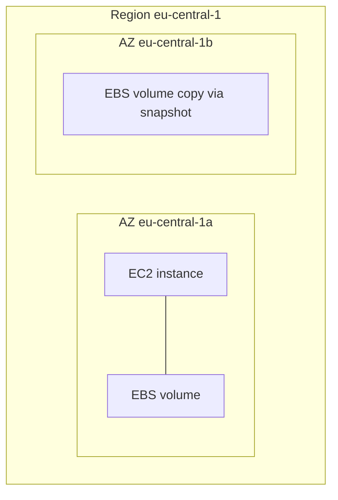

# AWS - EC2, EBS, EFS и AMI

Цель занятия - понять, как устроены **EC2**, **EBS**, **EFS** и **AMI**, как управлять дисками (подключение, расширение, LVM, снапшоты по расписанию, восстановление, свои образы), и как использовать **CLI**. 


---

## 2. Архитектура EC2

**Amazon EC2** - IaaS: виртуальная машина на физическом хосте в дата-центре AWS.

| Компонент | Назначение |
|-----------|------------|
| **Region** | географическая область (например `eu-central-1`) |
| **Availability Zone (AZ)** | изолированный ЦОД внутри региона (`eu-central-1a`) |
| **Host** | физический сервер (скрыт от пользователя) |
| **Instance** | ваша VM: vCPU, RAM, сеть, диски |
| **ENI** | сетевой интерфейс instance (private IP, SG, MAC) |
| **Placement group** | правила размещения instance на хостах (кластер/разнесение) |

Современные instance типы работают на **Nitro**: гипервизор с отдельными «карточками» для CPU/сети/EBS - меньше «шумных соседей», предсказуемее I/O.

**Важно:** instance привязан к **AZ** (subnet в VPC). EBS volume, созданный в `eu-central-1a`, нельзя attach к instance в `eu-central-1b` без копирования (snapshot → volume в другой AZ).



## 2. AMI - образ диска

**AMI (Amazon Machine Image)** - шаблон для запуска instance: корневой диск (и опционально дополнительные) + метаданные (архитектура, virtualization type, права на launch).
**Под капотом:**
- AMI ссылается на **EBS snapshot** (или набор snapshots) в S3-managed storage AWS (не ваш публичный S3 bucket).
- **Block device mapping** описывает, какой snapshot станет `/dev/xvda` (root) и какие дополнительные диски подключатся при старте.
- Публичные AMI (Amazon Linux, Ubuntu) поддерживаются AWS/партнёрами; **свой AMI** - `create-image` с running/stopped instance → новый snapshot → новый `image-id`.

Типичный поток **золотого образа**:

```text
Базовый AMI → instance + user data + пакеты → create-image → devops-lab-ami-v1
→ launch template / ASG (модуль 13.4) → N идентичных instance
```

**Copy AMI между регионами:** `aws ec2 copy-image` - для DR или запуска в другом region.

## Instance types и модели оплаты

| Категория         | Примеры                 | Когда                        |
| ----------------- | ----------------------- | ---------------------------- |
| General purpose   | `t3.micro`, `m7i.large` | веб, CI runner, учебные лабы |
| Compute optimized | `c7i.*`                 | CPU-bound                    |
| Memory optimized  | `r7i.*`                 | БД в EC2 (не RDS)            |
| Burstable         | `t3`, `t4g`             | CPU credits, дешёвые dev     |

**On-Demand** - почасовая оплата.
**Reserved / Savings Plans** - скидка за обязательство.
**Spot** - дешёвые capacity с возможностью прерывания (не для lab runner без обработки SIGTERM).

У instance есть лимиты **EBS bandwidth** и **network** - при выборе типа смотрите не только vCPU/RAM.

## Lifecycle и биллинг

```text
pending → running → stopping → stopped → starting → running
                → shutting-down → terminated
```

| Состояние | Compute | EBS | Elastic IP |
|-----------|---------|-----|------------|
| running | платите | платите | платите, если не привязан - см. ниже |
| stopped | обычно нет | платите | неиспользуемый EIP - платите |
| terminated | нет | root volume по умолчанию удаляется (`DeleteOnTermination`); data volumes - остаются, если не удалили |

**Elastic IP:** публичный IPv4, привязанный к instance - бесплатен в рамках лимита; **непривязанный** или привязанный к **stopped** instance - плата за простой.

## Key pair, Security Group, user data

- **Key pair** - AWS хранит public key; private key (`*.pem`) только у вас. SSH: `ec2-user` (AL2023), `ubuntu` (Ubuntu).
- **Security Group** - stateful firewall на ENI: правила ingress/egress. Нет «deny rule» - только allow; default deny.
- **User data** - скрипт/cloud-init при **первом** boot (и при смене user data с перезапуском - зависит от ОС). Выполняется от root; логи: `/var/log/cloud-init-output.log`.

**Instance profile** - роль EC2 → временные credentials через metadata, без ключей на диске.

## Instance Metadata Service (IMDSv1 vs IMDSv2)

Endpoint (link-local, только с instance):

```text
http://169.254.169.254/latest/meta-data/
```

**IMDSv1:** GET без заголовков - уязвим к SSRF (приложение на VM делает запрос «наружу», злоумышленник подсовывает URL metadata).
**IMDSv2:** сначала `PUT` на `/latest/api/token` с заголовком `X-aws-ec2-metadata-token-ttl-seconds`, затем GET с `X-aws-ec2-metadata-token`.
Credentials роли:

```text
/latest/meta-data/iam/security-credentials/<role-name>
```

На лабе проверьте:

```bash
TOKEN=$(curl -s -X PUT "http://169.254.169.254/latest/api/token" \
  -H "X-aws-ec2-metadata-token-ttl-seconds: 21600")
curl -s -H "X-aws-ec2-metadata-token: $TOKEN" \
  http://169.254.169.254/latest/meta-data/iam/security-credentials/
```

Рекомендация AWS: **требовать IMDSv2** на новых instance (`HttpTokens=required`).

## EBS - блочное хранилище

**EBS** - сетевой блочный диск для EC2. ОС видит его как `/dev/nvme*n*` или `/dev/xvd*`.

| Свойство | Смысл |
|----------|--------|
| **AZ-scoped** | volume в одной AZ |
| **Типы** | `gp3` (универсальный), `io2` (IOPS), `st1/sc1` (throughput HDD) |
| **Размер / IOPS** | `gp3`: базовые 3000 IOPS, можно поднять |
| **Encryption** | AES-256, ключ KMS или default AWS managed |
| **Multi-attach** | только `io1/io2` на Nitro, не для обычных ОС без кластерной ФС |

**Root volume** создаётся из snapshot AMI при `run-instances`. Флаг **DeleteOnTermination** - удалять ли диск при terminate instance.
**Под капотом:** EBS реплицируется внутри AZ на инфраструктуре AWS; snapshot - **инкрементальный** снимок блоков в durable storage (S3 backend AWS).

## Работа с дисками (операционная модель)

### Attach / detach

1. Создать volume в **той же AZ**, что instance.
2. `attach-volume` → устройство ` /dev/sdf` → в ОС часто `nvme1n1`.
3. Первый раз: `mkfs`, `mount`, `/etc/fstab` по **UUID** (не по имени `xvdf` - оно может меняться).
4. `detach-volume` - сначала `umount` в ОС.

### Расширение диска

Два уровня:

1. **AWS:** `modify-volume` - увеличить Size (и при gp3 - IOPS/throughput). Уменьшить размер EBS нельзя.
2. **ОС:** расширить partition (`growpart`) и filesystem (`resize2fs` для ext4, `xfs_growfs` для XFS).

Instance может быть **running** (online resize) для многих ФС.

### Несколько дисков и LVM

Если нужен **один mount** из нескольких EBS (расширяемый пул):

```text
EBS vol1 + EBS vol2 → pvcreate → vgcreate → lvcreate → mkfs → mount /data
```

LVM не заменяет backup; snapshot делайте на уровне EBS или приложения.

### Snapshots

- **Crash-consistent** - snapshot без остановки IO (риск для активных БД).
- **Application-consistent** - остановка сервиса, freeze FS, или AWS Systems Manager Automation.
- Snapshot **инкрементальный**: платите за изменённые блоки с прошлого snapshot.
- **Восстановление:** `create-volume` из snapshot → attach → mount (новый volume = копия данных на момент snapshot).

### DLM (Data Lifecycle Manager)

Сервис AWS для **расписания** snapshot EBS по тегам:

```text
Tag Project=devops-lab → каждые 24 ч snapshot → хранить 7 копий → удалить старые
```

Политика - отдельный ресурс `dlm:CreateLifecyclePolicy`, не cron на instance.

### Свой AMI vs snapshot

| Действие | Результат |
|----------|-----------|
| `create-snapshot` | backup volume, можно создать volume |
| `create-image` | AMI + snapshot root, можно `run-instances` |

## EFS - managed NFS

**Amazon EFS** - elastic file system (NFSv4). Несколько EC2 в **разных AZ** одного region монтируют один и тот же путь.

| | EBS | EFS | S3 |
|--|-----|-----|-----|
| Модель | block | file (NFS) | object |
| Доступ | 1 instance (обычно) | много EC2 | API/HTTP |
| Размер | фиксированный GB | растёт автоматически | неограничен |

**Mount targets** - ENI в subnet; SG mount target должен разрешать NFS (TCP 2049) от SG instance.
Performance modes: **General Purpose** vs **Max I/O**. Throughput: Bursting vs Provisioned.

# Практика

Переменные для всех блоков (**выполните в этой же shell до любых `aws` команд**):

```bash
export AWS_PROFILE=lab
export AWS_REGION=eu-central-1
export KEY_NAME=devops-lab-key
export SG_NAME=devops-lab-ec2-sg
```

Проверка credentials (должен вернуть ARN user/role, не ошибку):

```bash
aws sts get-caller-identity
```

Удобно зафиксировать profile/region в каждой команде (в т.ч. внутри `$(...)`):

```bash
aws_cmd() { aws --profile "$AWS_PROFILE" --region "$AWS_REGION" "$@"; }
```

Если вы передаёте только `--profile lab` в **одну** строку, а подстановка `$(aws ec2 describe-vpcs ...)` идёт **без** profile - AWS возьмёт **default** profile → `AuthFailure`. Либо `export AWS_PROFILE=lab`, либо `aws_cmd` везде.

## Сеть и ключ (один раз)

```bash
MY_IP=$(curl -s https://checkip.amazonaws.com)

# Обязательно: переменные не пустые (иначе MissingParameter GroupName)
: "${AWS_PROFILE:?export AWS_PROFILE=lab}"
: "${SG_NAME:?export SG_NAME=devops-lab-ec2-sg}"
echo "SG_NAME=$SG_NAME AWS_PROFILE=$AWS_PROFILE"

VPC_ID=$(aws_cmd ec2 describe-vpcs --filters Name=isDefault,Values=true \
  --query 'Vpcs[0].VpcId' --output text)
: "${VPC_ID:?VPC_ID empty - проверьте AuthFailure на describe-vpcs и region}"
echo "VPC_ID=$VPC_ID"

aws_cmd ec2 create-security-group \
  --group-name "${SG_NAME}" \
  --description "DevOps lab EC2" \
  --vpc-id "${VPC_ID}" \
  --tag-specifications 'ResourceType=security-group,Tags=[{Key=Project,Value=devops-lab}]'
```

Если ошибка `MissingParameter` GroupName сохраняется при непустом `echo SG_NAME=...`, выполните **одной строкой** (исключает ошибку переноса в zsh):

```bash
aws --profile "$AWS_PROFILE" --region "$AWS_REGION" ec2 create-security-group --group-name devops-lab-ec2-sg --description "DevOps lab EC2" --vpc-id "$VPC_ID" --tag-specifications 'ResourceType=security-group,Tags=[{Key=Project,Value=devops-lab}]'
```

Функция `aws_cmd` действует только в **той же** shell, где вы её объявили (`aws_cmd() { ... }`). Новая вкладка терминала → объявите снова и снова `export` переменных.

Если SG уже существует: `InvalidGroup.Duplicate` - переходите к `describe-security-groups`.

```bash
SG_ID=$(aws_cmd ec2 describe-security-groups --group-names "$SG_NAME" \
  --query 'SecurityGroups[0].GroupId' --output text)

aws_cmd ec2 authorize-security-group-ingress --group-id "$SG_ID" \
  --protocol tcp --port 22 --cidr "${MY_IP}/32"
aws_cmd ec2 authorize-security-group-ingress --group-id "$SG_ID" \
  --protocol tcp --port 80 --cidr "0.0.0.0/0"
```

## Запуск instance

```bash
AMI_ID=$(aws ec2 describe-images \
  --owners amazon \
  --filters "Name=name,Values=al2023-ami-2023*" "Name=architecture,Values=x86_64" \
  --query 'sort_by(Images, &CreationDate)[-1].ImageId' --output text)

aws ec2 run-instances \
  --image-id "$AMI_ID" \
  --instance-type t3.micro \
  --key-name "$KEY_NAME" \
  --security-group-ids "$SG_ID" \
  --iam-instance-profile Name=devops-lab-ec2-profile \
  --tag-specifications 'ResourceType=instance,Tags=[{Key=Name,Value=devops-lab-ec2},{Key=Project,Value=devops-lab}]' \
  --user-data file://user-data.sh \
  --metadata-options HttpTokens=optional \
  --count 1
```

`user-data.sh` (пример):

```bash
#!/bin/bash
dnf update -y
dnf install -y nginx git aws-cli
systemctl enable --now nginx
echo "hello from $(hostname)" > /usr/share/nginx/html/index.html
```

## EBS: volume, attach, snapshot, modify

```bash
INSTANCE_ID=i-0bf5c7cd0bdcc1cbb
AZ=$(aws ec2 describe-instances --instance-ids "$INSTANCE_ID" \
  --query 'Reservations[0].Instances[0].Placement.AvailabilityZone' --output text)

VOL_ID=$(aws ec2 create-volume --availability-zone "$AZ" --size 10 --volume-type gp3 \
  --tag-specifications 'ResourceType=volume,Tags=[{Key=Project,Value=devops-lab},{Key=Name,Value=devops-lab-data}]' \
  --query VolumeId --output text)

aws ec2 attach-volume --volume-id "$VOL_ID" --instance-id "$INSTANCE_ID" --device /dev/sdf
```

На instance (Amazon Linux, NVMe):

```bash
sudo lsblk
sudo mkfs -t xfs /dev/nvme1n1
sudo mkdir -p /data
sudo mount /dev/nvme1n1 /data
UUID=$(sudo blkid -s UUID -o value /dev/nvme1n1)
echo "UUID=$UUID /data xfs defaults,nofail 0 2" | sudo tee -a /etc/fstab
```

Расширение:

```bash
aws ec2 modify-volume --volume-id "$VOL_ID" --size 20
aws ec2 wait volume-in-use --volume-ids "$VOL_ID"
# на instance:
sudo growpart /dev/nvme1n1 1
sudo xfs_growfs /data
```

Snapshot и volume из snapshot:

```bash
SNAP_ID=$(aws ec2 create-snapshot --volume-id "$VOL_ID" \
  --description "devops-lab manual" --tag-specifications \
  'ResourceType=snapshot,Tags=[{Key=Project,Value=devops-lab}]' \
  --query SnapshotId --output text)

aws ec2 wait snapshot-completed --snapshot-ids "$SNAP_ID"

RESTORE_VOL=$(aws ec2 create-volume --snapshot-id "$SNAP_ID" --availability-zone "$AZ" \
  --volume-type gp3 --query VolumeId --output text)
```

## DLM - снапшоты по расписанию

Файл `dlm-policy.json`:

```json
{
  "PolicyDetails": {
    "PolicyType": "EBS_SNAPSHOT_MANAGEMENT",
    "ResourceTypes": ["VOLUME"],
    "TargetTags": [{ "Key": "Project", "Value": "devops-lab" }],
    "Schedules": [
      {
        "Name": "daily",
        "CreateRule": { "Interval": 24, "IntervalUnit": "HOURS", "Times": ["03:00"] },
        "RetainRule": { "Count": 3 },
        "CopyTags": true
      }
    ]
  },
  "State": "ENABLED",
  "Description": "DevOps lab EBS snapshots",
  "ExecutionRoleArn": "arn:aws:iam::ACCOUNT_ID:role/AWSDataLifecycleManagerDefaultRole"
}
```

Роль `AWSDataLifecycleManagerDefaultRole` создайте через Console (DLM → Create default role) или IAM. Замените `ACCOUNT_ID`.

```bash
aws dlm create-lifecycle-policy \
  --execution-role-arn "arn:aws:iam::ACCOUNT_ID:role/AWSDataLifecycleManagerDefaultRole" \
  --description "devops-lab dlm" \
  --state ENABLED \
  --policy-details file://dlm-policy.json
```

Для учебной лабы можно сократить интервал в Console или удалить policy после проверки создания **одного** snapshot.

## Свой AMI

```bash
aws ec2 create-image \
  --instance-id "$INSTANCE_ID" \
  --name "devops-lab-$(date +%Y%m%d)" \
  --no-reboot \
  --tag-specifications 'ResourceType=image,Tags=[{Key=Project,Value=devops-lab}]'

AMI_CUSTOM=ami-xxxxxxxx
aws ec2 wait image-available --image-ids "$AMI_CUSTOM"

aws ec2 run-instances \
  --image-id "$AMI_CUSTOM" \
  --instance-type t3.micro \
  --key-name "$KEY_NAME" \
  --security-group-ids "$SG_ID" \
  --tag-specifications 'ResourceType=instance,Tags=[{Key=Name,Value=devops-lab-ec2-ami}]' \
  --count 1
```

## EFS

```bash
VPC_ID=$(aws ec2 describe-vpcs --filters Name=isDefault,Values=true --query 'Vpcs[0].VpcId' --output text)
SUBNET_ID=$(aws ec2 describe-subnets --filters "Name=vpc-id,Values=$VPC_ID" \
  --query 'Subnets[0].SubnetId' --output text)

FS_ID=$(aws efs create-file-system \
  --performance-mode generalPurpose \
  --encrypted \
  --tags Key=Name,Value=devops-lab-efs Key=Project,Value=devops-lab \
  --query FileSystemId --output text)

aws efs create-mount-target --file-system-id "$FS_ID" --subnet-id "$SUBNET_ID" \
  --security-groups "$SG_ID"

aws ec2 authorize-security-group-ingress --group-id "$SG_ID" \
  --protocol tcp --port 2049 --source-group "$SG_ID"
```

На instance:

```bash
sudo dnf install -y amazon-efs-utils
sudo mkdir -p /mnt/efs
sudo mount -t efs -o tls "$FS_ID":/ /mnt/efs
echo "$FS_ID:/ /mnt/efs efs _netdev,tls 0 0" | sudo tee -a /etc/fstab
echo "shared-$(hostname)" | sudo tee /mnt/efs/test.txt
```

## Задания для самостоятельного выполнения

### Предусловия

- Admin profile `lab`, region `eu-central-1`.
- Создана роля для доступа к s3
- Key pair `devops-lab-key.pem`, `chmod 400`.

---

### Instance profile (если ещё нет)

```bash
aws iam get-instance-profile --instance-profile-name devops-lab-ec2-profile --profile lab
```

Ожидается роль `devops-lab-ec2-s3-role` внутри profile.

---

### Launch EC2, SSH, nginx

1. Создайте SG и правила.
2. `run-instances` с `devops-lab-ec2-profile`, user data, теги `Name=devops-lab-ec2`, `Project=devops-lab`.
3. Дождитесь `running`, возьмите public IP.

```bash
INSTANCE_ID=$(aws ec2 describe-instances \
  --filters "Name=tag:Name,Values=devops-lab-ec2" "Name=instance-state-name,Values=running" \
  --query 'Reservations[0].Instances[0].InstanceId' --output text)

PUBLIC_IP=$(aws ec2 describe-instances --instance-ids "$INSTANCE_ID" \
  --query 'Reservations[0].Instances[0].PublicIpAddress' --output text)

ssh -i devops-lab-key.pem ec2-user@"$PUBLIC_IP"
curl -s "http://$PUBLIC_IP"
```

**Ожидаемый результат:** HTML с `hello from ip-...`.

---

### EBS: data volume, grow, snapshot, DLM, restore

**C1.** Создайте 10 GiB `gp3` volume в AZ instance, attach `/dev/sdf`, смонтируйте в `/data` (§3.3).
**C2.** Запишите файл `sudo dd if=/dev/urandom of=/data/lab.bin bs=1M count=5`.
**C3.** `modify-volume` → 20 GiB → `growpart` + `xfs_growfs` (или `resize2fs` для ext4).
**C4.** `create-snapshot`, дождитесь `completed`.
**C5.** Создайте DLM policy на тег `Project=devops-lab` (§3.4) или вручную второй snapshot для демонстрации retention.
**C6.** `create-volume` из snapshot → attach как `/dev/sdg` → смонтируйте в `/restore` → убедитесь, что `lab.bin` на месте.
**C7 (опционально LVM).** Второй 5 GiB volume → `pvcreate` на обоих PV → `vgcreate vg_data` → `lvcreate` → mount `/data_lvm`.

---

### Custom AMI

1. На `devops-lab-ec2` установите пакет-маркер: `echo lab-v1 | sudo tee /etc/devops-lab-marker`.
2. `create-image --no-reboot` → `wait image-available`.
3. Запустите второй instance из AMI, тег `devops-lab-ec2-ami`.
4. SSH на новый instance: `cat /etc/devops-lab-marker` → `lab-v1`.

Зафиксируйте `AMI_CUSTOM` и `INSTANCE_AMI` для cleanup.

---

### EFS

1. Создайте filesystem и mount target.
2. Смонтируйте на `devops-lab-ec2`.
3. (Рекомендуется) Запустите второй micro-instance в той же VPC/subnet, смонтируйте тот же EFS, прочитайте `test.txt` с первого хоста.

Если второй instance не запускаете - опишите в отчёте шаги для multi-AZ mount.

---

### GitLab Runner 

На primary EC2:

```bash
curl -L --output /tmp/gitlab-runner.rpm \
  https://gitlab-runner-downloads.s3.amazonaws.com/latest/rpm/gitlab-runner_amd64.rpm
sudo rpm -i /tmp/gitlab-runner.rpm
sudo gitlab-runner --version
sudo gitlab-runner register --non-interactive \
  --url "https://gitlab.com/" \
  --token "YOUR_REGISTRATION_TOKEN" \
  --executor "shell" \
  --description "aws-ec2-shell-runner" \
  --tag-list "aws,ec2,shell" \
  --run-untagged="false" \
  --locked="false"
sudo gitlab-runner verify
sudo systemctl status gitlab-runner
```

В GitLab UI: **Settings → CI/CD → Runners** - статус **online**.

Тестовый `.gitlab-ci.yml`:

```yaml
test_runner:
  tags: [aws, ec2, shell]
  script:
    - hostname
    - aws sts get-caller-identity
```

Job должен выполниться на EC2 и показать ARN **роли** instance (не вашего user).

---

## Cost warning

| Ресурс | Риск |
|--------|------|
| EC2 t3.micro | free tier / почасовая оплата |
| EBS volumes | плата за GB-месяц |
| Snapshots | плата за хранение изменённых блоков |
| DLM | стоимость snapshots по расписанию |
| Custom AMI | snapshot storage |
| EFS | плата за GB + throughput |
| Elastic IP не привязан | плата |
| GitLab Runner | compute EC2 |

Не оставляйте второй instance и restore volumes после лабы.

---

## Troubleshooting

| Симптом | Что проверить |
|---------|---------------|
| `AuthFailure` на `describe-vpcs` | В `$(aws ...)` нет того же profile, что у внешней команды: сделайте `export AWS_PROFILE=lab` или `aws_cmd`. Проверка: `aws sts get-caller-identity --profile lab`. |
| `MissingParameter` GroupName | Пустой `$SG_NAME`: `echo "[$SG_NAME]"` - должно быть `devops-lab-ec2-sg`. Заново `export SG_NAME=devops-lab-ec2-sg` в **этой** shell. Нет `aws_cmd` в новой вкладке. Проверка: `: "${SG_NAME:?}"`. |
| SSH timeout | SG port 22, ваш IP изменился, public IP, `chmod 400` |
| `InvalidParameterValue` attach | volume AZ ≠ instance AZ |
| Диск не виден в ОС | NVMe имя (`lsblk`), не `/dev/sdf` |
| `growpart` не находит partition | номер partition, для NVMe `nvme1n1p1` |
| Snapshot `pending` долго | размер volume, подождите `wait snapshot-completed` |
| DLM не создаёт snapshots | ExecutionRoleArn, теги на volume, policy ENABLED, 1–2 ч задержка |
| AMI `pending` | `wait image-available` |
| EFS mount timeout | SG 2049, mount target в subnet instance, `amazon-efs-utils` |
| Runner offline | token, URL, `gitlab-runner` service, outbound 443 |
| IMDS пустой | instance profile при launch, не после terminate |

---

## Чеклист по практике

- [ ] EC2 запущен, SSH и nginx работают.
- [ ] Data volume смонтирован, расширен до 20 GiB.
- [ ] Snapshot создан, volume восстановлен из snapshot.
- [ ] DLM policy создана (или объяснена альтернатива).
- [ ] Свой AMI создан, второй instance из AMI работает.
- [ ] EFS смонтирован, общий файл виден (или описан второй host).
- [ ] GitLab Runner online, job с тегами выполнен.
- [ ] boto3: snapshot или create_image выполнен скриптом.
- [ ] Cleanup: instances, volumes, snapshots, AMI, EFS удалены.

## Вопросы для самоконтроля:

- объяснить архитектуру EC2 (AZ, ENI, Nitro, lifecycle);
- создать и использовать **свой AMI**, запустить instance из него;
- работать с **EBS**: attach/detach, расширить volume и ФС, snapshot, **DLM** по расписанию, volume из snapshot;
- опционально объединить диски через **LVM**;
- смонтировать **EFS** на instance (общий NFS);
- запустить **GitLab Runner** (shell executor) на EC2;
- вызывать те же операции через `aws ec2` / `aws dlm` / `aws efs` и **boto3**.
