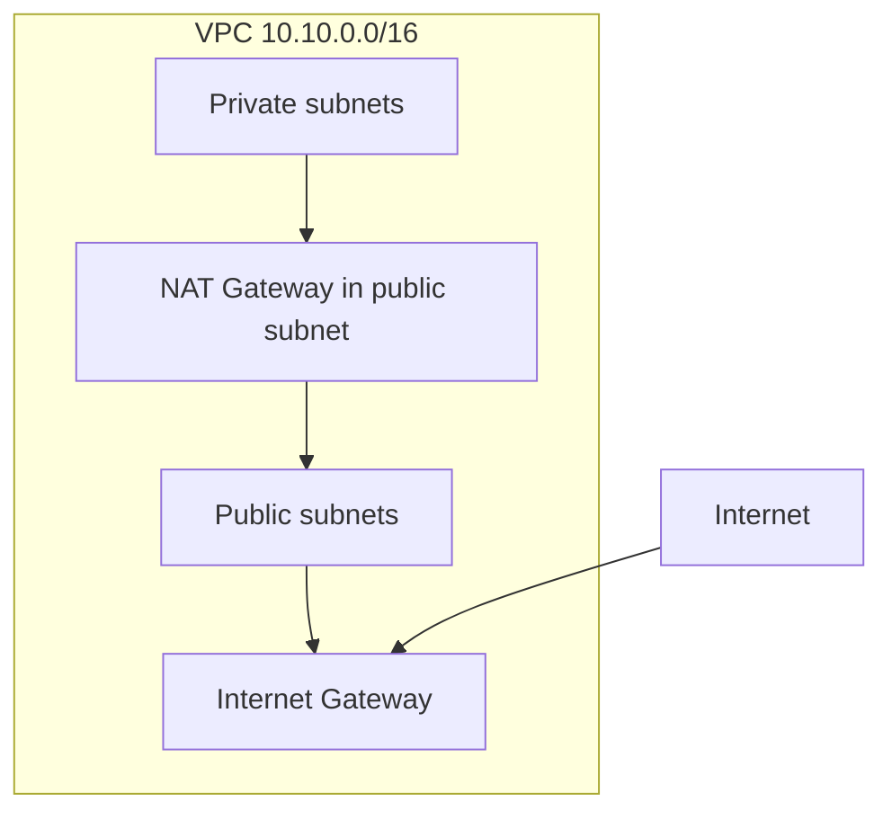

# VPC, маршрутизация, NAT и Security Groups

Цель — понять **VPC** как основу сети AWS: subnets, маршруты, Internet Gateway, NAT, Security Groups и NACL. 


## 2. Теория

### 2.1. VPC под капотом

**VPC** — изолированная L3-сеть в **одном region**. У каждой VPC свой CIDR (например `10.10.0.0/16` → 65 536 адресов) из них AWS зарезервирует 5 адресов в каждом subnet. В каждой подсети (Subnet) AWS резервирует **первые 4 IP-адреса и последний IP-адрес** диапазона. Это сделано для работы сетевой инфраструктуры AWS.
Зарезервированы будут:

| IP         | Назначение                     |                                                                                                                                                                                                                              |
| ---------- | ------------------------------ | ---------------------------------------------------------------------------------------------------------------------------------------------------------------------------------------------------------------------------- |
| 10.0.0.0   | Network Address                | Это адрес самой сети. Как и в обычных IP-сетях, его нельзя назначить хосту.                                                                                                                                                  |
| 10.0.0.1   | VPC Router                     | Это виртуальный маршрутизатор AWS.<br>Через него работает:<br>- маршрутизация между subnet'ами<br>- Internet Gateway<br>- NAT Gateway<br>- VPN Gateway<br>- Transit Gateway<br>Фактически это default gateway для инстансов. |
| 10.0.0.2   | Amazon DNS                     | Встроенный DNS AWS.<br>Через него работают:<br>- Private Hosted Zones<br>- внутренние DNS-имена EC2<br>- разрешение имён сервисов AWS                                                                                        |
| 10.0.0.3   | Reserved for AWS               | Специальный служебный адрес AWS.<br>Не используется клиентами.<br>AWS оставляет его под внутренние сервисы.                                                                                                                  |
| 10.0.0.255 | Broadcast (зарезервирован AWS) | В классических сетях это broadcast.<br>В AWS широковещательные пакеты вообще не поддерживаются, но адрес всё равно резервируется.                                                                                            |

| Компонент | Роль |
|-----------|------|
| **Implicit router** | маршрутизирует между subnets одной VPC |
| **Subnet** | часть CIDR, привязана к **одной AZ** |
| **Route table** | куда отправлять пакеты (local, IGW, NAT, peering, TGW…) |
| **ENI** | сетевой интерфейс EC2/RDS/Lambda в VPC |

VPC **regional**: subnets в `eu-central-1a` и `eu-central-1b` — одна логическая сеть, разные AZ для отказоустойчивости.
Что такое Tenancy
Определяет физическое размещение EC2 на серверах AWS.
1.  Default Самый дешёвый вариант. Ваши EC2 размещаются на общих физических хостах AWS. Но виртуально полностью изолированы. Используется в 99% случаев.
2. Dedicated - Инстансы запускаются на выделенном оборудовании. Используется если есть требования:
	- лицензирования Oracle
	- лицензирования Windows
	- PCI DSS
	- требования регуляторов
Минус Dedicated - Очень дорого. Иногда в несколько раз дороже.

### 2.2. Public vs private subnet

Subnet **не** «public» по названию. Критерий — **route table**:

```text
Public:  0.0.0.0/0 → igw-xxxx (Internet Gateway)
Private: нет маршрута на IGW; outbound часто 0.0.0.0/0 → nat-xxxx
```

Дополнительно для instance в public subnet:

- **Auto-assign public IPv4** на launch (или Elastic IP);
- SG разрешает нужный ingress.

**Private** instance без NAT **не** инициирует исходящий доступ в интернет (updates, `curl` API), но может принимать трафик **изнутри VPC** (например от ALB).


# Современный production-шаблон


```
VPC 10.0.0.0/16AZ-a:  
Public    10.0.0.0/20
Private   10.0.32.0/19
Database  10.0.96.0/20
AZ-b:  
Public    10.0.16.0/20  
Private   10.0.64.0/19  
Database  10.0.112.0/20
```

Где:

- Public — только ALB и NAT Gateway.
- Private — EKS/ECS/приложения.
- Database — RDS и кэши.
- Все рабочие нагрузки находятся в private subnet.
- Единственная точка входа из Интернета — Load Balancer.

Именно такую схему рекомендует AWS для большинства production-систем.

### 2.3. Route tables

- **Main route table** — по умолчанию для subnet без явной association.
- **Custom route table** — обычно отдельно для public и private subnets.

Обязательный маршрут:

```text
10.10.0.0/16 → local (внутри VPC)
```

**Асимметрия:** return path должен совпадать с outbound (типичная ошибка при NAT/NACL).

### 2.4. Internet Gateway (IGW) — подробно

**Internet Gateway (IGW)** — управляемый AWS шлюз на границе **VPC ↔ публичный интернет**. Это не EC2 и не «роутер в subnet» — отдельный тип ресурса `aws_internet_gateway` / `igw-xxxxxxxx`.

#### 2.4.1. Прикрепляется к VPC (один IGW на VPC)

| Факт | Пояснение |
|------|-----------|
| IGW **attach** к **VpcId** | Связь «эта VPC может обмениваться трафиком с интернетом через этот шлюз» |
| Рекомендация AWS | **Один** IGW на одну VPC (достаточно для всей сети) |
| Технически | Можно attach второй IGW к той же VPC — редко нужно; маршрутизация усложняется |
| Без attach | IGW существует, но **не работает** для VPC — как «неподключённый кабель» |

```bash
# Создание и привязка (лаба §3.1)
create-internet-gateway
attach-internet-gateway --internet-gateway-id igw-xxx --vpc-id vpc-xxx
```

**Detach** возможен только если в VPC нет зависимостей (часто мешают ENI с public IP, маршруты `0.0.0.0/0 → igw`). Перед удалением VPC сначала detach/delete IGW.
**Связь с route table:** сам по себе IGW ничего не маршрутизует. Subnet должна иметь маршрут:

```text
0.0.0.0/0  →  igw-xxxxxxxx
```


#### 2.4.2. Horizontal scaling, redundant

| Что это **не** значит | Что это **значит** |
|----------------------|-------------------|
| Не «одна маленькая VM, которую надо масштабировать» | AWS масштабирует **свою** сторону IGW под нагрузку |
| Не вы выбираете instance type для IGW | Нет `t3.micro` для IGW — сервис **managed** |
| Не HA-кластер **внутри** вашей subnet | Отказоустойчивость **на стороне AWS** (несколько AZ инфраструктуры шлюза) |

Для инженера: не настраиваете CPU/RAM IGW, не патчите ОС, не ставите IGW в **две** subnet «для HA» — один logical IGW на VPC, AWS обеспечивает пропускную способность.

**Ограничение AZ:** IGW — **regional** ресурс для VPC, но **исходящий/входящий** трафик instance всё равно идёт через subnet/AZ, где сидит ENI. Падение **одной** AZ не «ломает» IGW целиком, но instance в этой AZ недоступны.

#### 2.4.3. Не ставится «внутрь» subnet — VPC-level gateway

```text
        Internet
            │
      ┌─────▼─────┐
      │    IGW    │  ← не «в» 10.10.1.0/24, а на границе VPC
      └─────┬─────┘
            │
   ┌────────┴────────┐
   │  VPC 10.10.0.0/16 │
   │  ┌─────────────┐  │
   │  │ public sn   │  │  route 0.0.0.0/0 → igw
   │  │ 10.10.1.0/24│  │
   │  └─────────────┘  │
   │  ┌─────────────┐  │
   │  │ private sn  │  │  без маршрута на igw (или через NAT)
   │  └─────────────┘  │
   └───────────────────┘
```

| Сравнение | IGW | NAT Gateway |
|-----------|-----|-------------|
| Уровень | **VPC** | **Subnet** (ENI в public subnet) |
| В Console | VPC → Internet gateways | Subnet → виден NAT в AZ |
| CLI create | `create-internet-gateway` + `attach` | `create-nat-gateway --subnet-id ...` |

Путаница на лабе: «поставили IGW в public subnet» — **неверная модель**. В public subnet ставят **NAT Gateway** (и EC2/ALB). IGW **привязан к VPC**, маршрут из subnet **указывает** на `igw-id`.

#### 2.4.4. Bidirectional internet для ресурсов с public IP в public subnet

**Bidirectional** = входящий **и** исходящий трафик между интернетом и ресурсом с **публичным IPv4** (если SG/NACL разрешают).

**Исходящий (instance → интернет):**

```text
EC2 10.10.1.50 (public IP 3.x.x.x)
  → subnet RT: 0.0.0.0/0 → IGW
  → IGW SNAT не нужен для «своего» public IP — ответы идут с этого public IP
  → Internet
```

**Входящий (интернет → instance):**

```text
Клиент → DNS/прямой IP 3.x.x.x
  → IGW знает, какой ENI в VPC владеет этим public IP (mapping)
  → пакет на private 10.10.1.50 (DNAT на границе)
  → SG inbound :22 / :80 должен разрешить
```

| Условие | Нужно для работы |
|---------|------------------|
| Public subnet | RT: `0.0.0.0/0 → igw` |
| Public IPv4 на ENI | Auto-assign public IP, Elastic IP, или ALB (у ALB своя схема) |
| Security Group | Inbound с нужных портов (22, 80, …) |
| **Private** subnet без NAT | IGW **не** даёт private-only instance выход в интернет |
| **Private** IP без public | Inbound из интернета **напрямую** на чистый private IP **не** идёт через IGW |

**Почему private + только IGW attached недостаточно:**

- У instance в private subnet **нет** публичного IPv4 в интернет-таблицах AWS.
- Маршрут `0.0.0.0/0 → igw` в private RT без NAT для **исходящего** с private IP не даёт полноценного выхода (и не заменяет SNAT).
- Для private исходящего нужен **NAT Gateway** (`0.0.0.0/0 → nat-xxx`) или другой egress.

**Отличие IGW от NAT (направление):**

| | IGW | NAT Gateway |
|--|-----|-------------|
| Inbound из интернета на **ваш** public IP | Да (если SG разрешает) | Нет (NAT не принимает inbound с интернета на private) |
| Outbound из **private** subnet | Нет (без public IP / без NAT) | Да (SNAT на EIP NAT) |
| Где в лабе | Public EC2, ALB (схема иная) | Private EC2 → `curl` в интернет |

#### 2.4.5. Чеклист «IGW настроен правильно»

- [ ] `describe-internet-gateways` — `Attachments[].VpcId` = ваша VPC
- [ ] Public route table: `0.0.0.0/0` → `igw-...`
- [ ] Public subnet associated с **этой** RT (не main без igw)
- [ ] `map-public-ip-on-launch` или EIP, если нужен SSH/curl с instance
- [ ] SG разрешает нужный трафик (timeout часто = SG, не IGW)

#### 2.4.6. Типичные заблуждения

| Заблуждение | Реальность |
|-------------|------------|
| «IGW в каждой AZ» | Один IGW на VPC; AZ задают subnet |
| «Attached IGW = весь VPC в интернете» | Только subnet с маршрутом на igw + public IP (или NAT для private egress) |
| «Bidirectional = без SG» | IGW не заменяет firewall; SG обязателен |
| «Тот же IGW что NAT» | Разные ресурсы; NAT в subnet, IGW на VPC |

### 2.5. NAT Gateway vs NAT Instance

| | NAT Gateway | NAT Instance (legacy) |
|--|-------------|------------------------|
| Управление | managed AWS | ваш EC2 |
| HA | в AZ, при падении AZ — пересоздать | сами |
| Стоимость | часы + GB processed | EC2 + EIP |
| Размещение | **public subnet** | public subnet |

**NAT Gateway** использует **Elastic IP**. Private subnet route: `0.0.0.0/0 → nat-xxx`.

### 2.6. Security Groups

**Stateful:** разрешили inbound → ответный outbound разрешён автоматически.

- Привязка к **ENI** (EC2, ALB, RDS interface…).
- Правила только **Allow**, нет Deny.
- Можно ссылаться на другой SG: `SourceSecurityGroupId=sg-alb` → app принимает только от ALB.

### 2.7. NACL

**Stateless** — нужны явные inbound **и** outbound. Нумерация правил (100, 110…). Default NACL разрешает всё.
Полезно для грубой изоляции subnet; легко сломать **ephemeral ports** (ответы TCP).
Для курса: достаточно SG; NACL — опциональная лаба D.

### 2.8. VPC Endpoints (кратко)

- **Gateway endpoint** (S3, DynamoDB) — маршрут в route table, трафик не идёт в интернет/NAT.
- **Interface endpoint** (многие API) — ENI в subnet, PrivateLink.

Зачем: private EC2 → S3 без NAT (экономия и безопасность).

### 2.9. Elastic IP

Публичный IPv4, привязанный к instance или NAT GW. **Непривязанный** EIP — плата за простой.

### 2.10. RDS и private subnet

Managed RDS обычно в **private subnets** (DB subnet group). Доступ:

- приложение в private subnet через SG (port 5432/3306);
- не `0.0.0.0/0` на БД.

---

## 3. Практика

```bash
export AWS_PROFILE=lab
export AWS_REGION=eu-central-1
export VPC_CIDR=10.10.0.0/16
aws_cmd() { aws --profile "$AWS_PROFILE" --region "$AWS_REGION" "$@"; }
aws sts get-caller-identity
```

Две AZ для лабы:

```bash
AZ1=$(aws_cmd ec2 describe-availability-zones \
  --query 'AvailabilityZones[0].ZoneName' --output text)
AZ2=$(aws_cmd ec2 describe-availability-zones \
  --query 'AvailabilityZones[1].ZoneName' --output text)
echo "$AZ1 $AZ2"
```

### 3.1. VPC, IGW, subnets

```bash
VPC_ID=$(aws_cmd ec2 create-vpc --cidr-block "$VPC_CIDR" \
  --tag-specifications 'ResourceType=vpc,Tags=[{Key=Name,Value=devops-lab-vpc},{Key=Project,Value=devops-lab}]' \
  --query Vpc.VpcId --output text)
aws_cmd ec2 modify-vpc-attribute --vpc-id "$VPC_ID" --enable-dns-hostnames

IGW_ID=$(aws_cmd ec2 create-internet-gateway \
  --tag-specifications 'ResourceType=internet-gateway,Tags=[{Key=Project,Value=devops-lab}]' \
  --query InternetGateway.InternetGatewayId --output text)
aws_cmd ec2 attach-internet-gateway --internet-gateway-id "$IGW_ID" --vpc-id "$VPC_ID"

PUB1=$(aws_cmd ec2 create-subnet --vpc-id "$VPC_ID" --cidr-block 10.10.1.0/24 --availability-zone "$AZ1" \
  --tag-specifications 'ResourceType=subnet,Tags=[{Key=Name,Value=devops-lab-public-1}]' --query Subnet.SubnetId --output text)
PUB2=$(aws_cmd ec2 create-subnet --vpc-id "$VPC_ID" --cidr-block 10.10.2.0/24 --availability-zone "$AZ2" \
  --tag-specifications 'ResourceType=subnet,Tags=[{Key=Name,Value=devops-lab-public-2}]' --query Subnet.SubnetId --output text)
PRIV1=$(aws_cmd ec2 create-subnet --vpc-id "$VPC_ID" --cidr-block 10.10.11.0/24 --availability-zone "$AZ1" \
  --tag-specifications 'ResourceType=subnet,Tags=[{Key=Name,Value=devops-lab-private-1}]' --query Subnet.SubnetId --output text)
PRIV2=$(aws_cmd ec2 create-subnet --vpc-id "$VPC_ID" --cidr-block 10.10.12.0/24 --availability-zone "$AZ2" \
  --tag-specifications 'ResourceType=subnet,Tags=[{Key=Name,Value=devops-lab-private-2}]' --query Subnet.SubnetId --output text)

aws_cmd ec2 modify-subnet-attribute --subnet-id "$PUB1" --map-public-ip-on-launch
aws_cmd ec2 modify-subnet-attribute --subnet-id "$PUB2" --map-public-ip-on-launch
```

### 3.2. Route tables

```bash
RT_PUBLIC=$(aws_cmd ec2 create-route-table --vpc-id "$VPC_ID" \
  --tag-specifications 'ResourceType=route-table,Tags=[{Key=Name,Value=devops-lab-rt-public}]' \
  --query RouteTable.RouteTableId --output text)
aws_cmd ec2 create-route --route-table-id "$RT_PUBLIC" --destination-cidr-block 0.0.0.0/0 --gateway-id "$IGW_ID"
aws_cmd ec2 associate-route-table --route-table-id "$RT_PUBLIC" --subnet-id "$PUB1"
aws_cmd ec2 associate-route-table --route-table-id "$RT_PUBLIC" --subnet-id "$PUB2"

RT_PRIVATE=$(aws_cmd ec2 create-route-table --vpc-id "$VPC_ID" \
  --tag-specifications 'ResourceType=route-table,Tags=[{Key=Name,Value=devops-lab-rt-private}]' \
  --query RouteTable.RouteTableId --output text)
aws_cmd ec2 associate-route-table --route-table-id "$RT_PRIVATE" --subnet-id "$PRIV1"
aws_cmd ec2 associate-route-table --route-table-id "$RT_PRIVATE" --subnet-id "$PRIV2"
```

### 3.3. Security Groups

```bash
MY_IP=$(curl -s https://checkip.amazonaws.com)

ALB_SG=$(aws_cmd ec2 create-security-group --group-name devops-lab-alb-sg \
  --description "ALB lab SG" --vpc-id "$VPC_ID" --query GroupId --output text)
APP_SG=$(aws_cmd ec2 create-security-group --group-name devops-lab-app-sg \
  --description "App lab SG" --vpc-id "$VPC_ID" --query GroupId --output text)

aws_cmd ec2 authorize-security-group-ingress --group-id "$ALB_SG" --protocol tcp --port 80 --cidr 0.0.0.0/0
aws_cmd ec2 authorize-security-group-ingress --group-id "$APP_SG" --protocol tcp --port 80 \
  --source-group "$ALB_SG"
aws_cmd ec2 authorize-security-group-ingress --group-id "$APP_SG" --protocol tcp --port 22 --cidr "${MY_IP}/32"
```

```bash
echo "VPC_ID=$VPC_ID PUB1=$PUB1 PUB2=$PUB2 PRIV1=$PRIV1 PRIV2=$PRIV2 ALB_SG=$ALB_SG APP_SG=$APP_SG RT_PRIVATE=$RT_PRIVATE"
```

### 3.4. NAT Gateway (обратите внимание на стоимость)

```bash
EIP_ALLOC=$(aws_cmd ec2 allocate-address --domain vpc --query AllocationId --output text)
NAT_ID=$(aws_cmd ec2 create-nat-gateway --subnet-id "$PUB1" --allocation-id "$EIP_ALLOC" \
  --tag-specifications 'ResourceType=natgateway,Tags=[{Key=Project,Value=devops-lab}]' \
  --query 'NatGateway.NatGatewayId' --output text)
echo "NAT_ID=$NAT_ID"
# если пусто — не запускайте wait/create-route; исправьте ошибку выше
aws_cmd ec2 wait nat-gateway-available --nat-gateway-ids "$NAT_ID"
aws_cmd ec2 create-route --route-table-id "$RT_PRIVATE" --destination-cidr-block 0.0.0.0/0 --nat-gateway-id "$NAT_ID"
```

Проверка: с **private** VM (§3.5, jump через public) → `curl` возвращает IP **NAT** (EIP), не IP public VM. **Удалите NAT в течение 15–30 мин.**

```bash
aws_cmd ec2 delete-nat-gateway --nat-gateway-id "$NAT_ID"
aws_cmd ec2 wait nat-gateway-deleted --nat-gateway-ids "$NAT_ID"
aws_cmd ec2 release-address --allocation-id "$EIP_ALLOC"
aws_cmd ec2 delete-route --route-table-id "$RT_PRIVATE" --destination-cidr-block 0.0.0.0/0
```

### 3.5. Две EC2: public vs private (демо интернета)

Цель — на практике увидеть разницу **маршрутизации**, а не только схему на доске:

| VM | Subnet | Public IPv4 | Маршрут в интернет | `curl` к интернету |
|----|--------|-------------|--------------------|--------------------|
| **public** | `PUB1` | да (auto-assign) | `0.0.0.0/0 → IGW` | работает |
| **private** | `PRIV1` | нет | только `local` (без NAT) | **таймаут** |

Выполняйте **после** §3.2 (route tables) и **до** опционального NAT (§3.4). После демо instance **terminate** (перед 13.4.2 ALB/ASG не нужны).

#### SG и ключ для демо-VM

Отдельная SG, чтобы не смешивать с ALB/app из §3.3:

```bash
DEMO_SG=$(aws_cmd ec2 create-security-group --group-name devops-lab-demo-sg \
  --description "Demo public/private EC2" --vpc-id "$VPC_ID" --query GroupId --output text)

# SSH с вашей машины на public VM
aws_cmd ec2 authorize-security-group-ingress --group-id "$DEMO_SG" --protocol tcp --port 22 --cidr "${MY_IP}/32"
# SSH с public VM на private (внутри VPC)
aws_cmd ec2 authorize-security-group-ingress --group-id "$DEMO_SG" --protocol tcp --port 22 --cidr 10.10.0.0/16
# Исходящий трафик (для curl) — по умолчанию egress allow all; явно не требуется
```

Ключ (один раз на аккаунт/регион; если уже есть — пропустите create):

```bash
KEY_NAME=devops-lab-net-key
aws_cmd ec2 describe-key-pairs --key-names "$KEY_NAME" &>/dev/null || \
  aws_cmd ec2 create-key-pair --key-name "$KEY_NAME" \
    --query 'KeyMaterial' --output text > "${KEY_NAME}.pem"
chmod 600 "${KEY_NAME}.pem"
```

AMI Amazon Linux 2023:

```bash
AMI_ID=$(aws_cmd ec2 describe-images --owners amazon \
  --filters "Name=name,Values=al2023-ami-2023*" "Name=architecture,Values=x86_64" \
  --query 'sort_by(Images, &CreationDate)[-1].ImageId' --output text)
echo "AMI_ID=$AMI_ID"
```

#### Запуск instance

```bash
VM_PUBLIC=$(aws_cmd ec2 run-instances \
  --image-id "$AMI_ID" \
  --instance-type t3.micro \
  --key-name "$KEY_NAME" \
  --subnet-id "$PUB1" \
  --security-group-ids "$DEMO_SG" \
  --tag-specifications 'ResourceType=instance,Tags=[{Key=Name,Value=devops-lab-vm-public},{Key=Project,Value=devops-lab}]' \
  --query 'Instances[0].InstanceId' --output text)

VM_PRIVATE=$(aws_cmd ec2 run-instances \
  --image-id "$AMI_ID" \
  --instance-type t3.micro \
  --key-name "$KEY_NAME" \
  --subnet-id "$PRIV1" \
  --security-group-ids "$DEMO_SG" \
  --no-associate-public-ip-address \
  --tag-specifications 'ResourceType=instance,Tags=[{Key=Name,Value=devops-lab-vm-private},{Key=Project,Value=devops-lab}]' \
  --query 'Instances[0].InstanceId' --output text)

aws_cmd ec2 wait instance-running --instance-ids "$VM_PUBLIC" "$VM_PRIVATE"

PUB_IP=$(aws_cmd ec2 describe-instances --instance-ids "$VM_PUBLIC" \
  --query 'Reservations[0].Instances[0].PublicIpAddress' --output text)
PRIV_IP=$(aws_cmd ec2 describe-instances --instance-ids "$VM_PRIVATE" \
  --query 'Reservations[0].Instances[0].PrivateIpAddress' --output text)
echo "Public VM:  $VM_PUBLIC  $PUB_IP"
echo "Private VM: $VM_PRIVATE  $PRIV_IP (только private IP)"
```

#### Проверка: интернет есть / нет

**1) Public VM** — с ноутбука:

```bash
ssh -i "${KEY_NAME}.pem" -o StrictHostKeyChecking=accept-new ec2-user@"$PUB_IP" \
  'curl -s --connect-timeout 5 https://checkip.amazonaws.com && echo'
```

Ожидаемо: публичный IP (EIP или auto-assign public).

**2) Private VM** — только через jump с public (прямого SSH с интернета нет). На private тот же key pair — используйте **SSH agent forwarding** (`-A`):

```bash
eval "$(ssh-agent -s)"
ssh-add "${KEY_NAME}.pem"

ssh -A -i "${KEY_NAME}.pem" -o StrictHostKeyChecking=accept-new ec2-user@"$PUB_IP" \
  "curl -s --connect-timeout 5 https://checkip.amazonaws.com && echo ' (public OK)'"

ssh -A -i "devops-lab-key.pem" -o StrictHostKeyChecking=accept-new ec2-user@$PUB_IP \
  "ssh -o StrictHostKeyChecking=accept-new ec2-user@10.10.11.154 \
    'curl -s --connect-timeout 5 https://checkip.amazonaws.com || echo NO_INTERNET'"
```

Ожидаемо на **private**: `NO_INTERNET` или пустой вывод после таймаута — нет маршрута `0.0.0.0/0` в private route table (NAT ещё не создан).

**3) После опционального NAT (§3.4)** — повторите команду из private: `curl` должен вернуть IP **NAT Gateway** (EIP), не IP public VM.

#### Почему так (кратко)

- **Public VM:** subnet → route `0.0.0.0/0 → IGW` + public IP на ENI → пакет уходит в интернет.
- **Private VM:** только `10.10.0.0/16 → local`; без NAT пакет на `0.0.0.0/0` **некуда** отправить (implicit router не маршрутизует в IGW из private subnet без маршрута).

#### Удаление демо-VM (перед 13.4.2)

```bash
aws_cmd ec2 terminate-instances --instance-ids "$VM_PUBLIC" "$VM_PRIVATE"
aws_cmd ec2 wait instance-terminated --instance-ids "$VM_PUBLIC" "$VM_PRIVATE"
# DEMO_SG можно оставить или удалить после terminate:
# aws_cmd ec2 delete-security-group --group-id "$DEMO_SG"
```

## Cost warning

| Ресурс | Риск |
|--------|------|
| 2× `t3.micro` (демо VM) | часы, пока не `terminate` |
| NAT Gateway | плата за час + traffic |
| Elastic IP | непривязанный EIP |
| IPv4 address | новые публичные IPv4 могут тарифицироваться (проверьте актуальный pricing) |

---

## Troubleshooting

| Симптом | Проверка |
|---------|----------|
| `AuthFailure` | `export AWS_PROFILE=lab`, `aws_cmd` в `$(...)` |
| Subnet без internet | RT association, IGW attach, map public IP |
| Private no outbound | NAT route в **private** RT, NAT в **public** subnet |
| `nat-gateway` not valid taggable resource | В `--tag-specifications` должно быть `ResourceType=natgateway`, не `nat-gateway` |
| `InvalidNatGatewayId` / `NAT_ID` пустой | `create-nat-gateway` упал — сначала исправьте NAT, потом `wait` и `create-route` |
| SSH на private с ноутбука не работает | это ожидаемо — только jump с public VM или SSM |
| `curl` на private «висит» | нет default route — нужен NAT или это демо «без интернета» |
| SG rule fails | same VPC, `--source-group` vs `--cidr` |
| Can't delete VPC | остались EC2, ENI, ALB, NAT, subnets |

---

## Чеклист

### Практика

- [ ] VPC `10.10.0.0/16`, 2 public + 2 private subnets в 2 AZ.
- [ ] IGW, public route `0.0.0.0/0 → IGW`.
- [ ] SG alb + app (80 от alb-sg).
- [ ] Две demo EC2: public `curl` OK, private `curl` fail без NAT.
- [ ] Demo EC2 terminated перед 13.4.2.
- [ ] NAT создан, private `curl` через NAT OK, NAT удалён

### Теория

- объяснить CIDR, subnet, route table, local route;
- отличать **public** и **private** subnet по маршрутам;
- отличать **Internet Gateway** и **NAT Gateway**;
- отличать **Security Group** от **NACL**;
- понимать, зачем RDS живёт в private subnet + DB subnet group.

