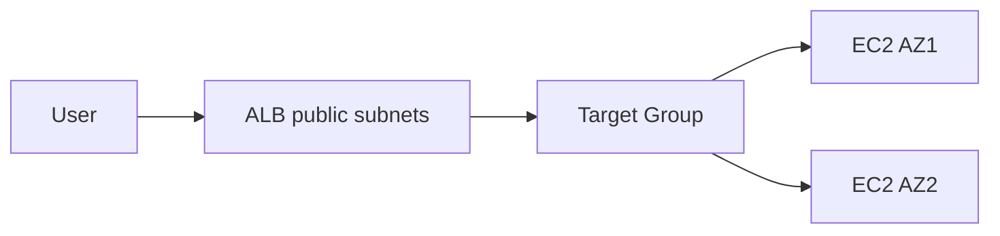

# ALB, Target Groups и Auto Scaling

Цель - собрать **отказоустойчивый** фронт: Application Load Balancer, Target Group, Launch Template, Auto Scaling Group. VPC и SG - из предыдущих занятий.

В предыдущем файле была построена **сеть**. Одна EC2 с nginx - не production-паттерн: нет балансировки, нет автозамены при падении, нет единой точки входа.

Здесь собираем **HA-фронт**:

```text
Интернет → ALB (public subnets) → Target Group → EC2×N (за APP SG)
                ↑                                      ↑
           слушает :80                            nginx :80
                ↑                                      ↑
           Auto Scaling Group держит N instance и регистрирует их в TG
                ↑
           Launch Template - «рецепт» каждой новой VM
```

Клиент ходит на **один DNS** балансировщика. ALB распределяет HTTP между healthy backend'ами. ASG поддерживает нужное число машин и заменяет упавшие.


## 2. Теория


### 2.1. Семейство ELB

| Тип      | Уровень              | Сценарий                                   |
| -------- | -------------------- | ------------------------------------------ |
| **ALB**  | L7 HTTP/HTTPS        | веб, path/host routing, WebSocket          |
| **NLB**  | L4 TCP/UDP           | низкая latency, static IP, TLS passthrough |
| **GWLB** | L3/L4 для appliances | IDS/IPS, firewall appliances               |

Курс: **ALB** (internet-facing в public subnets).

### 2.2. ALB под капотом

- **Nodes** в нескольких AZ (cross-zone load balancing опционально).
- **Listener** (port 80/443) → **rules** → **target group**.
- **Target** - EC2 instance IP, IP address, Lambda, другой ALB.
- **Health check** - HTTP/TCP на path/port; unhealthy не получает новые connections.
- **Connection draining (deregistration delay)** - завершение активных сессий при scale-in.

DNS name ALB: `devops-lab-alb-1234567890.eu-central-1.elb.amazonaws.com`



### 2.3. Кто за что отвечает

| Компонент                  | За что отвечает                        | Чего не делает                    |
| -------------------------- | -------------------------------------- | --------------------------------- |
| **VPC / subnets** (13.4.1) | Сеть, AZ, маршруты                     | Не балансирует HTTP               |
| **ALB SG**                 | Пускает HTTP с интернета на ENI ALB    | Не пускает трафик на app напрямую |
| **APP SG**                 | Пускает :80 **только от ALB SG**       | Не открывает :80 всему интернету  |
| **Launch Template**        | Шаблон VM: AMI, тип, SG, user data     | Не держит количество instance     |
| **Target Group**           | Список backend'ов + health check       | Не создаёт VM                     |
| **ALB**                    | Публичная точка входа, L7 балансировка | Не запускает EC2                  |
| **Listener**               | «Порт 80 ALB → forward в TG»           | Не health check (это TG)          |
| **Auto Scaling Group**     | Сколько VM, в каких subnet, self-heal  | Не принимает HTTP от клиента      |

### 2.4. Security Groups в схеме ALB

```text
Internet --:80--> ALB_SG (0.0.0.0/0 в лабе)
ALB       --:80--> APP_SG (source = ALB_SG only)
```

- **ALB SG** - «витрина»: кто может стучаться на балансировщик.
- **APP SG** - backend **не** торчит в интернет; только трафик от ALB.

Без правила `APP_SG ← ALB_SG:80` пришлось бы открывать :80 на instance для `0.0.0.0/0` - плохая практика.

### 2.5. Launch Template

**Launch Template (LT)** - наследник Launch Configuration. Хранит **версионируемый** рецепт instance:

| Поле LT | Смысл |
|---------|--------|
| AMI | ОС и базовый образ |
| Instance type | `t3.micro` в лабе |
| Security groups | `APP_SG` на каждой VM |
| User data | Скрипт первого boot (nginx) |
| IAM instance profile | (опционально) роль для SSM, S3 |
| Key pair | (опционально) SSH |

ASG при scale-out / self-heal всегда запускает instance **по LT** - поэтому все backend'ы одинаковые.

### 2.6. User data - что это и где взять

**User data** - текст (обычно shell-скрипт), который AWS передаёт instance **при первом запуске**. На Amazon Linux его выполняет **cloud-init** от root один раз после boot.

| Вопрос | Ответ |
|--------|--------|
| Когда выполняется? | При **первом** старте instance (не при каждом reboot) |
| Кто запускает? | `cloud-init` на VM |
| Зачем в лабе? | Установить nginx и положить `index.html` **без ручного SSH** |
| Почему важно для ASG? | Каждая **новая** VM после terminate/scale-out должна сама стать backend'ом |
| Формат в API | **Base64** от содержимого файла |

**Где взять файл в курсе**

Готовый скрипт лежит в репозитории курса:

```text
13. Cloud AWS/13.4 Networking/lab/user-data.sh
```

Содержимое:

```bash
#!/bin/bash
set -euxo pipefail
dnf update -y
dnf install -y nginx
systemctl enable --now nginx
TOKEN=$(curl -s -X PUT "http://169.254.169.254/latest/api/token" \
  -H "X-aws-ec2-metadata-token-ttl-seconds: 21600")
AZ=$(curl -s -H "X-aws-ec2-metadata-token: $TOKEN" \
  http://169.254.169.254/latest/meta-data/placement/availability-zone)
echo "hello from $(hostname) in $AZ" > /usr/share/nginx/html/index.html
```

Построчно:

| Строка | Зачем |
|--------|--------|
| `dnf install nginx` | Поднять HTTP-сервер для health check ALB на path `/` |
| `systemctl enable --now nginx` | Старт и автозапуск nginx |
| IMDSv2 token + `placement/availability-zone` | Узнать AZ из metadata (безопаснее, чем IMDSv1) |
| `hello from $(hostname) in $AZ` | При `curl` ALB видно **разные** backend'ы и AZ |

**Как создать свой user data**

1. Скопировать [lab/user-data.sh](lab/user-data.sh) из задания по EC2.
2. Отредактировать под свою задачу (пакеты, конфиги, pull образа).
3. Передать в AWS одним из способов:
   - `run-instances --user-data file://lab/user-data.sh`
   - в LT: поле `UserData` = base64 от файла (см. §3.1).

**Проверка на уже запущенной VM**

```bash
# Лог cloud-init (если есть SSH)
sudo tail -50 /var/log/cloud-init-output.log
curl -s localhost/
```

**Типичные ошибки user data**

| Проблема | Причина |
|----------|---------|
| Targets **unhealthy** | nginx не успел подняться; смотреть grace period и лог cloud-init |
| `dnf update` долго | В лабе можно убрать `update -y` для ускорения |
| Нет исходящего интернета | Instance в private subnet без NAT - `dnf` не скачает пакеты |

В production instance обычно в **private** subnet, исходящий - через **NAT**; user data тогда тоже работает, если есть маршрут `0.0.0.0/0 → NAT`.

### 2.7. Target Group

**Target Group (TG)** - логическая группа backend'ов для ALB.

| Параметр          | В лабе    | Зачем                       |     |
| ----------------- | --------- | --------------------------- | --- |
| Protocol/port     | HTTP:80   | Как ALB ходит на backend    |     |
| VPC               | `$VPC_ID` | Targets только из этой VPC  |     |
| Health check path | `/`       | nginx отдаёт index на корне |     |
| Interval          | 30 с      | Как часто проверять         |     |

ALB периодически делает health check. **Unhealthy** target не получает **новые** запросы. TG **не создаёт** EC2 - только знает, куда слать трафик.

### 2.8. Listener

**Listener** - правило на ALB: «входящий трафик на **порт 80** → действие **forward** в Target Group».

Без listener ALB существует, но **не маршрутизирует** HTTP в группу. В production на :443 добавляют TLS-сертификат (ACM) и редирект 80→443.

### 2.9. Auto Scaling Group

| Параметр | Смысл |
|----------|--------|
| **Min / Max / Desired** | границы и текущее желаемое число instance |
| **Launch Template** | что запускать при scale-out / replace |
| **Subnets** | в каких AZ появляются VM (в лабе public; в prod - private) |
| **Target group ARNs** | ASG **регистрирует** новые instance в TG ALB |
| **Health check type** | `ELB` - ASG доверяет health ALB, не только «VM running» |
| **Health check grace period** | пауза после старта VM, пока user data поднимает nginx |

**Self-healing:** instance unhealthy или terminated → ASG запускает замену → снова `desired` штук.
**Scaling policies:** target tracking CPU, step scaling - в production; в лабе фиксируем `desired=2`.
**Instance refresh:** rolling replace всех instance на новую версию LT (кратко, для деплоя без смены AMI вручную).

### 2.10. Путь трафика (end-to-end)

```text
1. curl http://ALB_DNS/
2. DNS → IP ENI ALB в public subnet
3. ALB listener :80 → default action forward → TG
4. TG выбирает healthy target (EC2 private IP)
5. Пакет идёт внутри VPC на :80 instance (APP SG разрешает source=ALB_SG)
6. nginx отдаёт index.html
```

Обратно ответ идёт через ALB к клиенту. Клиент **не** знает private IP backend'ов.

### 2.11. Public subnets в лабе vs private в production

В методичке ASG в **public** subnets (`PUB1`, `PUB2`) **без NAT** - упрощение:

- user data (`dnf install`) требует исходящий интернет;
- NAT в 13.4.1 опционален и дорогой для долгой лабы.
- ALB - только в **public**;
- EC2 приложения - в **private**, outbound через NAT;
- APP SG по-прежнему только от ALB SG.

### 2.12. Защита от удаления

- **ALB:** `deletion_protection.enabled=true` - нельзя удалить ALB случайно в Console.
- **ASG:** **termination policies** (OldestInstance…); **scale-in protection** на отдельных instance.
- Не путать с **RDS deletion protection**.

```bash
aws elbv2 modify-load-balancer-attributes \
  --load-balancer-arn "$ALB_ARN" \
  --attributes Key=deletion_protection.enabled,Value=true
```

Перед cleanup - выключить protection.

---

## 3. AWS CLI

### 3.0. Подготовка

**Предусловие:** завершёно занятие про сети, сохранен файл `devops-lab-net.env` с `VPC_ID`, `PUB1`, `PUB2`, `APP_SG`, `ALB_SG`.

Перейти в каталог занятия и подготовить user data:

```bash
cd "13. Cloud AWS/13.4 Networking"   # путь к материалам курса
ls -l lab/user-data.sh               # файл должен существовать
chmod +x lab/user-data.sh            # опционально, для локального запуска

source devops-lab-net.env
export AWS_PROFILE=lab
export AWS_REGION=eu-central-1
aws_cmd() { aws --profile "$AWS_PROFILE" --region "$AWS_REGION" "$@"; }
```

**Порядок создания ресурсов** (важен из-за зависимостей):

```text
1. Launch Template     (нужен APP_SG, user-data)
2. Target Group        (нужен VPC_ID)
3. ALB + Listener      (нужны PUB1/PUB2, ALB_SG, TG_ARN)
4. Auto Scaling Group  (нужны LT, TG, subnets)
```

### 3.1. Launch Template

**Что делаем:** сохраняем рецепт EC2, чтобы ASG мог запускать одинаковые VM.
**За что отвечает:** AMI, тип, SG, user data. Не управляет количеством машин.

```bash
AMI_ID=$(aws_cmd ec2 describe-images --owners amazon \
  --filters "Name=name,Values=al2023-ami-2023*" "Name=architecture,Values=x86_64" \
  --query 'sort_by(Images, &CreationDate)[-1].ImageId' --output text)
echo "AMI_ID=$AMI_ID"

USER_DATA_B64=$(base64 -w0 lab/user-data.sh 2>/dev/null || base64 lab/user-data.sh)

aws_cmd ec2 create-launch-template --launch-template-name devops-lab-lt \
  --launch-template-data "{
    \"ImageId\": \"$AMI_ID\",
    \"InstanceType\": \"t3.micro\",
    \"SecurityGroupIds\": [\"$APP_SG\"],
    \"UserData\": \"$USER_DATA_B64\",
    \"TagSpecifications\": [{
      \"ResourceType\": \"instance\",
      \"Tags\": [{\"Key\": \"Project\", \"Value\": \"devops-lab\"}]
    }]
  }"
```

| Шаг | Зачем |
|-----|--------|
| `describe-images` | Свежая Amazon Linux 2023 в регионе |
| `SecurityGroupIds: APP_SG` | Backend принимает :80 только от ALB |
| `UserData` base64 | AWS API принимает только base64; |
| Tag `Project` | Поиск и cleanup |

### 3.2. Target Group

**Что делаем:** создаём группу backend'ов и правила health check.
**За что отвечает:** список targets, проверка `/`, статус healthy/unhealthy. Пока targets пустые - группа есть, но некому отвечать.

```bash
TG_ARN=$(aws_cmd elbv2 create-target-group --name devops-lab-tg \
  --protocol HTTP --port 80 --vpc-id "$VPC_ID" \
  --health-check-path / --health-check-interval-seconds 30 \
  --query 'TargetGroups[0].TargetGroupArn' --output text)
echo "TG_ARN=$TG_ARN"
```

| Параметр | Зачем |
|----------|--------|
| `HTTP:80` | Совпадает с nginx |
| `--vpc-id` | TG привязан к VPC из 13.4.1 |
| `health-check-path /` | Совпадает с `index.html` из user data |

### 3.3. ALB + Listener

**Что делаем:** публичный балансировщик и правило «:80 → TG».
**За что отвечает ALB:** DNS, приём HTTP из интернета, балансировка. **Listener** связывает порт ALB с TG.

```bash
ALB_ARN=$(aws_cmd elbv2 create-load-balancer --name devops-lab-alb \
  --subnets "$PUB1" "$PUB2" --security-groups "$ALB_SG" \
  --scheme internet-facing --type application \
  --query 'LoadBalancers[0].LoadBalancerArn' --output text)

DNS_NAME=$(aws_cmd elbv2 describe-load-balancers --load-balancer-arns "$ALB_ARN" \
  --query 'LoadBalancers[0].DNSName' --output text)
echo "DNS_NAME=$DNS_NAME"

aws_cmd elbv2 create-listener --load-balancer-arn "$ALB_ARN" \
  --protocol HTTP --port 80 \
  --default-actions Type=forward,TargetGroupArn="$TG_ARN"
```

| Шаг | Зачем |
|-----|--------|
| `PUB1`, `PUB2` | ALB internet-facing в двух AZ |
| `ALB_SG` | Firewall на ENI балансировщика |
| `internet-facing` | Доступ с интернета (ваш `curl`) |
| Listener forward | Без него ALB не шлёт трафик в TG |

Сохраните `DNS_NAME` в env для проверок:

```bash
echo "export DNS_NAME=$DNS_NAME" >> devops-lab-net.env
```

### 3.4. Auto Scaling Group

**Что делаем:** просим AWS держать 2 instance, регистрировать их в TG, лечить при падении.
**За что отвечает:** desired capacity, замена VM, привязка к LT и TG.
Без NAT - **public** subnets (instance получают public IP для `dnf` в user data):

```bash
aws --profile lab --region us-west-1 autoscaling create-auto-scaling-group \
  --auto-scaling-group-name devops-lab-asg \
  --launch-template LaunchTemplateName=devops-lab-lt,Version='$Latest' \
  --min-size 1 --max-size 2 --desired-capacity 2 \
  --vpc-zone-identifier "$PUB1, $PUB2" \
  --target-group-arns $TG_ARN \
  --health-check-type ELB --health-check-grace-period 300 \
  --tags "Key=Project,Value=devops-lab,PropagateAtLaunch=true"
```

| Параметр | Зачем |
|----------|--------|
| `desired-capacity 2` | Два backend'а в двух AZ |
| `target-group-arns` | Новые instance автоматически в TG |
| `health-check-type ELB` | Учитывать health ALB, не только «instance ok» |
| `grace-period 300` | 5 мин на user data + nginx до строгих проверок |

**Проверка** (подождите 2–5 мин после создания ASG):

```bash
aws_cmd elbv2 describe-target-health --target-group-arn "$TG_ARN"
# State: healthy для обоих targets

curl -s "http://$DNS_NAME"
# несколько раз - разные hostname и AZ в теле ответа
```

Если **unhealthy** - см. §7: чаще всего nginx ещё не поднялся, APP SG или неверный health path.

### 3.5. Self-healing test

**Что делаем:** имитируем падение VM и смотрим, как ASG восстанавливает capacity.
**За что отвечает ASG:** замена terminated/unhealthy instance по LT (с тем же user data).

```bash
INST=$(aws_cmd autoscaling describe-auto-scaling-groups --auto-scaling-group-names devops-lab-asg \
  --query 'AutoScalingGroups[0].Instances[0].InstanceId' --output text)
echo "Terminating $INST"
aws_cmd ec2 terminate-instances --instance-ids "$INST"

# через 3–5 мин:
aws_cmd autoscaling describe-auto-scaling-groups --auto-scaling-group-names devops-lab-asg \
  --query 'AutoScalingGroups[0].Instances[*].[InstanceId,LifecycleState,HealthStatus]' --output table
aws_cmd elbv2 describe-target-health --target-group-arn "$TG_ARN"
curl -s "http://$DNS_NAME"
```

Ожидание: снова **2** instance, targets **healthy**, `curl` отвечает.

---

## Cost warning

- **ALB** - плата за час + LCU (Load Balancer Capacity Units);
- **EC2** в ASG - compute по числу instance;
- **data transfer** - исходящий трафик с ALB/EC2;
- не оставлять стек на ночь - cleanup в конце занятия.

---

## Troubleshooting

| Симптом | Проверка |
|---------|----------|
| Targets **unhealthy** | nginx запущен? `sudo systemctl status nginx`; APP SG inbound :80 **from ALB SG**; health path `/`; grace period 300; лог `sudo tail /var/log/cloud-init-output.log` |
| ALB **503** | нет healthy targets в TG |
| ASG не стартует instance | LT существует; subnet в той же VPC; лимиты EC2; service-linked role `AWSServiceRoleForAutoScaling` |
| `curl` **timeout** | ALB SG inbound :80; `scheme internet-facing`; security group на ALB |
| `dnf` в user data падает | нет outbound internet (private subnet без NAT) |
| Duplicate name | уникальные имена ALB/TG/LT в region |
| User data не применился | смотреть `/var/log/cloud-init-output.log`; LT обновили - старые instance **не** перезапускают user data (нужен новый instance или instance refresh) |


## Чеклист

- объяснить ALB vs NLB, listener, target group, health check;
- описать путь трафика: client → ALB → EC2;
- объяснить, что такое **user data**, когда он выполняется и где взять файл;
- создать Launch Template, ASG с привязкой к ALB;
- проверить self-healing (terminate instance → ASG заменяет);
- знать **deletion protection** на ALB;
- выполнить операции через CLI и проверить работу.
