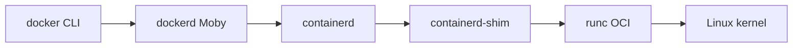

# Docker - архитектура и сущности

Современный **Docker Engine** - это не один бинарник, а цепочка компонентов: клиент общается с демоном, демон делегирует низкоуровневый запуск **containerd**, а тот вызывает **OCI runtime** (чаще всего **runc**). Ниже - схема и словарь сущностей, с которыми вы работаете в повседневной эксплуатации.

---

## 1. Цепочка вызовов (упрощённо)



- **`docker` (CLI)** - то, что вы вводите в терминале; говорит с демоном по API (обычно сокет).
- **`dockerd`** - демон: сборка образов, сеть, volumes, высокоуровневая логика «как Docker».
- **`containerd`** - управление жизненным циклом контейнеров, снимки, образы на уровне runtime.
- **`runc`** - создаёт процесс по спецификации OCI: namespaces, cgroups, запуск команды в rootfs.
Детали версий и плагинов могут отличаться, но **логика разделения ответственности** сохраняется.
**Containerd‑shim** - вспомогательный процесс, который запускается для каждого контейнера. Он выступает «прокладкой» между `containerd` и процессом контейнера.
**Ключевые задачи containerd-shim:**
1. **Позволяет `runc` завершиться после запуска контейнера.** `runc` создаёт окружение контейнера (используя namespaces и cgroups) и сразу завершается. Без shim‑процесса `runc` должен был бы оставаться запущенным всё время жизни контейнера.
2. **Сохраняет открытыми STDIO и файловые дескрипторы (FDs).** Если `dockerd` или `containerd` аварийно завершатся, shim продолжит держать открытыми каналы ввода‑вывода (STDIN, STDOUT, STDERR) контейнера. Без него при падении демона родительская сторона каналов закрылась бы, и контейнер завершился бы.
3. **Передаёт статус завершения контейнера наверх.** Когда контейнер останавливается, shim сообщает его код возврата (`exit code`) в `containerd`, а затем в `dockerd`. При этом `dockerd` не является прямым родителем процесса контейнера.
4. **Поддерживает функцию Live Restore.** Позволяет контейнерам продолжать работу при перезапуске демона Docker (`dockerd`).
**Где находится:** обычно `/usr/bin/containerd-shim` или `/usr/bin/docker-containerd-shim`.
## Как это работает вместе: цепочка процессов
Разберём на примере запуска контейнера:

1. Пользователь выполняет команду:
    ```bash
    docker run -d alpine sleep 60
    ```
2. `Docker CLI` отправляет запрос через REST API к `dockerd`.
3. `dockerd` передаёт задачу по запуску контейнера в `containerd`.
4. `containerd` вызывает `runc`, чтобы создать и запустить контейнер.
5. `runc`:
    - настраивает namespaces и cgroups для изоляции;
    - монтирует слои образа;
    - запускает процесс `sleep 60` внутри контейнера;
    - сразу завершается.
6. После завершения `runc` процесс `containerd‑shim` становится **родителем** для `sleep 60`.
7. `containerd‑shim` продолжает работать всё время жизни контейнера: держит открытыми STDIO, отслеживает статус процесса и передаёт его в `containerd`.
8. Если `dockerd` перезапускается, `containerd‑shim` и контейнер продолжают работать.

---

## 2. OCI (Open Container Initiative)

**OCI** задаёт два стандарта:

- **Image spec** - как описывается образ (манифест, слои, конфиг).
- **Runtime spec** - как runtime запускает процесс из rootfs (аналог «bundle»).

Благодаря OCI можно подменять **runc** на **crun**, **kata** (легкая VM) и др., если оркестратор и образ совместимы.

---

## 3. Основные сущности

### 3.1. Image (образ)

**Образ** - неизменяемые **слои** файловой системы плюс метаданные (команда по умолчанию, переменные окружения, пользователь). Слои переиспользуются между образами; тег в registry указывает на **манифест**, который ссылается на слои.

### 3.2. Container (контейнер)

**Контейнер** - это **запущенный** из образа процесс (или группа процессов) с **writable layer** поверх read-only слоёв, плюс настройки сети, монтирований и лимитов. Остановленный контейнер сохраняет writable layer до удаления.

### 3.3. Registry

**Registry** - хранилище образов (Docker Hub, GitHub Container Registry, Harbor, ECR, GCR…). Клиент делает `pull`/`push`; аутентификация и сканирование уязвимостей - зона ответственности платформы.

### 3.4. Dockerfile → build → image

**Dockerfile** - декларативное описание шагов сборки (`FROM`, `RUN`, `COPY`, `ENV`…). `docker build` (или BuildKit) создаёт слои и тегирует результат. **`.dockerignore`** уменьшает контекст сборки, исключая лишние файлы из отправки демону.

### 3.5. Volume и bind mount

- **Bind mount** - примонтировать каталог или файл хоста в путь внутри контейнера (удобно для разработки, опасно при неосторожных путях).
- **Volume** (управляемое Docker томом) - данные живут под управлением демона, часто удобнее для персистентности и бэкапов.

### 3.6. Network (идея)

На одном хосте типично **bridge**: контейнеры в подсети, доступ наружу через NAT, публикация портов `-p`. Режимы **host** (сеть хоста) и **overlay** (в swarm/Kubernetes) понимаются на следующих темах курса.

---

## 4. Сводка связей

| Сущность | Кратко |
|----------|--------|
| Dockerfile | Рецепт сборки |
| Image | Слои + метаданные, read-only |
| Container | Запущенный экземпляр + writable layer |
| Registry | Хранилище и доставка образов |
| Volume / bind | Персистентность и обмен с хостом |
| Network | Изоляция и маршрутизация трафика |
