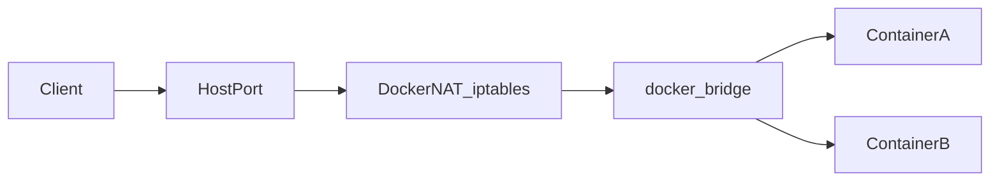

# Docker - сети

Каждый контейнер по умолчанию получает сетевой интерфейс в **network namespace**. **Docker Engine** создаёт виртуальные **veth**-пары, подключает их к **linux bridge** на хосте, настраивает **iptables/nftables** для NAT и **публикации портов** (`-p`). Понимание драйверов сети нужно для отладки «почему не пингуется по имени» и «почему порт недоступен снаружи».

Документация: [Networking overview](https://docs.docker.com/network/), драйверы: [bridge](https://docs.docker.com/network/drivers/bridge/), [host](https://docs.docker.com/network/drivers/host/), [overlay](https://docs.docker.com/network/drivers/overlay/), [macvlan](https://docs.docker.com/network/drivers/macvlan/), [ipvlan](https://docs.docker.com/network/drivers/ipvlan/), [none](https://docs.docker.com/network/drivers/none/).

---

## 1. Справочник драйверов сети

В выводе **`docker network ls`** в колонке **DRIVER** для встроенных сетей встречаются значения из списка ниже. В **API** Docker для сети без внешней связности иногда фигурирует драйвер **`null`** - это то же самое, что в CLI вы подключаете как **`--network none`** (сеть «пустышка»).

Проверка, какие драйверы зарегистрированы в демоне:

```bash
docker info --format '{{json .Plugins.Network}}' | tr ',' '\n'
```

Сводная таблица (детали - в подразделах):

| Драйвер (CLI) | Суть | Типичный сценарий |
|----------------|------|-------------------|
| **bridge** | Linux bridge + NAT на одном хосте | Почти все сервисы на одной машине |
| **host** | Сетевой стек **хоста** без отдельного namespace для сети | Низкая задержка, много портов, метрики с хоста |
| **overlay** | Overlay (часто VXLAN) между **узлами Swarm** | Мультихост под **Docker Swarm** |
| **macvlan** | Контейнеры с **своими MAC** в той же L2, что физический интерфейс | «Виртуалки в сети» без NAT, legacy |
| **ipvlan** | Общий MAC родителя, **разные IP** (L2 или L3 режим) | Много IP при лимите MAC на порту коммутатора |
| **null** / **`none`** | Только **lo**, без внешней сети Docker | Максимальная изоляция, кастомный сетевой sidecar |

### 1.1. `bridge`

**Что делает:** создаёт **linux bridge** на хосте, подключает контейнеры **veth**-парами; исходящий трафик обычно идёт через **NAT**; **`docker run -p`** настраивает проброс портов на хост.

**Когда использовать:** по умолчанию почти всегда; **пользовательская** bridge-сеть (`docker network create`) - когда нужны **DNS по имени контейнера** и изоляция групп сервисов друг от друга.

| Плюсы | Минусы |
|--------|--------|
| Изоляция контейнеров друг от друга и от хоста по портам | Дополнительный hop и NAT по сравнению с `host` |
| Встроенный DNS на user-defined bridge | Только **один хост** (без overlay / без внешнего оркестратора) |
| Знакомая модель `-p`, firewall на хосте | Нужно следить за пересечением подсетей с VPN/корпоративными маршрутами |

### 1.2. `host`

**Что делает:** контейнер **не получает отдельный network namespace** в смысле привязки к bridge Docker: процесс(ы) используют **интерфейсы и таблицы маршрутизации хоста** напрямую (как процесс на хосте с точки зрения сети).

**Когда использовать:** высокая нагрузка на сеть, протоколы/порты «как на железе», мониторинг сети хоста без отдельного интерфейса контейнера; **rootless** Docker часто **ограничивает** или запрещает `host`.

| Плюсы | Минусы |
|--------|--------|
| Нет NAT, минимальные накладные расходы | **Коллизии портов** между контейнерами и с хостом |
| Простая модель «слушаю тот же порт, что и на хосте» | **Слабее изоляция** сети и границы безопасности |
| | На Docker Desktop поведение может отличаться от Linux |

### 1.3. `overlay`

**Что делает:** создаёт **распределённую L2/L3-сеть** поверх нескольких хостов (типично **VXLAN**), чтобы контейнеры **Swarm** на разных нодах видели друг друга как одну подсеть.

**Когда использовать:** только в контексте **Docker Swarm** (или совместимых сценариев); для **Kubernetes** используют **CNI** (Calico, Cilium…), а не драйвер `overlay` Docker Engine на pod’ах.

| Плюсы | Минусы |
|--------|--------|
| Мультихост-связность без ручной склейки маршрутов на каждом контейнере | Сложность эксплуатации (MTU, контроль плоскости, отладка overlay) |
| Интеграция с сервисами Swarm | Привязка к экосистеме Swarm; вне Swarm часто избыточен |
| | Дополнительный оверхед инкапсуляции |

### 1.4. `macvlan`

**Что делает:** контейнерам выдаются **собственные MAC-адреса** в той же широковещательной области (**VLAN** / физический сегмент), что и **родительский** интерфейс хоста; с точки зрения коммутатора контейнеры похожи на отдельные **физические** устройства.

**Когда использовать:** приложениям нужен **реальный IP из корпоративной подсети** без NAT; legacy, где важна видимость в L2 (аналог «лёгкой ВМ» по сети).

| Плюсы | Минусы |
|--------|--------|
| Предсказуемые IP и маршрутизация как у «железа» | Требуются **свободные IP** и согласование с сетевиками |
| Нет NAT Docker bridge | Настройка **VLAN**, иногда **promiscuous** / **режим порта** на коммутаторе |
| | Ошибки в подсети/MAC легко ломают соседей в L2 |

### 1.5. `ipvlan`

**Что делает:** все контейнеры разделяют **один MAC** родительского интерфейса, но имеют **разные IP**; режим **L2** (общая broadcast-домена) или **L3** (маршрутизация, без broadcast между контейнерами - зависит от конфигурации).

**Когда использовать:** коммутатор **ограничивает число MAC** на порт; нужно много адресов IP в одном сегменте без «засорения» MAC-таблиц; продвинутая интеграция с L3-сетью.

| Плюсы | Минусы |
|--------|--------|
| Меньше MAC, чем у `macvlan` | Менее привычная модель для разработчиков |
| Гибкость L2 vs L3 режима | Жёсткие требования к версии ядра, топологии и политике маршрутизации |
| | Документацию и опции лучше читать целиком перед продом |

### 1.6. `null` и сеть **`none`**

В **CLI**: **`docker run --network none`**. В **инспекте** сети Docker такая сеть часто отображается с драйвером **`null`**: у контейнера остаётся только **loopback**, **Docker не настраивает** внешние интерфейсы и маршруты.

#### Зачем это нужно (сценарии)

**1) Максимальная сетевая изоляция.** Контейнер физически не может открыть TCP-сессию «наружу» через стандартный docker bridge, пока вы сами не поднимете туннель **внутри** процесса (например userspace VPN) или не перейдёте в другой режим сети. Удобно для **жёсткого CI** («убедиться, что сборка не тянет зависимости из интернета»), демонстраций и **снижения поверхности атаки** (нет случайного egress).

Проверка: исходящий запрос **не проходит** (ожидайте таймаут или «Network unreachable»):

```bash
docker run --rm --network none alpine:3.19 wget -T3 -qO- http://example.com/ || echo "нет маршрута - ожидаемо"
```

**2) «Чистый» network namespace перед кастомной настройкой.** Иногда контейнер потом подключают к сети **не через Docker** (редкие скрипты, лаборатории с **`nsenter`**, учебные модели в духе [11.1.7](../11.1%20Docker%20begin/11.1.7%20Docker%20-%20unshare%20%28справочник%20и%20практика%29.md)): старт с **`none`** гарантирует, что вы не зависите от дефолтного bridge до явных шагов.

**3) Отладка и минимальное воспроизведение.** Нужно исключить влияние DNS Docker, маршрутов bridge и `-p`: запуск с **`none`** показывает поведение приложения **без** внешней связности (полезно сравнить с обычным `docker run`).

**4) Связка с другим контейнером: `--network container:имя` (это не `none`, но тот же раздел логики «кто чей namespace»).** Второй контейнер **не получает свой** docker-bridge-интерфейс: он **разделяет network namespace** с уже запущенным контейнером **`имя`**. У обоих один набор IP, **`localhost` - общий**, открытые порты первого контейнера доступны со **второго** как `127.0.0.1:порт`.

Типичные применения **`--network container:`**:

- **Sidecar** к основному сервису (логирование, метрики, локальный proxy) без отдельной публикации портов на хост.
- **Отладка**: подключить образ с `curl`, `tcpdump`, `strace` к сети приложения без дублирования IP и без плясок с docker-сетями.

Пример: основной контейнер - `nginx`, второй смотрит его порт **с localhost** (тот же net ns):

```bash
docker rm -f share-demo 2>/dev/null
docker run -d --name share-demo nginx:alpine
docker run --rm --network container:share-demo curlimages/curl:8.5.0 -sS -o /dev/null -w "%{http_code}\n" http://127.0.0.1:80
docker rm -f share-demo
```

Пример **двух процессов в одной сети без user-defined bridge**: backend слушает только `127.0.0.1`, frontend в другом контейнере подключается через **`container:`** к тому же localhost (узкий сценарий; чаще всё же используют общую **bridge**-сеть и DNS).

Ограничения **`--network container:`**:

- Контейнеры должны быть на **одном** хосте.
- Порты **публикуются** флагами **`-p`** только у **первого** контейнера (у «присоединённого» свои `-p` для того же namespace обычно не нужны / не применяются так же - проверяйте документацию версии).
- Конфликт портов: два процесса в одном namespace **не могут** слушать один и тот же TCP-порт.

**Связка `none` + `container:`:** если **базовый** контейнер запущен с **`--network none`**, у него только **`lo`**. Второй контейнер с **`--network container:базовый`** унаследует **тот же** урезанный namespace - **внешней сети по-прежнему нет**. Это осознанный режим «два процесса в полностью изолированном net ns» (например два бинарника для теста IPC по localhost).

```bash
docker rm -f none-base 2>/dev/null
docker run -d --name none-base --network none alpine:3.19 sleep 300
docker run --rm --network container:none-base alpine:3.19 ip -brief addr
docker rm -f none-base
```

Оба увидят только **`lo`**.

| Плюсы | Минусы |
|-------|--------|
| Нет «случайного» исходящего трафика через bridge Docker | **Нет сети**, пока вы сами не построите обход (другой контейнер с отдельной сетью, VPN внутри и т.д.) |
| Меньше поверхность атаки по сети | Неудобно для типичного веб/API без доп. шагов |

---

## 2. Default bridge и пользовательский bridge

- **Default bridge** (`bridge`): контейнеры могут общаться по **IP**, но **встроенный DNS по имени контейнера не гарантирован** для старых сценариев; все контейнеры в одной «общей» сети по умолчанию.
- **User-defined bridge**: вы создаёте сеть `docker network create ...`; контейнеры в ней получают **разрешение имён** друг друга через **встроенный DNS Docker** (embedded DNS на 127.0.0.11 внутри контейнера) и изолированы от контейнеров в **другой** пользовательской сети.

Рекомендация для новых проектов на одном хосте: **отдельная пользовательская bridge-сеть** на приложение или стек, а не сваливать всё в default bridge.

### 2.1. Один контейнер в двух (и более) сетях - можно ли и когда нужно

**Да.** У контейнера всегда есть **ровно один** основной network namespace, но в нём Docker может держать **несколько интерфейсов**: по одному на каждую подключённую **user-defined** (или иную поддерживаемую) **bridge**-сеть. Первая сеть задаётся при **`docker run --network первая`** (или дефолт `bridge`), остальные подключаются командой **`docker network connect`**; отключение - **`docker network disconnect`**.

**Когда это полезно:**

- **Сегментация:** приложение должно видеть **БД** только во «внутренней» сети `db-net`, а **фронт** или балансировщик - в `public-net`; один контейнер (например API-gateway или агент) висит в **обеих** сетях и маршрутизирует логику сам.
- **Постепенный перенос:** сервис уже в старой сети, новые зависимости в новой - временно **две сети**, потом `disconnect` от лишней.
- **Интеграция с чужим стеком:** ваш контейнер должен общаться с двумя изолированными группами контейнеров, не сваливая всех в одну сеть.

**Пример** (учебный; имена сетей и контейнера свои):

```bash
docker network create net-a
docker network create net-b
docker run -d --name dual --network net-a alpine:3.19 sleep 300
docker network connect net-b dual
docker inspect -f '{{json .NetworkSettings.Networks}}' dual | head -c 400; echo
docker network disconnect net-b dual
docker rm -f dual
docker network rm net-a net-b
```

В **`docker inspect`** у контейнера секция **`NetworkSettings.Networks`** станет объектом с **двумя** ключами (имена сетей) - у каждого свой **`IPAddress`**.

**Ограничения и оговорки:**

- Режимы **`host`**, **`none`** и общий namespace **`container:...`** с множественными docker-сетями **не смешиваются** так же, как несколько bridge: у **`host`** нет отдельного изолированного стека для второй «docker-сети».
- У каждой bridge-сети свой **адресный план**; не пересекайте подсети с VPN/хостом.
- В **Docker Compose** несколько сетей задаются в YAML (`networks:` + `service.networks`); под капотом те же **`connect`**.

### 2.2. Как настроить взаимодействие при нескольких сетях

**Базовое правило:** два контейнера **напрямую** обмениваются трафиком на L2/L3 Docker-bridge **только если оба подключены к одной и той же сети**. Контейнер, висящий в **двух** сетях, для остальных выступает **мостом**: с ним можно говорить из `net-a` по адресу в `net-a` и из `net-b` по адресу в `net-b`, но контейнер **только в `net-a`** **не увидит** контейнер **только в `net-b`** (разные broadcast-домены, у Docker нет маршрутизатора между вашими bridge по умолчанию).
#### Имя контейнера и DNS
Встроенный **embedded DNS** (127.0.0.11) при запросе имени контейнера, который подключён к **нескольким** сетям, обычно возвращает IP **в той сети, которую разделяют запрашивающий и целевой контейнер** (то есть «правильный» интерфейс для текущей связи). Поэтому с **`app`** в `net-a` команда **`ping dual`** ходит на **IP `dual` в `net-a`**, а с **`db`** в `net-b` - на **IP `dual` в `net-b`**.
Если нужно **другое имя** в одной из сетей (например в `net-b` обращаться к `dual` как к `gateway`):

```bash
docker network connect --alias gateway net-b dual
```
Проверка с **`docker exec db getent hosts gateway`** (если в образе есть `getent`).
#### Пример «шлюз между сегментами»
Три контейнера: **`dual`** в `net-a` и `net-b`, **`app`** только в `net-a`, **`db`** только в `net-b`. **`app`** достучится до **`dual`** по имени; **`db`** - до **`dual`** по имени; **`app`** **не** достучится до **`db`** (нет общей сети).

```bash
docker rm -f dual app db 2>/dev/null
docker network rm net-a net-b 2>/dev/null
docker network create net-a
docker network create net-b
docker run -d --name dual --network net-a alpine:3.19 sleep 600
docker network connect net-b dual
docker run -d --name app --network net-a alpine:3.19 sleep 600
docker run -d --name db --network net-b alpine:3.19 sleep 600
docker exec app ping -c1 dual
docker exec db ping -c1 dual
docker exec app ping -c1 -W2 db || true
docker rm -f dual app db
docker network rm net-a net-b
```

Чтобы **`app`** общался с **`db`**, нужен либо **третий** контейнер/прокси с доступом в обе сети (часто это и есть **`dual`** с прикладным софтом), либо подключить одного из клиентов **ко второй сети** (`docker network connect net-b app`), если политика безопасности позволяет.

#### Внутри «двойного» контейнера: процессы и порты

В namespace будет **несколько интерфейсов** (`eth0`, `eth1`, … - имена условны). **Один и тот же TCP-порт** (например `8080`) нельзя слушать **дважды** на `0.0.0.0:8080` для обоих интерфейсов - будет конфликт. Варианты:
- слушать **разные порты** на разных интерфейсах или один порт только на нужном IP;
- для исходящих соединений полагаться на **таблицу маршрутизации** Linux (у контейнера будет **default via** одного из шлюзов сетей - смотрите **`ip route`** внутри контейнера).
Приложение может явно **привязаться** к IP конкретной сети или интерфейсу, если это поддерживает конфиг.
#### Публикация на хост (`-p`)
Флаги **`-p`** привязаны к **контейнеру и его портам**; при нескольких сетях DNAT на хосте по-прежнему ведёт в **контейнер**, но уточняйте в документации версии, как выбирается целевая сеть для правил (на практике чаще всё настраивают на **первой** подключённой bridge-сети или проверяют **`iptables`/`nft`** на хосте).

---

## 3. Публикация портов и маршрут трафика

Флаг **`-p [хост_ip:]хост_порт:порт_контейнера[/udp]`** настраивает **DNAT** на хосте к IP контейнера в bridge-сети. Несколько портов - несколько `-p`.



На схеме упрощённо: реальный путь зависит от rootless/rootful, nftables/iptables и версии Docker.

---

## 4. Команды

| Команда | Назначение |
|---------|------------|
| `docker network ls` | Список сетей |
| `docker network create [опции] имя` | Создать сеть (по умолчанию `--driver bridge`) |
| `docker network inspect имя` | Подсеть, шлюз, контейнеры, опции |
| `docker network connect сеть контейнер` | Подключить работающий контейнер ко второй сети |
| `docker network disconnect сеть контейнер` | Отключить |
| `docker network rm имя` | Удалить сеть (без подключённых контейнеров) |
| `docker run --network имя` / `--net host` / `--net none` | Выбор сети при запуске |

Полезные опции `docker network create`:

- `--subnet`, `--gateway` - явная IP-подсеть (избегать пересечений с корпоративными VPN).
- `--driver bridge` - явно (значение по умолчанию).

---

## 5. Практика - два контейнера в одной пользовательской сети

```bash
docker network create app-net

docker run -d --name web --network app-net alpine:3.19 \
  sh -c 'while true; do echo -e "HTTP/1.0 200 OK\n\nhi" | nc -l -p 8080; done'

docker run --rm --network app-net alpine:3.19 wget -qO- http://web:8080
```

Обратите внимание: обращение по **имени** `web` работает благодаря **встроенному DNS** пользовательской bridge-сети.

Публикация на хост (связь с [11.1.4](../11.1%20Docker%20begin/11.1.4%20Docker%20-%20базовые%20команды%20и%20практика.md)):

```bash
docker rm -f web 2>/dev/null
docker run -d --name web --network app-net -p 18080:8080 alpine:3.19 \
  sh -c 'while true; do echo -e "HTTP/1.0 200 OK\n\nhi" | nc -l -p 8080; done'
curl -s http://127.0.0.1:18080/
```

Уборка:

```bash
docker rm -f web
docker network rm app-net
```

---

## 6. Сеть host и none (демонстрация одной командой)

Краткий теоретический разбор драйверов **`host`** и **`none`/`null`** - в п. **1.2** и **1.6** выше.
**Host** (осторожно: конфликт портов с процессами хоста):

```bash
docker run --rm --network host alpine:3.19 ip link | head
```
**None:**
```bash
docker run --rm --network none alpine:3.19 ip link
```

Ожидается только **lo**.

---

## 7. Compose и Kubernetes

**Docker Compose** объявляет сети в YAML и подключает сервисы автоматически. **Kubernetes** использует **CNI**, а не драйверы Docker bridge напрямую на pod’ах. Это вынесено за рамки занятия 11.2; здесь важна база модели «bridge + DNS + NAT».
