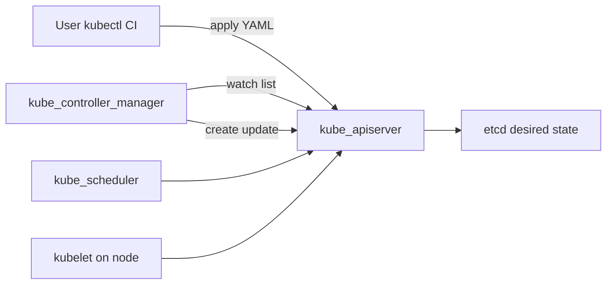
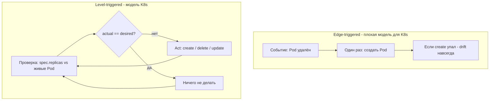
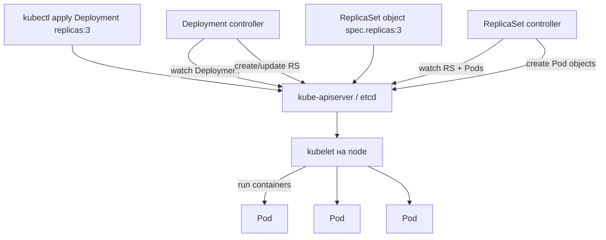
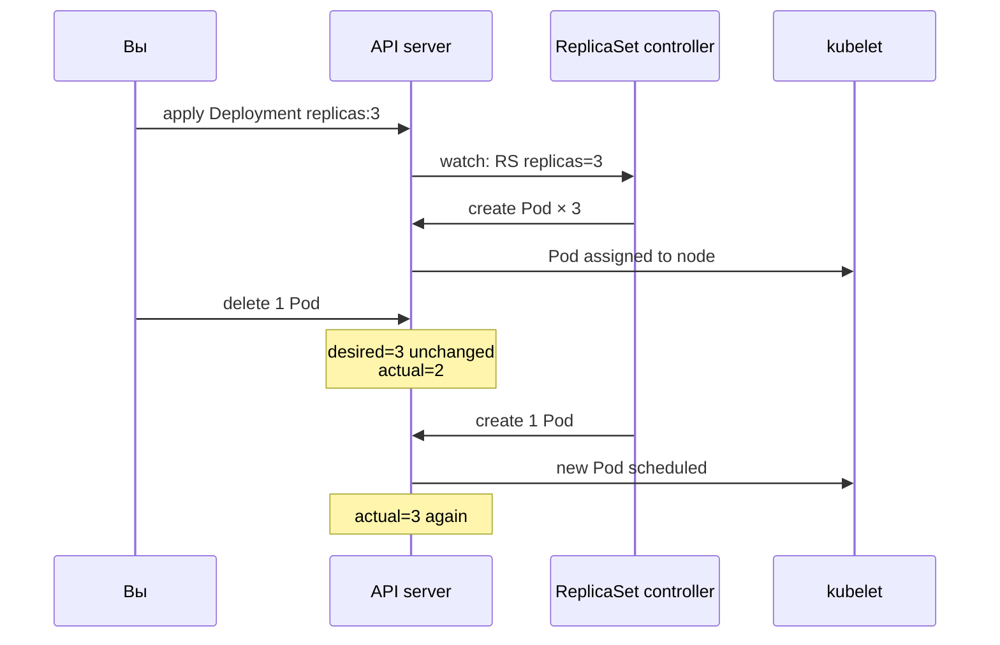

# Kubernetes - Controllers: интенсивный воркшоп (3×60 мин)

# Блок 1: Философия «Желаемое vs Реальное» (~60 мин)

**Цель:** сдвиг от императивного («сделай это») к декларативному («хочу вот так»).

## 1.1. Архитектура: где живёт controller



| Компонент                   | Роль                                                                           |
| --------------------------- | ------------------------------------------------------------------------------ |
| **kube-apiserver**          | Единственный вход в etcd; validation, admission                                |
| **etcd**                    | Хранит **desired state** (spec) и **actual** (status)                          |
| **kube-controller-manager** | Набор **control loops** (Deployment, RS, Job, Node, …)                         |
| **kube-scheduler**          | Назначает Pod на node - **не** controller workload в смысле reconcile replicas |
| **kubelet**                 | На node: запуск container, probes - исполнитель, не cluster-level reconcile    |

**Talos homelab:** control plane на `maste1`; controller-manager - static pod / system component. Логи смотрим через:

```bash
kubectl get pods -n kube-system | grep controller-manager
kubectl logs -n kube-system -l component=kube-controller-manager --tail=30
```

**Разбор (логи controller-manager, опционально):**

| Команда | Параметры | Назначение |
|---------|-----------|------------|
| `kubectl get pods -n kube-system \| grep controller-manager` | shell pipe | Найти имя Pod kube-controller-manager на вашем дистрибутиве |
| `kubectl logs` | `-l component=kube-controller-manager` - label; `--tail=30` | Последние строки reconcile (имя label на Talos может отличаться) |

---

## 1.2. Reconciliation loop - что это на самом деле

### Суть одной фразой

Kubernetes **не выполняет команды**. Он **постоянно сравнивает два состояния**:

| | Где хранится | Вопрос |
|---|--------------|--------|
| **Desired (желаемое)** | `spec` объекта в **etcd** | «Сколько Pod **должно** быть? Какой образ? Какие labels?» |
| **Actual (фактическое)** | Pod'ы в cluster + `status` | «Сколько Pod **есть** прямо сейчас? В каком они состоянии?» |

Controller - это процесс, который в бесконечном цикле отвечает на вопрос: **«Факт совпадает с желаемым?»** Если нет - делает **минимальные действия**, чтобы сблизить их. Это и есть **reconcile** (согласование).

Вы **не говорите** cluster «создай Pod». Вы **записываете в etcd**: «я хочу 3 Pod с label `app=ctrl-demo`». Controller **сам** доводит реальность до этой записи - и **продолжает** это делать, пока объект существует.

---

### Edge-triggered vs level-triggered - почему это важно

Представьте термостат.

**Edge-triggered (по событию):** «Температура упала ниже 20° → включи обогрев **один раз**». Если обогрев сломался через час - термостат **не заметит**, пока температура снова не пересечёт порог.

**Level-triggered (по уровню):** «**Пока** температура ниже 20° → держи обогрев включённым». Каждую минуту проверяешь: цель 20°, сейчас 18° → включай. Обогрев сгорел? На следующей проверке снова включишь.

Kubernetes controllers работают **level-triggered**:

- Им **не важно**, *что именно* произошло (Pod умер, node упала, сеть моргнула).
- Им важно: **сейчас** desired = 3 Pod, actual = 2 → **создай ещё один**.

Поэтому после `kubectl delete pod` cluster **не «забывает»** - на следующем проходе loop controller видит: «в spec написано 3, живых 2» → создаёт третий. Даже если event о delete **потерялся** (сбой сети, restart controller) - через **resync** (периодический полный перечень объектов, обычно ~каждые 10–15 мин) controller снова прочитает actual и исправит drift.



---

### Пошагово: один проход reconcile loop

Возьмём **ReplicaSet controller** (самый наглядный для demo §1.3). Deployment controller делает то же, но с ReplicaSet как промежуточным объектом.

**Шаг 0 - вы записали desired state**

```bash
kubectl apply -f …/01-deployment-selfheal.yaml   # spec.replicas: 3
```

1. `kubectl` отправляет YAML в **kube-apiserver**.
2. API server валидирует, пишет объект в **etcd**: Deployment `ctrl-demo-dep`, поле `spec.replicas: 3`.
3. На этом ваше участие **заканчивается**. Дальше работают controllers.

**Шаг 1 - Read desired (informers / watch)**

ReplicaSet controller **не опрашивает** etcd напрямую каждую секунду. Он использует **informer**:

- При старте - **list** всех ReplicaSet (полная картина).
- Дальше - **watch** на API server: «пришли изменения по ReplicaSet / Pod».
- Плюс **resync**: периодически заново сверяет локальный кэш с API.

Controller читает: «ReplicaSet `ctrl-demo-dep-xxxxx` → `spec.replicas: 3`, selector `app=ctrl-demo`».

**Шаг 2 - Read actual**

Controller **list** Pod'ов с label `app=ctrl-demo` (через тот же informer на Pod):

- Pod `ctrl-demo-dep-xxxxx-abc12` - Running
- Pod `ctrl-demo-dep-xxxxx-def34` - Running
- Pod `ctrl-demo-dep-xxxxx-ghi56` - Running

**actual = 3**, **desired = 3** → diff пуст → **Act не нужен**.

**Шаг 3 - событие: вы удалили Pod**

```bash
kubectl delete pod ctrl-demo-dep-xxxxx-abc12 -n lab-space
```

1. API server удаляет объект Pod из etcd.
2. Watch на Pod шлёт controller'у: «Pod удалён» (или при resync controller просто увидит 2 Pod вместо 3).
3. Controller **снова** делает Read → Diff:
   - desired = 3 (в spec ReplicaSet **ничего не менялось**)
   - actual = 2 (два Running Pod)
   - **diff = +1 Pod**

**Шаг 4 - Act**

Controller вызывает API server: **create** новый Pod object с:

- теми же labels (`app=ctrl-demo`), что в selector ReplicaSet;
- тем же pod template (образ nginx), что в ReplicaSet;
- **новым** именем (`…-jkl78`) - Pod **не** «воскрешается» с тем же именем (в отличие от StatefulSet).

**Шаг 5 - wait**

Controller **не спит навсегда**. Он ждёт:

- следующий event (Pod Created / Updated / Deleted), **или**
- resync timer.

И снова **Шаг 1**. Loop **никогда** не заканчивается, пока жив controller и объект в etcd.

```text
loop forever:
  desired = read spec from API (via informer/watch)   # «сколько ДОЛЖНО быть»
  actual  = read status / list child objects          # «сколько ЕСТЬ»
  diff    = desired - actual                          # «чего не хватает / лишнее»
  if diff != empty:
    act()   # create Pod, delete Pod, update RS, evict, ...
  wait event or resync period                         # снова проверить уровень
```

**Ключевой момент:** delete Pod **не меняет** desired. Вы изменили **actual**. Controller исправляет **actual** под неизменный **desired**.

---

### Кто что делает в цепочке Deployment → ReplicaSet → Pod

Не один controller «магически держит 3 Pod». Работа **разделена**:



| Кто | Desired читает из | Actual смотрит на | Act |
|-----|-------------------|---------------------|-----|
| **Deployment controller** | `Deployment.spec` (replicas, template, strategy) | ReplicaSet'ы с ownerRef на этот Deployment | Создать/обновить RS при смене template; rolling update |
| **ReplicaSet controller** | `ReplicaSet.spec.replicas` + selector | Pod'ы с matching labels | Create/delete Pod до нужного count |
| **kubelet** | `Pod.spec` на **своей** node | Container runtime (docker/containerd) | Start/stop container, probes - **не** cluster-level count |

**Self-heal после delete Pod** - это **ReplicaSet controller**, не kubelet и не Deployment controller (Deployment уже создал RS с replicas: 3 и «отошёл в сторону», пока template не меняется).

---

### Imperative vs Declarative - не лозунг, а разница в том, **где** живёт правда

#### Imperative: «сделай это сейчас»

```bash
kubectl run app-1 --image=nginx:1.27-alpine
kubectl run app-2 --image=nginx:1.27-alpine
kubectl run app-3 --image=nginx:1.27-alpine
```

**Что в etcd:** три **отдельных** объекта Pod. У каждого **нет** поля «должно быть 3 реплики». Нет ReplicaSet. Нет owner, который следит за **количеством**.

**Timeline при сбое:**

| Время | Событие | Кто реагирует | Результат |
|-------|---------|---------------|-----------|
| T0 | Три Pod Running | - | 3 экземпляра nginx |
| T1 | `kubectl delete pod app-2` | Никто на уровне cluster | В etcd **2** Pod; **нигде не записано**, что нужно 3 |
| T2 | … | ReplicaSet controller **не существует** для этих Pod | **2 Pod навсегда**, пока вы сами не `kubectl run` третий |

Cluster **не знает цель** «3 сервера». Он знает только факты: «есть Pod app-1», «есть Pod app-3». Delete - это **изменение факта**, не нарушение правила, потому что **правила нет**.

#### Declarative: «я хочу вот так»

```yaml
spec:
  replicas: 3
```

**Что в etcd:** один Deployment + ReplicaSet с **правилом**: «всегда 3 Pod с selector `app=ctrl-demo`». Количество - часть **desired state**, не разовая команда.

**Timeline при том же сбое:**

| Время | Событие | Кто реагирует | Результат |
|-------|---------|---------------|-----------|
| T0 | RS spec.replicas=3, 3 Pod Running | - | desired=3, actual=3 |
| T1 | `kubectl delete pod …` | - | desired=**3** (не изменилось), actual=**2** |
| T2 | Watch/resync | **ReplicaSet controller** | diff=+1 → create Pod |
| T3 | kubelet на node | Запуск container | actual=3 снова |

Вы **не просили** «создай Pod». Controller **увидел рассогласование** и исправил его - потому что в etcd **до сих пор** написано `replicas: 3`.



---

### Почему «controller никогда не спит» - буквально

- **Watch** может оборваться → controller переподключается и снова list+watch.
- **Act** может частично упасть (API timeout) → на следующем проходе diff всё ещё не пуст → retry.
- **Drift** может появиться без вашего участия (admin delete, node loss, kubelet kill) → level-triggered loop **снова** сравнит levels.

Controller **не event handler** в стиле «на delete - создай». Он ** thermostat**: «держи actual = desired».

Исключение, которое вы покажете в §1.4A: **голый Pod** - для него **нет** controller'а, который reconcile **количество**. Есть только kubelet (перезапуск **того же** Pod при `restartPolicy: Always` - это другая история).

---

### Цепочка controllers (краткая сводка)


```text
Deployment controller  →  управляет ReplicaSet (rolling update, history)
ReplicaSet controller    →  держит N Pod с matching labels
```

**Зачем Deployment, если есть ReplicaSet?**

| ReplicaSet | Deployment |
|------------|------------|
| N одинаковых Pod | N Pod **+** rolling update, maxSurge, rollback |
| Нет истории версий | ReplicaSet revisions, `rollout undo` |
| Replace-only | Стратегии Recreate / RollingUpdate |

Deployment controller reconcile **версии** (какой template → какой RS активен). ReplicaSet controller reconcile **количество** Pod. На demo §1.3 вы бьёте по **ReplicaSet** loop (delete Pod); на demo §1.4C - по **Deployment** loop (ручной scale RS откатывается, потому что owner spec говорит replicas: 3).


## 2.2. DaemonSet - теория

**DaemonSet** - **ровно один** Pod (или N с `daemonset.spec`) **на каждой** schedulable node.

| Зачем | Пример |
|-------|--------|
| Agent на каждой node | **Cilium**, **kube-proxy**, node-exporter |
| Сбор логов | Fluent Bit, Promtail |
| Сетевой LB (MetalLB speaker) | speaker DaemonSet - если MetalLB установлен |

Controller: при **новой** node → новый Pod; node **cordon** → новые Pod DS **не** сядут на неё (running остаются).

### Demo 2B - **без добавления node**

Не добавляем node - **наблюдаем** существующие DaemonSet в cluster:

```bash
kubectl get daemonset -A
kubectl get pods -n kube-system -l k8s-app=kube-proxy -o wide
kubectl get pods -n kube-system -l app.kubernetes.io/name=cilium-agent -o wide
```

**Разбор команд §2.2 (DaemonSet observe):**

| Команда | Параметры | Назначение |
|---------|-----------|------------|
| `kubectl get daemonset -A` | `-A` - все namespace | Список всех DaemonSet в cluster |
| `kubectl get pods` | `-n kube-system` - system NS; `-l k8s-app=kube-proxy` - label kube-proxy; `-o wide` - NODE column | По одному kube-proxy Pod **на node** |
| `-l app.kubernetes.io/name=cilium-agent` | label Cilium agent | DaemonSet CNI - agent на каждой schedulable node |
| `-o wide` | доп. колонки NODE, IP | Сопоставить Pod ↔ node без `describe` |

| Наблюдение | Вывод |
|------------|--------|
| Число Pod kube-proxy = число **Ready nodes** | DS «по одному на node» |
| Cilium agent на `worker-1`, `worker-2`, `worker-3` | То же |

**Подсчёт:**

```bash
kubectl get nodes --no-headers | wc -l
kubectl get pods -n kube-system -l k8s-app=kube-proxy --no-headers | wc -l
```

**Разбор команд §2.2 (подсчёт):**

| Команда | Параметры | Назначение |
|---------|-----------|------------|
| `kubectl get nodes --no-headers` | без заголовка таблицы | Список nodes для `wc -l` |
| `kubectl get pods … --no-headers` | `-l k8s-app=kube-proxy` | Число kube-proxy Pod |
| `wc -l` | shell: count lines | Сравнить: nodes ≈ DS pods (может отличаться из-за taints) |

Числа должны **совпадать** (на control-plane без taint на proxy - зависит от setup; на Talos часто proxy на all nodes).

**Опционально - cordon без новой node:**

```bash
kubectl cordon worker-3
kubectl get node worker-3   # SchedulingDisabled
# новый Pod generic Deployment НЕ на worker-3; DS pods на worker-3 остаются
kubectl uncordon worker-3
```

**Разбор команд §2.2 (cordon):**

| Команда | Параметры | Назначение |
|---------|-----------|------------|
| `kubectl cordon worker-3` | `worker-3` - имя node | Пометить node **Unschedulable** - новые Pod не садятся |
| `kubectl get node worker-3` | - | В STATUS: `SchedulingDisabled` |
| `kubectl uncordon worker-3` | - | Снять cordon - node снова принимает Pod |
| *эффект* | - | Deployment Pod **не** reschedule на cordon node; **running** DaemonSet Pod **остаются** |

**Narrative:** «если бы добавили worker-4, DaemonSet controller **сам** создал бы cilium/kube-proxy там» - без live add node.

---

## 2.3. Job / CronJob - теория

| | **Job** | **CronJob** |
|---|---------|-------------|
| Controller | Job controller | CronJob → Job |
| Pod живёт | До **Success** | Job по расписанию |
| RestartPolicy | `Never` / `OnFailure` | в pod template Job |


### Demo 2C - Job vs CronJob


```bash
kubectl apply -f lab/controllers-workshop/manifests/03-job-vs-cronjob.yaml
kubectl wait --for=condition=complete job/ctrl-demo-job -n lab-space --timeout=60s
kubectl logs job/ctrl-demo-job -n lab-space
kubectl get cronjob -n lab-space
kubectl delete cronjob ctrl-demo-cron -n lab-space   # не оставлять шум
```

**Разбор команд §2.3 (Job / CronJob):**

| Команда | Параметры | Назначение |
|---------|-----------|------------|
| `kubectl apply -f …/03-job-vs-cronjob.yaml` | Job + CronJob | Создать batch workload для demo controllers |
| `kubectl wait` | `--for=condition=complete` - Job завершён успешно; `job/ctrl-demo-job` - имя; `--timeout=60s` | Блокировка shell до Complete (или timeout) |
| `kubectl logs job/ctrl-demo-job` | `-n lab-space` | Логи Pod Job (stdout контейнера) |
| `kubectl get cronjob` | `-n lab-space` | Показать расписание CronJob (не запускать live - каждые 10 мин) |
| `kubectl delete cronjob ctrl-demo-cron` | `-n lab-space` | Удалить CronJob - не оставлять фоновые Job в cluster |

---

## 2.4. Node controller, cordon, drain

**Node controller** (в kube-controller-manager):

- Node **NotReady** → mark pods for eviction (after timeout)
- Rate-limited **eviction**

```bash
kubectl get nodes
kubectl describe node worker-1 | grep -A6 Conditions
```

**Разбор команд §2.4 (Node controller):**

| Команда | Параметры | Назначение |
|---------|-----------|------------|
| `kubectl get nodes` | - | Список nodes и STATUS (Ready / NotReady) |
| `kubectl describe node worker-1` | `worker-1` - имя node | Детали node: Conditions, capacity, taints |
| `grep -A6 Conditions` | shell: 6 строк после match | Вырезать блок Ready, MemoryPressure, DiskPressure |

| Condition | Смысл |
|-----------|--------|
| **Ready** | kubelet healthy |
| **MemoryPressure** | мало памяти |
| **DiskPressure** | мало disk |

**cordon / drain** (на homelab - **осторожно**, multi-node cluster):

```bash
kubectl cordon worker-3          # только demo, потом uncordon
kubectl drain worker-3 --ignore-daemonsets --dry-run=client
kubectl uncordon worker-3
```

**Разбор команд §2.4 (drain):**

| Команда | Параметры | Назначение |
|---------|-----------|------------|
| `kubectl cordon worker-3` | - | Подготовка к drain: запрет новых Pod |
| `kubectl drain worker-3` | `--ignore-daemonsets` - не evict DS Pod; `--dry-run=client` - только план | Показать, **какие** Pod будут evicted, **без** реального drain |
| `--ignore-daemonsets` | флаг drain | kube-proxy / cilium-agent **остаются** на node |
| `--dry-run=client` | client-side dry-run | Безопасно на homelab - ничего не меняет в cluster |
| `kubectl uncordon worker-3` | - | Обязательно после demo - вернуть node в работу |

---