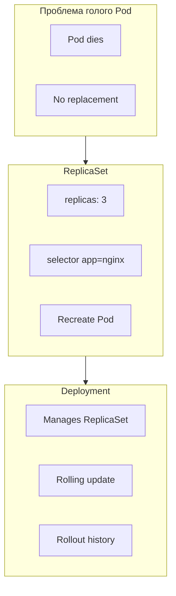

# Pod, ReplicaSet и Deployment

## 2. Зачем три уровня



| Объект | Решает | Не решает |
|--------|--------|-----------|
| **Pod** | Запуск 1+ containers | Restart policy limited; no N replicas |
| **ReplicaSet** | Держит **N** идентичных Pod'ов | Rolling update, history |
| **Deployment** | **Production** deploy pattern | Service discovery (→ [15.1.5 Service](15.1.5%20Kubernetes%20-%20Job%2C%20CronJob%20и%20Service.md)) |

**Production default:** `Deployment` (который создаёт ReplicaSet, который создаёт Pod'ы).

---

## 3. Pod

### 3.1. Теория

**Pod** - минимальная единица deployment в Kubernetes:

- **Shared network:** один IP; containers в Pod видят `localhost` друг друга.
- **Shared volumes** (optional): emptyDir, PVC mounts.
- **Lifecycle:** Pending → Running → Succeeded/Failed.
- **Ephemeral:** Pod **не** «перезапускается» после delete - создаётся **новый** object с новым именем.

**Restart policy** (на уровне Pod):

| Policy | Поведение |
|--------|-----------|
| `Always` | kubelet перезапускает container при exit (default) |
| `OnFailure` | Только при ненулевом exit code |
| `Never` | Не перезапускать |

Даже с `Always` - при **удалении** Pod object он **не** восстанавливается без ReplicaSet/Deployment.

### 3.2. Манифест Pod

```yaml
apiVersion: v1
kind: Pod
metadata:
  name: nginx-pod
  labels:
    app: nginx
    tier: frontend
spec:
  containers:
    - name: nginx
      image: nginx:1.27-alpine
      ports:
        - containerPort: 80
```

### 3.3. Проверка без Service

```bash
kubectl apply -f manifests/01-pod-nginx.yaml
kubectl get pod nginx-pod -o wide
kubectl port-forward pod/nginx-pod 8080:80
curl -s localhost:8080 | head
kubectl logs nginx-pod
kubectl exec -it nginx-pod -- sh
```

`port-forward` - временный tunnel для лабы; стабильный доступ - в [15.1.5 - Service](15.1.5%20Kubernetes%20-%20Job%2C%20CronJob%20и%20Service.md).

---

## 4. ReplicaSet

### 4.1. Теория

**ReplicaSet** (successor ReplicationController):

- `spec.replicas` - сколько Pod'ов;
- `spec.selector` - **matchLabels** для Pod'ов, которыми управляет;
- **Controller loop:** running < replicas → create Pod; running > replicas → delete Pod.

```text
kubectl delete pod nginx-xxxxx
    → ReplicaSet controller: replicas=3, running=2
    → creates new Pod with new name
```

### 4.2. Манифest

```yaml
apiVersion: apps/v1
kind: ReplicaSet
metadata:
  name: nginx-rs
  labels:
    app: nginx
spec:
  replicas: 3
  selector:
    matchLabels:
      app: nginx
      tier: frontend
  template:
    metadata:
      labels:
        app: nginx
        tier: frontend
    spec:
      containers:
        - name: nginx
          image: nginx:1.27-alpine
          ports:
            - containerPort: 80
```

**`template`** - шаблон Pod'а (как у Deployment). **Selector** должен **match** labels template.

### 4.3. Команды

```bash
kubectl apply -f manifests/02-replicaset-nginx.yaml
kubectl get rs
kubectl get pods -l app=nginx --show-labels
kubectl delete pod <one-pod-name>
kubectl get pods -w    # новый Pod появится
kubectl scale rs nginx-rs --replicas=5
```

---

## 5. Deployment

### 5.1. Теория

**Deployment** управляет **ReplicaSet'ами** (реvisions):

- Изменили `image` или template → **новый** ReplicaSet;
- **RollingUpdate** - постепенная замена Pod'ов;
- **rollout history** - откат на предыдущую revision.

```text
Deployment nginx-dep (revision 2)
    ├── ReplicaSet nginx-dep-7d4f8b (rev 2, desired 3) ← active
    └── ReplicaSet nginx-dep-5c9a1 (rev 1, desired 0) ← old, scaled to 0
```

### 5.2. Strategy

```yaml
spec:
  replicas: 3
  strategy:
    type: RollingUpdate
    rollingUpdate:
      maxSurge: 1
      maxUnavailable: 0
```

| Параметр | Смысл |
|----------|--------|
| `maxSurge` | Сколько **лишних** Pod'ов можно создать сверх replicas во время update |
| `maxUnavailable` | Сколько Pod'ов может быть **недоступно** во время update |

`maxUnavailable: 0` + `maxSurge: 1` - **zero-downtime** при 3 replicas (сначала новый, потом старый).

### 5.3. Манифест

```yaml
apiVersion: apps/v1
kind: Deployment
metadata:
  name: nginx-dep
  labels:
    app: nginx
spec:
  replicas: 3
  selector:
    matchLabels:
      app: nginx
      tier: frontend
  strategy:
    type: RollingUpdate
    rollingUpdate:
      maxSurge: 1
      maxUnavailable: 0
  template:
    metadata:
      labels:
        app: nginx
        tier: frontend
    spec:
      containers:
        - name: nginx
          image: nginx:1.27-alpine
          ports:
            - containerPort: 80
```

### 5.4. Rolling update и rollback

```bash
kubectl apply -f manifests/03-deployment-nginx.yaml
kubectl rollout status deployment/nginx-dep
kubectl set image deployment/nginx-dep nginx=nginx:1.26-alpine
kubectl rollout status deployment/nginx-dep
kubectl rollout history deployment/nginx-dep
kubectl rollout undo deployment/nginx-dep
kubectl scale deployment/nginx-dep --replicas=5
```

---

## 6. ownerReferences и labels

```bash
kubectl get pods -l app=nginx -o yaml | grep -A5 ownerReferences
kubectl get rs -o wide
kubectl describe deployment nginx-dep
```

```text
Deployment nginx-dep
  ownerReferences: (none - top level)
ReplicaSet nginx-dep-xxxxx
  ownerReferences: Deployment/nginx-dep
Pod nginx-dep-xxxxx-yyyyy
  ownerReferences: ReplicaSet/nginx-dep-xxxxx
```

**Labels** (`app=nginx`) - для **selector**. **ownerReferences** - для **garbage collection** (удалили Deployment → RS и Pods удалятся).
