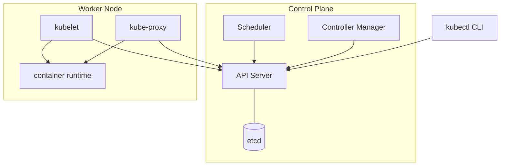
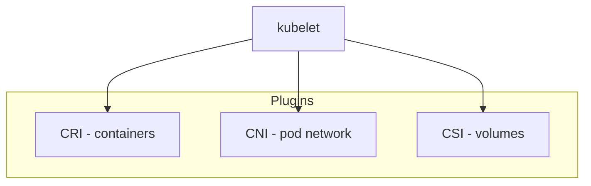
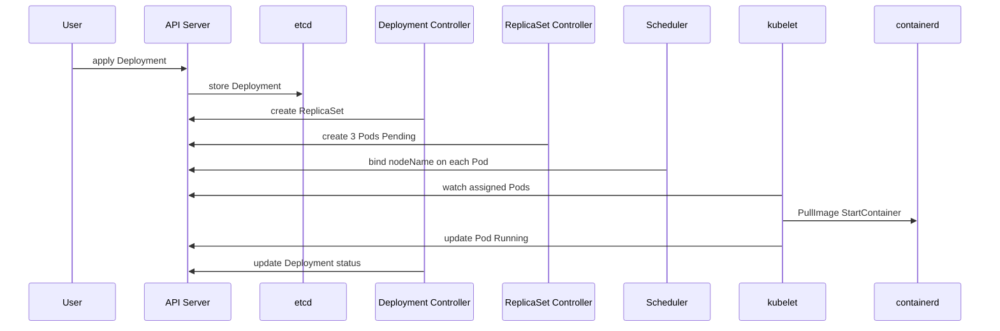

# 15.1.2 Kubernetes — архитектура и компоненты

## 2. Общая схема кластера

Кластер Kubernetes делится на:

| Часть             | Где работает             | Задача                           |
| ----------------- | ------------------------ | -------------------------------- |
| **Control plane** | Master node(s) / managed | API, state, scheduling decisions |
| **Worker nodes**  | Data plane               | Запуск Pod'ов, сеть, volumes     |



**Важно:** все компоненты общаются с **API server** (кроме etcd, который только с API server). Нет «прямого» доступа kubectl к kubelet для управления workloads (исключения — debug, metrics).

---

## 3. Control plane

### 3.1. kube-apiserver

**Центральная точка** кластера:

- REST API для всех ресурсов (`/api/v1/pods`, `/apis/apps/v1/deployments`, …).
- **Authentication** (who) → **Authorization** (RBAC, can?) → **Admission** (mutating/validating webhooks) → запись в etcd.
- **Watch** — clients (kubectl, controllers, kubelet) подписываются на изменения.

```text
kubectl apply -f pod.yaml
    → HTTPS POST /api/v1/namespaces/default/pods
    → admission plugins
    → persist in etcd
    → watch notifies kubelet / controllers
```

### 3.2. etcd

**Distributed key-value store** — **единственный** source of truth для state кластера.

| Хранит | Не хранит |
|--------|-----------|
| Все K8s objects (spec + status) | Container images |
| Cluster config | Application logs (→ stdout/Logging) |

- HA prod: **3 или 5** etcd members на отдельных нодах.
- Backup etcd — **disaster recovery** (критично для platform team).
- Minikube: один etcd внутри VM.

### 3.3. kube-scheduler

**Выбирает Node** для нового Pod (у которого ещё нет `spec.nodeName`).

Учитывает:

- **Requests/limits** CPU/memory;
- **Node affinity / taints / tolerations**;
- **Pod affinity / anti-affinity**;
- **Volume topology**;
- **Custom schedulers** (optional).

```text
Pod created (Pending)
    → scheduler assigns nodeName=worker-2
    → API server updates Pod
    → kubelet on worker-2 видит Pod и запускает
```

Scheduler **не** запускает контейнеры — только **назначает** ноду.

### 3.4. kube-controller-manager

Набор **control loops** (controllers), каждый — reconcile одного типа ресурса:

| Controller (пример) | Задача |
|---------------------|--------|
| **Deployment controller** | Поддерживает ReplicaSet по spec Deployment |
| **ReplicaSet controller** | Держит N Pod'ов с matching labels |
| **Node controller** | Node lifecycle, evictions |
| **Service controller** | Cloud LB для LoadBalancer Services |
| **EndpointSlice controller** | Backends для Service |

```text
Deployment spec.replicas=3, running Pods=2
    → ReplicaSet controller создаёт 3-й Pod
    → scheduler назначает Node
    → kubelet запускает container
```

**Controller manager** и **scheduler** — отдельные процессы; в managed K8s их не видно, но логика та же.

---

## 4. Worker node

### 4.1. kubelet

**Агент на каждой worker node**:

- Регистрирует node в API (`Node` object).
- **Watch** Pod'ы, назначенные **этой** node (`spec.nodeName`).
- Вызывает **CRI** (container runtime): pull image, create container, start.
- Reports **Pod status** (Running, Failed) → API server.
- Runs **probes** (liveness/readiness).
- Mounts volumes через **CSI**.

```text
Pod assigned to node-1
    → kubelet: EnsureImagePull(nginx:1.27)
    → CRI: CreateContainer + Start
    → status.phase=Running → API
```

### 4.2. kube-proxy

**Сетевой proxy** на node для **Service** abstraction:

- Режимы: iptables, IPVS, eBPF (depends on setup).
- Реализует **ClusterIP**: трафик на virtual IP Service → backend Pod IPs.
- Работает в связке с **CNI** (Pod получает IP из pod network).


### 4.3. Container runtime

Через **CRI** (Container Runtime Interface):

| Runtime | Типичное использование |
|---------|------------------------|
| **containerd** | Docker Engine, Minikube, EKS |
| **CRI-O** | OpenShift, некоторые distros |

Низкоуровнево — **runc** (OCI), как в Docker chain.

---

## 5. CRI, CNI, CSI

Три стандартных интерфейса **на node**:



| Интерфейс | Вопрос | Примеры |
|----------|--------|---------|
| **CRI** | Как запустить container? | containerd, CRI-O |
| **CNI** | Как Pod получает IP и маршруты? | Calico, Cilium, Flannel, kindnet |
| **CSI** | Как примонтировать disk? | EBS CSI, NFS drivers |

**Minikube** поднимает default CNI (often kindnet/calico depending on version) автоматически — в лабе не настраиваем вручную.

---

## 6. Объектная модель API

Каждый ресурс в Kubernetes — **object** с общей структурой:

```yaml
apiVersion: apps/v1      # группа и версия API
kind: Deployment         # тип ресурса
metadata:
  name: nginx-dep
  namespace: default
  labels:
    app: nginx
spec:                    # desired state — ВЫ задаёте
  replicas: 3
  template:
    spec:
      containers:
        - name: nginx
          image: nginx:1.27-alpine
status:                  # actual state — ЗАПОЛНЯЕТ система
  replicas: 3
  availableReplicas: 3
```

| Поле | Кто пишет |
|------|-----------|
| `metadata`, `spec` | Пользователь / CI (`kubectl apply`) |
| `status` | Controllers, kubelet (read-only для user) |

### 6.1. apiVersion и kind

| apiVersion | kind (примеры) |
|------------|----------------|
| `v1` | Pod, Service, Namespace, ConfigMap |
| `apps/v1` | Deployment, ReplicaSet, DaemonSet, StatefulSet |
| `batch/v1` | Job, CronJob |
| `networking.k8s.io/v1` | Ingress, NetworkPolicy |

```bash
kubectl api-resources
kubectl explain pod.spec.containers
```

### 6.2. Labels и selectors

**Labels** — key/value на объектах. **Selectors** связывают объекты:

```text
Deployment selector: app=nginx
    → ReplicaSet selects Pods with app=nginx
    → Service (later) selects same labels
```

### 6.3. Namespaces

**Namespace** — виртуальная изоляция внутри одного cluster (`default`, `kube-system`, …).

- RBAC, quotas, DNS names (`service.ns.svc.cluster.local`).

---

## 7. Обзор сущностей (preview)


| Сущность | Уровень | Кратко |
|----------|---------|--------|
| **Pod** | Workload | 1+ containers, shared IP |
| **ReplicaSet** | Controller | N identical Pods |
| **Deployment** | Controller | RS + rolling update + history |
| **Job** | Batch controller | Run-to-completion task |
| **CronJob** | Batch controller | Scheduled Jobs |
| **Service** | Network | Stable IP/DNS to Pods |
| **Ingress** | Network | HTTP routing to Services |
| **ConfigMap / Secret** | Config | Data без rebuild image |
| **Namespace** | Isolation | Logical cluster partition |

**Иерархия controllers (15.1 focus):**

```text
Deployment
    └── owns → ReplicaSet (revision 1, 2, …)
            └── owns → Pod, Pod, Pod
```

---

## 8. Путь запроса: kubectl apply → Running Pod

Полная sequence для **Deployment** (упрощённо):



Пошагово:

1. **kubectl apply** → Deployment в etcd.
2. **Deployment controller** создаёт **ReplicaSet** с pod template.
3. **ReplicaSet controller** создаёт **Pod** objects (replicas=N).
4. **Scheduler** проставляет **nodeName** на каждый Pod.
5. **kubelet** на node: pull image, start container via **CRI**.
6. **kubelet** обновляет **status** → Pod `Running`.
7. **ReplicaSet** следит: удалили Pod вручную → создаёт новый.

---

## 9. Minikube vs production

| | Minikube | Production (EKS/GKE) |
|--|----------|------------------------|
| Control plane | Внутри VM/docker | Managed, multi-AZ |
| Nodes | 1 (default) | Auto Scaling Group / node pools |
| etcd | Single | HA cluster |
| CNI | Built-in addon | Выбор (Calico, Cilium…) |
| Назначение | **Обучение, dev** | SLA, HA, compliance |
