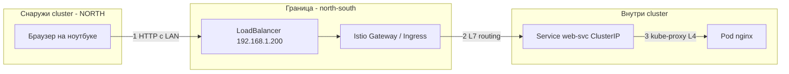
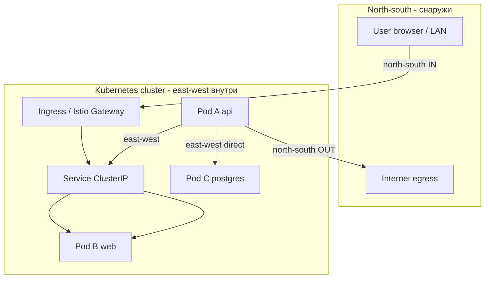
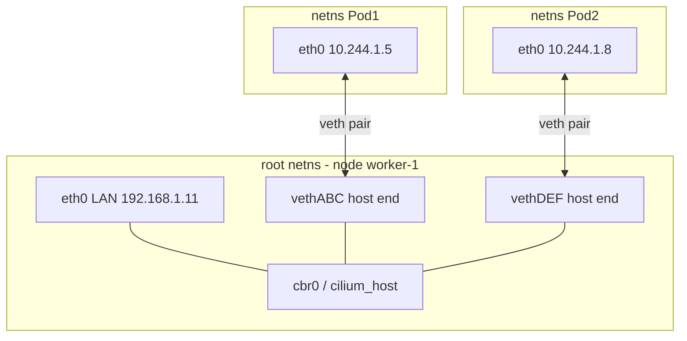
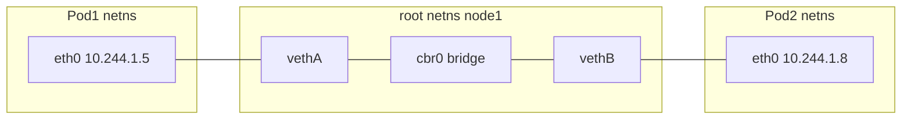
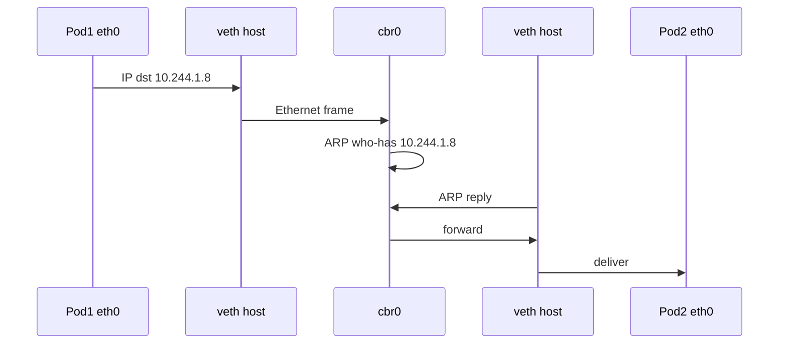
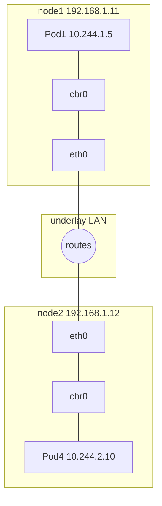
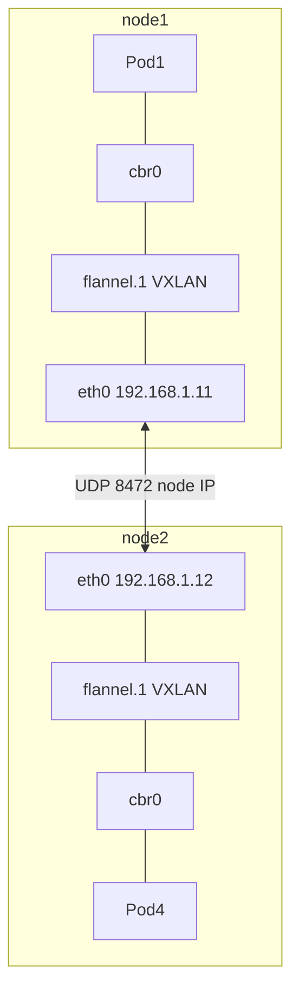
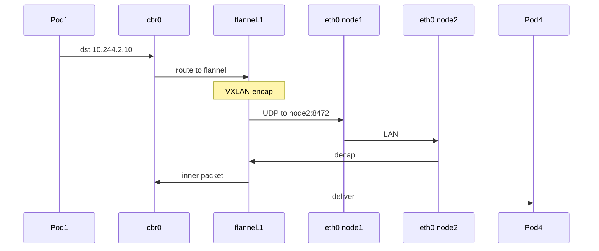
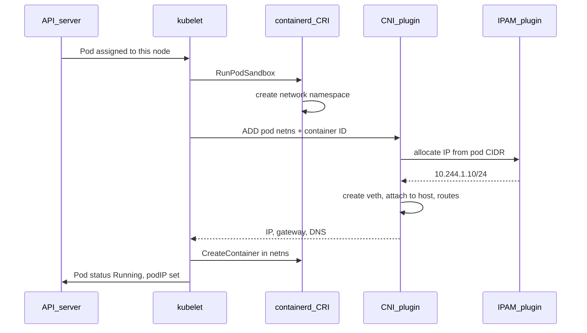
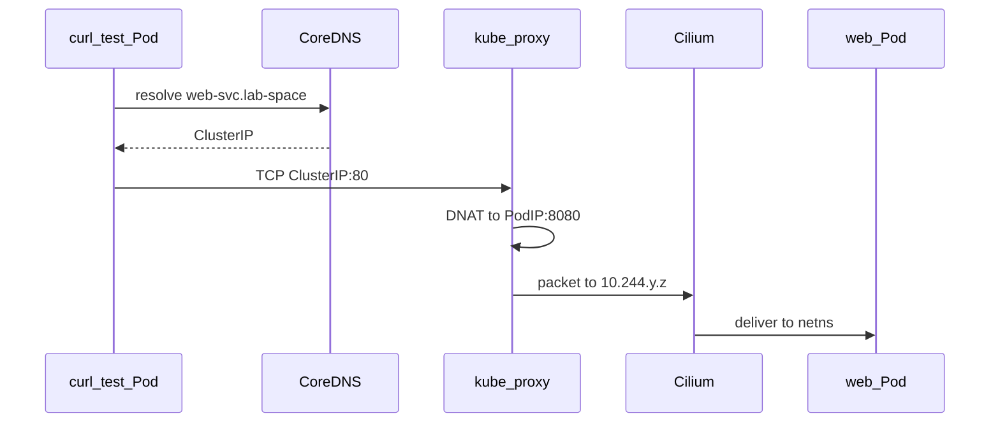

# Kubernetes - сетевая подсистема


## 2. East-west и north-south трафик

### 2.1. Откуда вообще «east» и «north»

Термины пришли из **схем дата-центров** (вид сверху на карту):

```text
                    NORTH
                      ↑
            [ Интернет / пользователи ]
                      |
    ──────────────────┼──────────────────  ← граница cluster / DC
                      |
         Pod A ←──────┼──────→ Pod B       ← EAST ⟷ WEST (внутри)
                      |
         Pod C ←──────┼──────→ Pod D
                      ↓
                    SOUTH
```

- **North-south (север–юг)** - трафик **через границу**: **снаружи cluster → внутрь** или **изнутри → наружу**. «Вертикальный» - пользователь, партнёр, другой дата-центр.
- **East-west (восток–запад)** - трафик **внутри** cluster (или внутри одной сети приложений): Pod ↔ Pod, Service ↔ Pod, `api` → `database`. «Горизонтальный» - **не выходит** к пользователю в интернет.

**Суть одной фразой:** north-south = **кто-то снаружи** разговаривает с приложением; east-west = **части приложения** разговаривают **между собой** внутри Kubernetes.

---

### 2.2. Аналогия без Kubernetes

Представьте **офисное здание**:

| Направление | Аналог | Пример |
|-------------|--------|--------|
| **North-south** | Входная дверь ↔ кабинеты | Клиент заходит с улицы → стойка reception → вас направляют в нужный кабинет |
| **East-west** | Кабинет ↔ кабинет | Бухгалтерия звонит в склад **внутри здания**, не выходя на улицу |

Kubernetes:

| Направление | «Дверь» в cluster | Кто маршрутизирует |
|-------------|-------------------|---------------------|
| **North-south** | NodePort, LoadBalancer, Ingress Gateway | Cilium LB, Istio Gateway, ingress-nginx |
| **East-west** | Нет «двери» - всё уже внутри pod network | CNI (Cilium) + kube-proxy + CoreDNS |

---

### 2.3. Конкретные примеры 


#### Пример A - North-south

Вы на ноутбуке открываете в браузере:

```text
http://192.168.1.200/   или   http://demo.local/
```

**Путь пакета:**

1. **Ноутбук** (LAN `192.168.1.x`) - вы **снаружи** pod network.
2. Пакет идёт на **LoadBalancer IP** `192.168.1.200` (Istio ingressgateway или ingress-nginx).
3. **Ingress / Gateway** смотрит Host и path → выбирает backend **Service**.
4. **kube-proxy** (L4) направляет на **Pod IP** одной из реплик.
5. **Cilium** доставляет пакет в network namespace Pod'а.



Это **north-south**: трафик **пересёк границу** «мир пользователя → Kubernetes».

#### Пример B - East-west (Pod → Service → Pod)

Внутри cluster уже есть debug Pod `curl-test`. Вы выполняете:

```bash
curl http://web-svc
```

**Путь пакета:**

1. `curl-test` Pod и `web-svc` - **оба внутри** cluster, оба в pod CIDR (`10.x.x.x`).
2. CoreDNS: `web-svc` → ClusterIP `10.96.x.x` (внутренний VIP, **не** виден с вашего ноутбука без port-forward).
3. kube-proxy на node источника: ClusterIP → Pod IP backend'а.
4. Cilium доставляет пакет на target node.

**Ни один шаг не идёт через `192.168.1.200` и не через браузер.** Пользователь с улицы **не участвует**. Это **east-west**.

#### Пример C - East-west (Pod → Pod напрямую)

Микросервис `api` вызывает `web` по **ClusterIP** или headless DNS `web-sts-0.web-headless…`:

```text
api Pod  →  DNS  →  web-svc:80  →  kube-proxy  →  web Pod
```

Или напрямую по Pod IP (редко, но возможно в mesh/debug):

```text
api Pod  →  10.244.1.15:8080  →  Cilium  →  web Pod
```

Снова **east-west** - оба конца внутри cluster.

#### Пример D - Это north-south или east-west?

| Сценарий | Направление | Почему |
|----------|-------------|--------|
| Браузер → `demo.local` → nginx Pod | **North-south** | Клиент **вне** cluster |
| `curl-test` Pod → `web-svc` | **East-west** | Оба **внутри** cluster |
| `api` Pod → `postgres` Pod в том же NS | **East-west** | Сервис ↔ сервис внутри |
| Pod → `https://google.com` | **North-south (исходящий)** | Трафик **выходит** из cluster в интернет |
| Prometheus → scrape metrics Pod'ов | **East-west** | Мониторинг внутри платформы |
| Argo CD → Kubernetes API | **East-west*** | Внутри control plane / cluster API (*часто так классифицируют) |

**Исходящий** трафик Pod'а в интернет (обновления, внешние API) тоже **north-south** - он **пересекает границу** наружу, просто направление «изнутри наружу», а не «снаружи внутрь».

---

### 2.4. Что важно не путать

| Миф | Реальность |
|-----|------------|
| «East-west = только Pod IP → Pod IP» | **Service → Pod** через ClusterIP - тоже east-west |
| «Ingress = весь трафик» | Ingress/Gateway обрабуживают в основном **north-south HTTP(S)**; Pod'ы друг с другом **не** ходят через Ingress |
| «North-south = только HTTP» | **NodePort TCP**, **LoadBalancer** для БД, **egress** в интернет - тоже north-south (L4) |
| «Разные namespace = east-west запрещён» | По умолчанию Pod из `lab-space` **может** достучаться до Pod в `default` - это east-west; блокировка = **NetworkPolicy** |
| «kube-proxy = north-south» | kube-proxy участвует **и** там, и там: любой трафик **на ClusterIP** (из Pod или через Ingress) |

**Ingress Controller** стоит на **границе** (north-south). После того как он отправил запрос на **ClusterIP** backend Service, дальше цепочка **внутри** cluster - kube-proxy + CNI - технически тоже «внутренняя доставка», но **точка входа** была north-south.

---

### 2.5. Шпаргалка

| Направление | Кто инициатор | Куда | Типичный путь |
|-------------|---------------|------|---------------|
| **East-west** | Pod / Service **внутри** cluster | Другой Pod / Service **внутри** | CNI pod network |
| **East-west via Service** | Pod | `web-svc:80` → backend Pod | CoreDNS → kube-proxy → CNI |
| **North-south (входящий)** | Браузер, Postman, партнёр | Приложение в cluster | LB / NodePort / Ingress → Service → Pod |
| **North-south (исходящий)** | Pod | Интернет, SaaS, внешняя БД | CNI → node NAT → router |



---

## 3. Два «мира» IP: pod network vs Service network

Kubernetes намеренно использует **два непересекающихся адресных пространства**. Путаница между ними - главная причина «не понимаю, куда идёт пакет».

| | **Pod network** | **Service network** |
|---|-----------------|---------------------|
| **Кто выдаёт IP** | **CNI** (IPAM плагин) | **Kubernetes API** (control plane) |
| **Кому принадлежит** | Каждому **Pod** | Каждому **Service** (ClusterIP) |
| **Пример CIDR** | `10.244.0.0/16`, `10.42.0.0/16` | `10.96.0.0/12` (default `--service-cluster-ip-range`) |
| **Маршрутизация** | CNI: veth, bridge, tunnel, BGP, eBPF | **kube-proxy**: iptables/IPVS на **каждой** node |
| **Достижимость с ноутбука** | **Нет** (без tunnel/VPN) | **Нет** для ClusterIP; LB/NodePort - исключения |
| **Жизненный цикл IP** | Pod умер → IP **освобождается** | Service удалён → ClusterIP **освобождается** |

```text
Pod A:     10.244.1.10:8080     ← реальный процесс в container network namespace
Pod B:     10.244.2.15:5432
Service:   10.96.47.88:80      ← виртуальный IP, нет процесса «на 10.96.47.88»
Node:      192.168.1.11         ← физическая / LAN IP worker (Talos)
LB VIP:    192.168.1.201        ← «внешний» вход (Cilium / cloud / MetalLB)
```

**ClusterIP не «пробрасывается» в pod CIDR.** kube-proxy на node перехватывает пакет **на адрес Service** и делает **DNAT** на **Pod IP** из EndpointSlice. Дальше **CNI** доставляет пакет на target node.

Проверка на cluster:

```bash
kubectl cluster-info dump | grep -E 'cluster-cidr|service-cluster-ip-range' | head -5
kubectl get nodes -o wide
kubectl get pods -A -o wide | head -10
```

**Разбор:**

| Команда | Назначение |
|---------|------------|
| `cluster-info dump \| grep cluster-cidr` | Pod CIDR cluster (задаётся при install: Talos machine config, kubeadm, cloud) |
| `grep service-cluster-ip-range` | Диапазон ClusterIP |
| `get nodes -o wide` | **INTERNAL-IP** node - LAN адрес (`192.168.1.x`), не pod IP |
| `get pods -o wide` | **IP** column - pod network от CNI |

---

## 4. Что есть в реальном cluster

Kubernetes **не поставляет** рабочую pod-сеть «из коробки» в tarball. При установке cluster **обязан** иметь:

1. **CNI plugin** - иначе Pod'ы останутся без IP (`ContainerCreating` / network not ready).
2. **kube-proxy** - DaemonSet или static pod на каждой node.
3. **CoreDNS** - Deployment для DNS имён Service.

**Не входит** в минимальный cluster (ставится отдельно):

- Ingress Controller (nginx, Traefik, …)
- LoadBalancer implementation на bare metal (Cilium LB IPAM, MetalLB, kube-vip)
- Service Mesh (Istio, Linkerd)
- NetworkPolicy enforcement (зависит от CNI)

### 4.1. Где что живет 

| Компонент | Форма | Namespace | На каждой node? |
|-----------|-------|-----------|-----------------|
| **Cilium agent** | DaemonSet | `kube-system` | **Да** - dataplane |
| **Cilium operator** | Deployment | `kube-system` | Нет - control logic, LB IPAM |
| **kube-proxy** | DaemonSet | `kube-system` | **Да** |
| **CoreDNS** | Deployment (2+ replicas) | `kube-system` | Нет - Service + anti-affinity |
| **istiod** | Deployment | `istio-system` | Нет - mesh control plane |

```bash
kubectl get nodes -o wide
kubectl get pods -n kube-system -o wide | grep -E 'cilium|kube-proxy|coredns'
kubectl get svc -n kube-system kube-dns -o wide
```

**Разбор:**

| Команда | Назначение |
|---------|------------|
| `get nodes -o wide` | 4 nodes: control-plane + workers; INTERNAL-IP в LAN |
| `grep cilium\|kube-proxy\|coredns` | DS agent/proxy на **каждой** node; CoreDNS - несколько Pod'ов |
| `get svc kube-dns` | ClusterIP DNS (`10.96.0.10` часто) - резolv.conf Pod'ов указывает сюда |

### 4.2. Talos / kubeadm / cloud - одна модель

| Distro | Кто ставит CNI | Типичный CNI |
|--------|----------------|--------------|
| **Talos** | Вы в machine config / extension | **Cilium**, Calico |
| **kubeadm** | Вы после `kubeadm init` (`kubectl apply -f calico.yaml`) | Calico, Cilium, Canal |
| **EKS** | AWS (vpc-cni) | **aws-vpc-cni** - Pod IP из VPC subnet |
| **GKE** | Google | Dataplane V2 (eBPF) / Calico |
| **AKS** | Azure | Azure CNI / kubenet |

**Minikube / kind** - упрощённые single- или multi-node кластеры для обучения; **архитектура та же** (CNI + kube-proxy + DNS), но один node, другой CIDR, иногда `kindnet`. Для production-мышления ориентируйтесь на **multi-node + реальный CNI**.

### 4.3. Требования Kubernetes к сети (почему CNI обязателен)

Из [official networking model](https://kubernetes.io/docs/concepts/cluster-administration/networking/):

- Каждый Pod получает **уникальный IP** в pod network.
- Pod'ы на **разных nodes** общаются **без NAT** между собой (Pod IP ↔ Pod IP).
- Agents на node (kubelet) **не** делают маршрутизацию между nodes - это **CNI**.
- Service abstraction (ClusterIP) - **отдельный** слой (kube-proxy).

---

## 4.4. Иллюстрированный разбор pod-сети


Этот раздел отвечает на вопрос: **«Как пакет физически доходит от Pod A до Pod B?»** - до Service, Ingress и kube-proxy. Это **east-west на уровне L3**.

### 4.4.1. Главный принцип: IP на Pod, не на контейнер

**Сетевая модель Kubernetes** строится на одном правиле:

> **У каждого Pod - свой уникальный IP-адрес**, общий для **всех** контейнеров внутри Pod.

| Следствие | Зачем это хорошо |
|-----------|------------------|
| IP «принадлежит» Pod, не container | Контainer перезапустился - **IP Pod не меняется** |
| Нет NAT между Pod'ами | Pod A → Pod B по **Pod IP** напрямую |
| Нет конфликта портов на node | Pod1 `:8080` и Pod2 `:8080` - **разные IP**, node не «занимает» порты приложений |

**Pause-контейнер (sandbox):** при создании Pod runtime сначала поднимает **infra/pause** container - он **держит network namespace (netns)**. Остальные контейнеры Pod **подключаются** к этому netns. Поэтому в `kubectl get pods` вы видите `2/2` - один container pause.

```bash
kubectl get pods -n lab-space -o wide
kubectl run net-test --rm -it --restart=Never -n lab-space --image=busybox:1.36 -- ip addr
```

| Команда | Назначение |
|---------|------------|
| `get pods -o wide` | Колонка **IP** - адрес Pod в pod network |
| `ip addr` в debug Pod | `eth0` с Pod IP; один netns на все container'ы Pod |

**Требование Kubernetes:** все Pod IP **маршрутизируемы** из любого Pod **на любой node** - без NAT pod→pod. **Как** это обеспечить - решает **CNI**.

---

### 4.4.2. Рисунок 1 - Node и network namespace

На Linux **node** = **root network namespace** (`root netns`). LAN-интерфейс **`eth0`** - IP node `192.168.1.11`.

Каждый Pod - **отдельный netns**. Pod **не знает** о хосте и видит свой `eth0`.



**veth pair** - виртуальный «кабель»: `eth0` в netns Pod ↔ `vethXXX` на host. CNI при **ADD** создаёт пару.

```bash
ip link show type veth
ip addr show
brctl show 2>/dev/null || bridge link
```

| Команда | Назначение |
|---------|------------|
| `ip link show type veth` | veth пары Pod ↔ host |
| `ip addr` | `eth0` node + Cilium/cbr0 интерфейсы |
| `brctl show` | Linux bridge (классика Docker/`cbr0`) |

---

### 4.4.3. Рисунок 2 - Intra-node: Pod ↔ Pod на одной node

Host-концы veth подключены к bridge **`cbr0`** (Docker - `docker0`).



**Пакет Pod1 → Pod2:**

| Шаг | Что происходит |
|-----|----------------|
| 1 | Пакет из netns Pod1 через `eth0` |
| 2 | Host-конец veth в root netns |
| 3 | **`cbr0`**: ARP «кто 10.244.1.8?» |
| 4 | veth Pod2 отвечает |
| 5–6 | Frame доставлен в netns Pod2 |



**Без** kube-proxy и Service - чистый east-west same-node.

---

### 4.4.4. Рисунок 3 - Inter-node без overlay

Node1: pod CIDR `10.244.1.0/24`. Node2: `10.244.2.0/24`. Маршрут: «`10.244.2.0/24` → node2».



**Пакет Pod1 → Pod4 (другая node):**

| Шаг | Действие |
|-----|----------|
| 1–2 | Pod1 → cbr0; ARP не находит `10.244.2.10` локально |
| 3 | Пакет на **`eth0`** node (маршрут pod CIDR) |
| 4 | Underlay: `src=10.244.1.5`, `dst=10.244.2.10` |
| 5 | Routing → node2 |
| 6 | **`eth0` node2** + **ip_forward** |
| 7 | Route: pod CIDR → **`cbr0`** |
| 8 | ARP → veth Pod4 |

```bash
ip route show
sysctl net.ipv4.ip_forward
```

---

### 4.4.5. Рисунок 4 - Overlay Flannel VXLAN

Overlay **не обязателен** (Flant). Нужен при лимите cloud routes (AWS ~50) или когда underlay не маршрутизирует pod CIDR.

**`flannel.1`** + **`flanneld`**: Pod IP → Node IP mapping; VXLAN UDP **8472**.



**Encap path:**

| Шаг | Действие |
|-----|----------|
| 1–2 | Pod1 → cbr0; нет local ARP для remote pod |
| 3 | Route → **flannel.1**; encap: outer `node1→node2`, inner pod IPs |
| 4–5 | **`eth0`** underlay доставляет на node2 |
| 6 | Decap → **cbr0** → Pod4 |



## 5. CNI - стандарт и как это работает

### 5.1. Что такое CNI

**CNI** (Container Network Interface) - **не программа**, а **спецификация** + набор **плагинов** (обычно Go-бинарники в `/opt/cni/bin`).

**Задача CNI:** когда runtime создаёт **network namespace** для Pod sandbox, **kubelet** вызывает CNI и говорит: «подключи этот netns к cluster, выдай IP, настрой маршруты».

CNI **не** знает про Service, Ingress, Deployment - только **L3 connectivity Pod ↔ Pod** (и опционально policy, encryption).

### 5.2. Кто вызывает CNI



**ADD** - при создании Pod. **DEL** - при удалении (освободить IP, убрать veth).

Конфиг CNI на node: `/etc/cni/net.d/` (JSON). Пример **цепочки**:

```json
{
  "cniVersion": "0.3.1",
  "name": "cilium",
  "type": "cilium"
}
```

Или **chain** (несколько плагинов подряд): `bridge` → `host-local` IPAM → `portmap` для hostPort.

### 5.3. Анатомия Pod network на одной node

> Пошаговые схемы veth, bridge, ARP - **§4.4**. Здесь - обобщённая картина.

```text
┌─────────────────────────────────────────────────────────────┐
│  Node 192.168.1.11 (worker-1)                               │
│                                                             │
│  ┌────────────── host network ──────────────────────────┐   │
│  │  cilium_host / cni0 / vxlan.calico …                 │   │
│  │       ▲                    ▲                         │   │
│  │       │ veth               │ veth                     │   │
│  │  ┌────┴─────┐        ┌─────┴────┐                    │   │
│  │  │ Pod A    │        │ Pod B    │  …                 │   │
│  │  │ netns    │        │ netns    │                    │   │
│  │  │10.244.1.2│        │10.244.1.3│                    │   │
│  │  └──────────┘        └──────────┘                    │   │
│  └──────────────────────────────────────────────────────┘   │
└─────────────────────────────────────────────────────────────┘
         │ cross-node tunnel / BGP / native routing
         ▼
┌─────────────────────────────────────────────────────────────┐
│  Node 192.168.1.12 (worker-2)  … Pod C 10.244.2.5           │
└─────────────────────────────────────────────────────────────┘
```

Каждый Pod - **изолированный network namespace** (как `docker run --network`). **veth pair**: один конец в netns Pod'а, второй - на host, дальше логика CNI.

### 5.4. Cross-node: три семейства решений

| Модель | Как Pod A на node1 достигает Pod B на node2 | Примеры |
|--------|-----------------------------------------------|---------|
| **Overlay (tunnel)** | Pod IP инкапсулируется в UDP/VXLAN/Geneve между nodes | Flannel VXLAN, Calico VXLAN, Cilium VXLAN |
| **Native routing / BGP** | Pod CIDR анонсируется в underlay (ToR, Linux routes); пакет идёт без tunnel | Calico BGP, Cilium native routing |
| **VPC integration** | Pod IP = реальный IP в cloud subnet; маршруты в VPC | AWS vpc-cni, Azure CNI |

**Underlay** - физическая/LAN сеть между nodes (`192.168.1.0/24`). **Overlay** - «вторая сеть» поверх неё для pod CIDR.

На **homelab Talos** с Cilium часто: pod CIDR маршрутизируется через **eBPF** на host или tunnel - зависит от `routingMode` в Helm values.

### 5.5. CNI vs kube-proxy - не путать

| | **CNI** | **kube-proxy** |
|---|---------|----------------|
| **Уровень OSI** | L3 (IP между Pod'ами) | L4 (перехват **ClusterIP:port**) |
| **Объект** | Pod IP | Service VIP → Pod IP |
| **Где работает** | При **создании** netns + dataplane | Правила на **каждой** node постоянно |
| **Без него** | Pod без IP / нет связности между nodes | ClusterIP не работает; **Pod IP напрямую** - работает |

---

## 6. CNI плагины: Flannel, Calico, Cilium

### 6.1. Сводная таблица

| | **Flannel** | **Calico** | **Cilium** |
|---|-------------|------------|------------|
| **Фокус** | «Просто связать Pod'ы» | Маршрутизация + **NetworkPolicy** | eBPF dataplane + policy + observability |
| **Dataplane** | VXLAN / host-gw | iptables/nftables или eBPF (Calico eBPF mode) | **eBPF** в kernel |
| **Cross-node** | Overlay (VXLAN) | BGP **или** overlay | Native routing / tunnel / BGP |
| **NetworkPolicy** | **Нет** (нужен Calico policy controller отдельно) | **Да** | **Да** |
| **LoadBalancer LB** | Нет | Нет (отдельно MetalLB) | **LB IPAM + L2** (ваш homelab) |
| **Service mesh** | Нет | Нет | Istio совместим; встроенный mesh optional |
| **Сложность** | Низкая | Средняя–высокая | Средняя–высокая |
| **Типичный use** | Legacy dev, простые кластеры | On-prem prod, policy | Cloud-native prod, homelab Talos |

### 6.2. Flannel - минимальный overlay

> Иллюстрированный path пакета через **`flannel.1` VXLAN** - [§4.4.5](#445-рисунок-4--overlay-flannel-vxlan).

**Идея:** на каждой node daemon **flanneld** знает pod subnet (`10.244.1.0/24` на node1, `10.244.2.0/24` на node2). Трафик между subnets идёт через **VXLAN**: outer IP = node LAN, inner = pod IP.

```text
Pod 10.244.1.5 → Pod 10.244.2.10
  → veth → flannel.1 (VXLAN)
  → UDP packet to 192.168.1.12
  → unwrap → deliver to Pod on node2
```

**Плюсы:** просто установить, мало движущихся частей. **Минусы:** нет NetworkPolicy; overhead tunnel; MTU уменьшается (VXLAN header). **Не** рекомендуется для новых prod - но часто встречается в старых кластерах.

### 6.3. Calico - маршрутизация и policy

**Два режима (упрощённо):**

**A) BGP mode (без overlay):** каждая node **анонсирует** pod CIDR соседям (ToR или mesh между nodes). Pod IP **маршрутизируем** в underlay. Нет лишней инкапсуляции - **лучше MTU и latency**.

**B) VXLAN overlay:** как Flannel, если BGP в LAN недоступен.

**NetworkPolicy:** Calico **iptables/eBPF rules** на node: «Pod с label `role=frontend` может ходить на `role=db`:5432».

**Felix** - agent на node; **Typha** (optional) - кэш для scale; **kube-controllers** - sync policy.

```bash
# если Calico (не ваш homelab):
kubectl get pods -n kube-system -l k8s-app=calico-node
```

### 6.4. Cilium - eBPF dataplane (ваш homelab)

**eBPF** - программы в **Linux kernel**, не проходящие через классический iptables chain для **каждого** пакета. Cilium **вставляет** logic в hook'и kernel: «этот packet от 10.244.1.5 к 10.244.2.10 → forward через tunnel/native».

**Компоненты:**

| Комponent | Роль |
|-----------|------|
| **cilium-agent** (DaemonSet) | Dataplane на **каждой** node: pod networking, policy, LB datapath |
| **cilium-operator** (Deployment) | IPAM pools, LoadBalancer IP assign, identity sync |
| **cilium-envoy** (optional) | L7 policy / mesh |

**На homelab дополнительно:**

- **CiliumLoadBalancerIPPool** - выдача `192.168.1.200–210` для `Service type: LoadBalancer` **без MetalLB**
- **CiliumL2AnnouncementPolicy** - ARP на LAN: «IP .201 живёт на worker-2»

```bash
kubectl get pods -n kube-system -l app.kubernetes.io/name=cilium-agent -o wide
kubectl get ciliumnodes
kubectl get ciliumloadbalancerippools
cilium status   # CLI на node или cilium pod exec
```

**Разбор:**

| Команда | Назначение |
|---------|------------|
| `get pods … cilium-agent -o wide` | Agent на **каждой** node - east-west dataplane |
| `get ciliumnodes` | CR: pod CIDR per node, health |
| `get ciliumloadbalancerippools` | North-south LB VIP pool |
| `cilium status` | Routing mode, kube-proxy replacement, connectivity |

**Kube-proxy replacement:** Cilium может **заменить** kube-proxy (Service LB через eBPF). На cluster проверьте: `kubectl get cm -n kube-system cilium-config -o yaml | grep kube-proxy-replacement`. Если `true` - часть работы kube-proxy делает Cilium; если `false` - **оба** слоя (как часто на homelab).

### 6.5. AWS VPC CNI (cloud контраст)

На **EKS** Pod часто получает IP **из той же VPC subnet**, что и node:

- **Плюс:** Pod IP routable в VPC (Security Groups per Pod).
- **Минус:** лимит IP в subnet; другая модель, чем overlay homelab.

Это тот же **CNI contract** (kubelet → ADD), другая реализация IPAM.

---

## 7. kube-proxy и EndpointSlice

### 7.1. Зачем kube-proxy

**Service** - абстракция **stable VIP** (`10.96.x.x:80`) на **меняющийся** набор Pod IP. kube-proxy на **каждой** node держит правила: «traffic to **ClusterIP:port** → DNAT to **one of backend Pod IPs:targetPort**».

**EndpointSlice controller** (в kube-controller-manager) заполняет backends:

```bash
kubectl get svc web-svc -n lab-space
kubectl get endpointslice -n lab-space -l kubernetes.io/service-name=web-svc -o yaml
kubectl get pods -n lab-space -l app=web -o wide
```

**Разбор:**

| Команда | Назначение |
|---------|------------|
| `get svc` | ClusterIP и **port** Service |
| `get endpointslice` | Реальные **Pod IP:port** backends |
| `get pods -o wide` | IP column **должен совпадать** с addresses в EndpointSlice |

Пустой EndpointSlice при Running Pod'ах → **selector** Service не совпадает с labels Pod **или** readiness probe fail.

### 7.2. Режимы kube-proxy

| Mode | Механизм | Когда |
|------|----------|-------|
| **iptables** | Random DNAT chain per Service | Default многих distros |
| **IPVS** | L4 load balance, меньше правил при 1000+ Service | Large clusters, `kube-proxy --proxy-mode=ipvs` |
| **nftables** | Современная замена iptables backend | Новые версии K8s |
| **eBPF (Cilium)** | kube-proxy **disabled**, Cilium programs Service | `kubeProxyReplacement: true` |

```text
Pod curl-test → DNS web-svc → 10.96.47.88:80
  → routing: packet to ClusterIP попадает в iptables/IPVS (local node)
  → kube-proxy rule: DNAT → 10.244.1.22:8080
  → Cilium маршрутизирует 10.244.1.22 на local или remote node
  → Pod web принимает на containerPort
```

kube-proxy - **L4 only**. Он **не** смотрит HTTP Host/Path. **Ingress / Istio Gateway** - L7 поверх этой цепочки.

### 7.3. NodePort и LoadBalancer - расширение kube-proxy + cloud/Cilium

| type | Что добавляется |
|------|-----------------|
| **NodePort** | Прослушивание `0.0.0.0:30000-32767` на **каждой** node → тот же ClusterIP chain |
| **LoadBalancer** | **Внешний** IP + балансировщик → чаще всего NodePort backends |

```bash
kubectl get svc -A --field-selector spec.type=LoadBalancer
kubectl get pods -n kube-system -l app.kubernetes.io/name=cilium-operator
```

---

## 8. Пути трафика пошагово

### 8.1. East-west: Pod → Service → Pod (тот же namespace)

**Сценарий:** `curl-test` Pod → `http://web-svc.lab-space.svc.cluster.local`

| Шаг | Где | Что происходит |
|-----|-----|----------------|
| 1 | Pod `curl-test` | `/etc/resolv.conf` → nameserver `10.96.0.10` (CoreDNS) |
| 2 | CoreDNS Pod | `web-svc.lab-space.svc.cluster.local` → A record **ClusterIP** |
| 3 | Node `curl-test` | Маршрут: ClusterIP → local; попадает в **kube-proxy** rule |
| 4 | kube-proxy | DNAT: `10.96.x.x:80` → `10.244.y.z:8080` (Pod из EndpointSlice) |
| 5 | **CNI** | Если target Pod на **другой** node - tunnel/native route до worker-2 |
| 6 | Pod `web` | nginx слушает `containerPort` 8080 |



**North-south не участвует** - пакет не покидал pod/service plane «в сторону пользователя».

### 8.2. East-west: Pod → Pod напрямую (headless / Pod IP)

Headless Service (`clusterIP: None`) → DNS возвращает **Pod A records** напрямую:

```bash
kubectl run dns-sts --rm -it --restart=Never -n lab-space --image=busybox:1.36 -- \
  nslookup web-sts-0.web-headless.lab-space.svc.cluster.local
```

DNS → `10.244.x.x` **без** ClusterIP → **CNI only**, kube-proxy **минует**.

### 8.3. North-south: браузер → LoadBalancer → Ingress → Service → Pod

**Homelab:** `http://192.168.1.201/` (ingress-nginx) или `http://192.168.1.200/` (Istio).

| Шаг | Компонент | Действие |
|-----|-----------|----------|
| 1 | Браузер (LAN) | TCP к **192.168.1.201:80** - **вне** pod CIDR |
| 2 | **Cilium L2** | ARP: VIP на MAC worker node с ingress Pod |
| 3 | **ingress-nginx** Pod | Terminate HTTP, read Host `demo.local`, path `/` |
| 4 | Ingress rule | Backend `web-svc:80` (**ClusterIP**) |
| 5 | kube-proxy на node ingress Pod | DNAT ClusterIP → backend Pod IP |
| 6 | Cilium | Доставка на web Pod (может другая node) |

Полная практика - [15.2.4 §8](15.2.4%20Kubernetes%20-%20Ingress%20установка%20и%20использование.md).

### 8.4. North-south: NodePort (без LoadBalancer)

```bash
kubectl get svc -n lab-space -o wide
# NodePort 30080 → curl http://192.168.1.11:30080
```

| Шаг | Действие |
|-----|----------|
| 1 | Client → **Node INTERNAL-IP:NodePort** |
| 2 | kube-proxy на **этой** node принимает NodePort |
| 3 | DNAT → Service → backend Pod IP |
| 4 | Cilium → Pod |

На **multi-node** NodePort работает на **любой** node - kube-proxy + routing доставят на backend.

### 8.5. North-south исходящий: Pod → internet

```text
Pod → default route в netns → host → node NAT (masquerade) → 192.168.1.1 router → internet
```

**CNI** + **node iptables MASQUERADE** (или Cilium masquerade). Egress policy - **NetworkPolicy** / **CiliumNetworkPolicy** / egress gateway.

