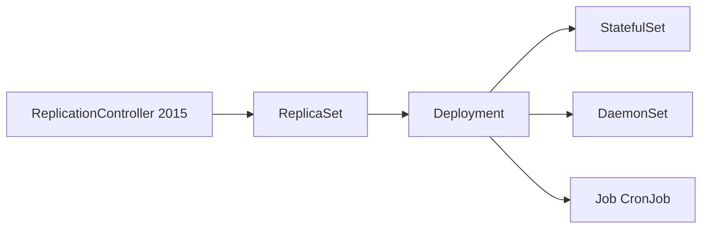
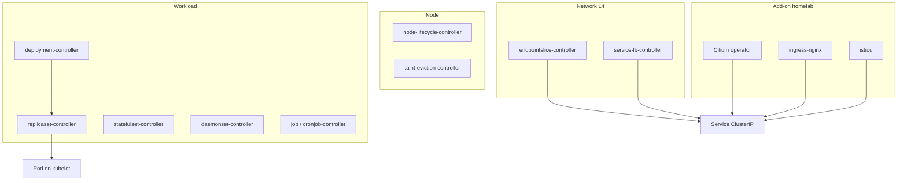

# Kubernetes - Справочник controllers

> **Справочник**, не урок. **§0** - откуда взялась идея controllers. Список **встроенных** controllers из `kube-controller-manager` актуален для **Kubernetes 1.31+** (флаг `--controllers`).

---

## Как читать таблицы

| Колонка | Смысл |
|---------|--------|
| **Controller** | Имя в `--controllers` |
| **За что отвечает** | Desired state → reconcile |
| **Объекты** | Kind'ы, которые watch'ит |

**Общий паттерн:** Read spec → diff с actual → Act (create/update/delete) → repeat.

---

## 0. Откуда взялись controllers

### 0.1. Идея: не «запусти процесс», а «держи состояние»

Controllers в Kubernetes - не случайный набор daemon'ов. Это реализация одной идеи из **систем управления** (control theory):

```text
setpoint (желаемое)  →  controller сравнивает  →  actuator исправляет  →  снова сравнивает
```

В Kubernetes:

| Control theory | Kubernetes |
|----------------|------------|
| Setpoint | `spec` объекта в **etcd** (desired state) |
| Sensor | **watch/list** actual state (Pod'ы, Node status, …) |
| Controller | Процесс в **kube-controller-manager** |
| Actuator | Вызовы **API server** (create Pod, patch Service, …) |

**Откуда в Google:** внутренний оркестратор **Borg** (2000-е) и преемник **Omega** уже держали **desired state** в центральном хранилище и фоновые процессы **сводили** реальность к цели. Kubernetes (2014, open source) перенёс эту модель в etcd + набор **независимых control loops** - по одному на тип задачи.

---

### 0.2. Почему их так много

**Один гигантский «супер-controller»** был бы монолитом: сложно тестировать, один баг ломает всё.

Поэтому в `kube-controller-manager` - **десятки маленьких loops**, каждый отвечает за **свой Kind**:

```text
2014–2015:  ReplicationController → ReplicaSet → Deployment
            Service + Endpoints
            Node controller
2016+:      StatefulSet, DaemonSet, Job, CronJob
            PV/PVC binder, attach-detach
            HPA, PDB, garbage collector
2018+:      EndpointSlice (вместо Endpoints)
2020+:      CSR controllers, TTL, VAP status
2024+:      DRA resourceclaim, service-cidr, …
```

Новый тип ресурса в API → почти всегда **новый controller** (или расширение существующего), который знает **domain logic** этого Kind.

Список в §1–9 - это **накопленная история** Kubernetes: каждая строка = «когда-то добавили фичу → написали loop».

---

### 0.3. Откуда взялся kube-controller-manager как процесс

Изначально (Kubernetes 1.0) control plane = несколько бинарников на master:

| Процесс | Откуда логика |
|---------|---------------|
| **kube-apiserver** | Единая точка входа в etcd (не controller) |
| **kube-controller-manager** | **Все** встроенные loops в **одном** процессе |
| **kube-scheduler** | Отдельно - scheduling **не** reconcile workload count |
| **kubelet** | На node - **исполнитель** Pod'ов, не cluster controller |

**Почему один binary на все loops:** общий клиент к API, shared informers, один способ деплоя на control plane. Включение/выключение - флаг `--controllers=*, -foo`.

**cloud-controller-manager** (отдельный binary с ~1.11) - cloud-специфика (AWS/GCE LB, node metadata) **вынесли** из core, чтобы open-source core не зависел от облака.

---

### 0.4. Эволюция workload controllers (то, что вы видите на воркшопе)



| Этап | Проблема старого | Что добавили |
|------|------------------|--------------|
| **ReplicationController** | Нет rolling update, только replace | Первый «держи N Pod» |
| **ReplicaSet** | RC + selector set-based | Точный selector, основа Deployment |
| **Deployment** | RS без истории версий | Rolling update, rollback, maxSurge |
| **StatefulSet** | Deployment = random names | Stable identity, ordered, PVC |
| **DaemonSet** | «По одному на node» не выразить | Agent на каждой node |
| **Job / CronJob** | Deployment бесконечно рестартит | Run-to-completion |


---

### 0.5. Откуда внешние controllers (Cilium, Ingress, Operators)

Встроенные loops **не знают** ваш PostgreSQL, ваш LB на bare metal или Istio.

**Расширение:**

1. **CRD** (2017+) - новый Kind в API (как встроенный).
2. **Custom controller** - отдельный Pod с watch + reconcile (тот же паттерн).
3. **Operator** - custom controller + эксплуатационная логика (backup, upgrade).

| Add-on | «Откуда» | Заменяет / дополняет |
|--------|----------|----------------------|
| **ingress-nginx** | Community / Kubernetes SIG | L7 north-south (нет в core) |
| **Cilium operator** | Cilium project | `service-lb-controller` + CNI policy на bare metal |
| **Istio istiod** | Google/IBM → CNCF | L7 mesh поверх Service |
| **cert-manager** | Jetstack | TLS automation |
| **Argo CD** | Intuit / CNCF | GitOps reconcile `Application` CR |

На homelab **Cilium assign LB IP** - это **не** magic kube-controller-manager, а **отдельный** controller, написанный под CRD `CiliumLoadBalancerIPPool`.

---

### 0.6. Как это связано со справочником ниже

| Вопрос | Ответ |
|--------|--------|
| Почему 50+ имён в `--controllers`? | Годы фич K8s, каждая - свой loop |
| Почему они в **одном** pod/process? | Исторически `kube-controller-manager` |
| Почему Cilium/Istio **не** в списке? | Отдельные проекты, тот же **паттерн** |
| Откуда reconcile loop? | Borg/Omega → Kubernetes declarative model |

---

## 1. Workload - приложения и Pod'ы

| Controller                           | За что отвечает                                                          | Объекты                     |
| ------------------------------------ | ------------------------------------------------------------------------ | --------------------------- |
| **deployment-controller**            | Rolling update, history ReplicaSet, rollback                             | Deployment → ReplicaSet     |
| **replicaset-controller**            | Держит **N** Pod с matching labels                                       | ReplicaSet → Pod            |
| **replicationcontroller-controller** | Legacy RC (до Deployment)                                                | ReplicationController → Pod |
| **statefulset-controller**           | Ordered Pod'ы, stable identity, PVC                                      | StatefulSet → Pod           |
| **daemonset-controller**             | По одному (или N) Pod на каждую schedulable node                         | DaemonSet → Pod             |
| **job-controller**                   | Завершение Job, backoff, параллелизм                                     | Job → Pod                   |
| **cronjob-controller**               | Расписание → создаёт Job                                                 | CronJob → Job               |
| **pod-garbage-collector-controller** | Удаляет Pod'ы, помеченные owner'ом как disposable                        | Pod                         |
| **ttl-after-finished-controller**    | Auto-delete Job после TTL                                                | Job                         |
| **ttl-controller**                   | Удаление объектов по `metadata.ttlSecondsAfterFinished` / TTL annotation | разные Kind                 |
|                                      |                                                                          |                             |

---

## 2. Node - жизненный цикл узлов

| Controller                           | За что отвечает                                          | Объекты             |
| ------------------------------------ | -------------------------------------------------------- | ------------------- |
| **node-lifecycle-controller**        | Node NotReady → taint, eviction Pod'ов после timeout     | Node, Pod           |
| **node-ipam-controller**             | Раздача pod CIDR блоков node'ам (если включён IPAM в CM) | Node, CIDR          |
| **taint-eviction-controller**        | Eviction Pod'ов при NoExecute taint                      | Pod, Taint          |
| **cloud-node-lifecycle-controller**  | Cloud node shutdown / delete integration                 | Node (cloud)        |
| **node-route-controller**            | Программирует маршруты pod CIDR в cloud underlay         | Node, Route (cloud) |
| **device-taint-eviction-controller** | Eviction при taint устройств DRA *(feature gate)*        | Pod, ResourceClaim  |

---

## 3. Service, Endpoints, сеть (L4)

| Controller | За что отвечает | Объекты |
|------------|-----------------|---------|
| **endpointslice-controller** | Pod IP backends для Service → **EndpointSlice** | Service, Pod → EndpointSlice |
| **endpoints-controller** | Legacy Endpoints (устаревает; mirror в EndpointSlice) | Service → Endpoints |
| **endpointslice-mirroring-controller** | Синхрон Endpoints ↔ EndpointSlice при legacy clients | Endpoints, EndpointSlice |
| **service-lb-controller** | `type: LoadBalancer` → external LB / IP в **status** *(cloud или stub)* | Service |
| **service-cidr-controller** | Управление диапазоном ClusterIP (Service CIDR) | ServiceCIDR |

> **Homelab (Talos + Cilium):** EXTERNAL-IP для LoadBalancer часто assign **Cilium operator**, не `service-lb-controller`.

---

## 4. Storage - PV / PVC / volume

| Controller | За что отвечает | Объекты |
|------------|-----------------|---------|
| **persistentvolume-binder-controller** | Связывает PVC с подходящим PV | PV, PVC |
| **persistentvolume-attach-detach-controller** | Attach/detach volume к node (CSI) | VolumeAttachment |
| **persistentvolume-expander-controller** | Expand PVC если StorageClass allow | PVC, PV |
| **persistentvolume-protection-controller** | Finalizer: PV нельзя удалить, пока bound PVC | PV |
| **persistentvolumeclaim-protection-controller** | Finalizer: PVC in-use Pod'ом | PVC |
| **ephemeral-volume-controller** | Generic ephemeral volumes в Pod spec | Pod, PVC |
| **volumeattributesclass-protection-controller** | Finalizer для VolumeAttributesClass | VAC |

---

## 5. Namespace, quota, garbage collection

| Controller | За что отвечает | Объекты |
|------------|-----------------|---------|
| **namespace-controller** | При delete NS - каскадное удаление содержимого | Namespace |
| **resourcequota-controller** | Статус использования ResourceQuota | ResourceQuota |
| **garbage-collector-controller** | OwnerReferences: удаление дочерних объектов | все Kind с ownerRef |
| **storageversion-garbage-collector-controller** | Очистка старых storage versions API | APIService, CRD |

---

## 6. ServiceAccount, RBAC, security

| Controller | За что отвечает | Объекты |
|------------|-----------------|---------|
| **serviceaccount-controller** | Создаёт default ServiceAccount в новом namespace | Namespace → ServiceAccount |
| **serviceaccount-token-controller** | Legacy: Secret с token для SA *(deprecated flow)* | ServiceAccount, Secret |
| **legacy-serviceaccount-token-cleaner-controller** | Чистит устаревшие long-lived token Secret | Secret |
| **token-cleaner-controller** | Удаляет expired Secret-based token *(disabled by default)* | Secret |
| **clusterrole-aggregation-controller** | Агрегирует rules в ClusterRole по label selector | ClusterRole |
| **root-ca-certificate-publisher-controller** | ConfigMap `kube-root-ca.crt` в namespace | ConfigMap |
| **bootstrap-signer-controller** | Подпись bootstrap token Secret *(disabled by default)* | Secret |
| **validatingadmissionpolicy-status-controller** | Status для ValidatingAdmissionPolicy | VAP |
| **selinux-warning-controller** | Warning events для SELinux *(disabled by default)* | Pod |

---

## 7. Certificates (CSR, trust bundles)

| Controller | За что отвечает | Объекты |
|------------|-----------------|---------|
| **certificatesigningrequest-approving-controller** | Auto/manual approve CSR | CertificateSigningRequest |
| **certificatesigningrequest-signing-controller** | Подпись одобренных CSR | CSR |
| **certificatesigningrequest-cleaner-controller** | Удаление старых CSR | CSR |
| **podcertificaterequest-cleaner-controller** | Очистка PodCertificateRequest *(feature gate)* | PCR |
| **kube-apiserver-serving-clustertrustbundle-publisher-controller** | ClusterTrustBundle для API serving *(feature gate)* | CTB |

---

## 8. Autoscaling, disruption, scheduling helpers

| Controller | За что отвечает | Объекты |
|------------|-----------------|---------|
| **horizontal-pod-autoscaler-controller** | Scale Deployment/RS по metrics (CPU, custom) | HPA → workload |
| **disruption-controller** | PodDisruptionBudget: minAvailable / maxUnavailable при eviction | PDB, Pod |
| **podgroup-protection-controller** | Защита PodGroup (batch/scheduling) | PodGroup |

---

## 9. Dynamic Resource Allocation (DRA), migration

| Controller | За что отвечает | Объекты |
|------------|-----------------|---------|
| **resourceclaim-controller** | Lifecycle ResourceClaim *(feature gate DRA)* | ResourceClaim |
| **resourcepoolstatusrequest-controller** | Status resource pools *(feature gate)* | - |
| **storage-version-migrator-controller** | Миграция stored version объектов в etcd | CRD, types |

---

## 10. cloud-controller-manager (отдельный binary)

На **EKS/GCE/AKS** cloud-логика вынесена из `kube-controller-manager`:

| Controller | За что отвечает |
|------------|-----------------|
| **cloud-node-controller** | Node ↔ cloud VM metadata, addresses |
| **cloud-node-lifecycle-controller** | Shutdown / delete node в cloud |
| **service-lb-controller** | Cloud LB для Service LoadBalancer |
| **route-controller** | Маршруты к pod CIDR в VPC |

**Bare metal (Talos):** cloud-controller-manager **нет** или stub; LB - **Cilium / MetalLB / kube-vip**.

---

## 11. Не controllers в kube-controller-manager, но тот же паттерн

| Компонент | Где | За что |
|-----------|-----|--------|
| **kube-scheduler** | Отдельный процесс | `spec.nodeName` для Pending Pod |
| **kubelet** | На каждой node | Sync Pod spec → containers (CRI), не cluster-level |
| **Admission controllers** | API server | Validate/Mutate на create/update (не reconcile loop) |

---

## 12. Внешние controllers (add-on / Operator)

Не входят в `kube-controller-manager`; отдельный Deployment/DaemonSet + RBAC:

| Controller | CRD / объект | Задача |
|------------|--------------|--------|
| **ingress-nginx-controller** | Ingress | L7 HTTP routing, TLS |
| **Istio istiod** | Gateway, VirtualService | Mesh, L7, mTLS |
| **Cilium operator** | CiliumLoadBalancerIPPool, CNP | LB IPAM, policy, identity |
| **cert-manager** | Certificate, Issuer | Auto TLS |
| **MetalLB controller** | IPAddressPool | LB on bare metal |
| **Argo CD** | Application | GitOps sync |
| **prometheus-operator** | ServiceMonitor | Monitoring stack |
| **external-dns** | - | DNS records для Ingress |
| **CSI controller** | - | Provision volume (сторонний vendor) |

Любой **Operator** = Custom Controller + CRD - см. [15.2.8](15.2.8%20Kubernetes%20-%20CRD%20и%20Operators.md).

---

## 13. Disabled by default

Включать явно через `--controllers=foo`:

| Controller | Зачем включать |
|------------|----------------|
| **bootstrap-signer-controller** | Kubeadm bootstrap tokens |
| **token-cleaner-controller** | Legacy token Secret cleanup |
| **selinux-warning-controller** | SELinux warning events |

---

## 14. Как посмотреть на cluster

```bash
# Процесс control plane (Talos - через kubectl logs static pod)
kubectl get pods -n kube-system | grep controller-manager
kubectl logs -n kube-system -l component=kube-controller-manager --tail=20

# Cloud CM (если есть)
kubectl get pods -n kube-system | grep cloud-controller

# Внешние controllers
kubectl get deploy,ds -A | grep -E 'ingress|cilium|istio|cert-manager|argocd'
kubectl get crd | wc -l
```

| Команда | Назначение |
|---------|------------|
| `grep controller-manager` | Pod kube-controller-manager |
| `grep cloud-controller` | Cloud-specific controllers |
| `get crd` | Сколько extension API → столько потенциальных custom controllers |

Список **включённых** controllers задаётся флагом `--controllers` при старте `kube-controller-manager` (managed K8s - скрыто от пользователя).

---

## 15. Быстрая карта «кто за что» для воркшопа



---

**Источник списка §1–9:** [kube-controller-manager - `--controllers`](https://kubernetes.io/docs/reference/command-line-tools-reference/kube-controller-manager/) (Kubernetes 1.31).
