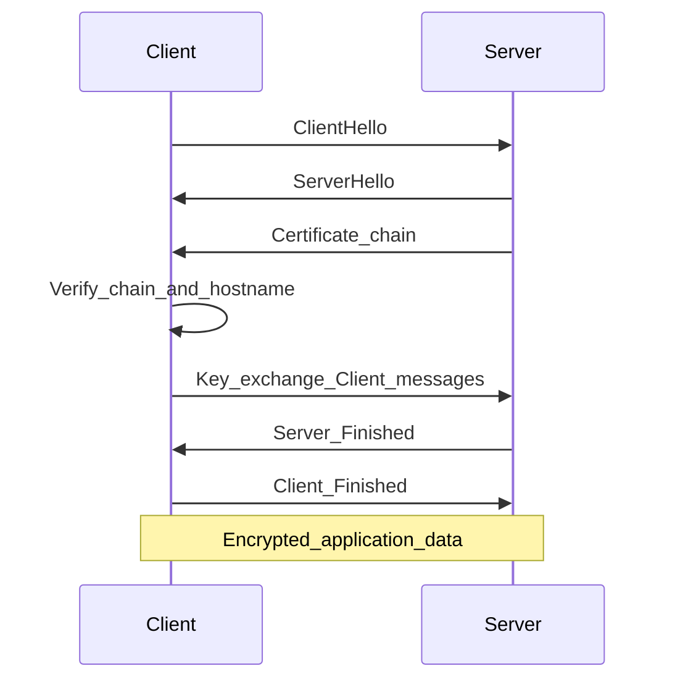

## 1. Что такое SSL и TLS

- **SSL (Secure Sockets Layer)** — старый набор протоколов для защиты передачи данных по сети. Версии SSL 2.0/3.0 считаются устаревшими и небезопасными; в продакшене их отключают.
- **TLS (Transport Layer Security)** — современный стандарт, пришедший на смену SSL. То, что в разговорной речи часто называют «SSL», на практике почти всегда **TLS** (например TLS 1.2 или TLS 1.3).

**Зачем нужны TLS поверх HTTP:**

- **Конфиденциальность** — трафик шифруется; перехватчик не читает содержимое без ключа сессии.
- **Целостность** — защита от подмены данных по пути (MAC/AEAD в современных шифрах).
- **Аутентификация сервера** — клиент проверяет **сертификат** сервера и цепочку до доверенного центра (подробнее в файле 7.2).

TLS работает **поверх TCP**: сначала устанавливается TCP-соединение, затем выполняется handshake TLS, после чего поверх защищённого канала идут данные приложения (например HTTP — тогда говорят **HTTPS**).

---

## 2. Роли сторон

| Роль | Кто это | Задача в TLS |
|------|---------|--------------|
| **Клиент** | браузер, curl, мобильное приложение | выбрать параметры, проверить сертификат сервера, согласовать ключи |
| **Сервер** | web-сервер (nginx, Apache и т.д.) | предъявить сертификат, использовать закрытый ключ, согласовать ключи |

Опционально используется **взаимная аутентификация** (клиентский сертификат) — реже на публичных сайтах, чаще во внутренних API и VPN.

---

## 3. Процесс рукопожатия (TLS handshake) — упрощённо

Ниже — логическая последовательность для понимания администратором. Детали зависят от версии TLS (1.2 и 1.3 отличаются: в 1.3 часть сообщений объединена и зашифрована раньше).

### 3.1. TLS 1.2 (классическая схема)

1. **ClientHello** — клиент сообщает поддерживаемые версии TLS, наборы шифров (cipher suites), случайное число, расширения (SNI — имя хоста для виртуальных HTTPS-сайтов на одном IP).
2. **ServerHello** — сервер выбирает версию протокола и cipher suite, присылает своё случайное число.
3. **Сертификат сервера** — цепочка сертификатов (leaf + при необходимости intermediate). Клиент проверяет подписи и доверие к корневому CA.
4. **ServerHelloDone** (в TLS 1.2) — сервер закончил свою часть приветствия.
5. **Обмен ключами** — клиент генерирует премастер-секрет (или использует ECDHE/DHE для совершенной прямой секретности) и отправляет зашифрованные/подписанные данные в зависимости от выбранного обмена.
6. **Change Cipher Spec** + **Finished** — стороны переключаются на согласованные ключи; сообщения Finished подтверждают целостность handshake.
7. Далее идёт **зашифрованный** трафик приложения (например HTTP).

### 3.2. TLS 1.3 (кратко)

- Меньше round-trip’ов, часть данных зашифрована раньше.
- Устаревшие и небезопасные алгоритмы убраны из стандарта.
- Для админа важно: поддержка TLS 1.3 в openssl/nginx, корректные cipher suites и сертификаты те же по смыслу.

---

## 4. Схема последовательности (mermaid)



---

## 5. Что полезно «увидеть» самому (без лабы)

В браузере на HTTPS-сайте: **замок** → сведения о сертификате, издатель (CA), срок действия, цепочка. Это напрямую связано с тем, что проверяет клиент во время handshake.

Для командной строки и разбора сертификатов используйте материал [7.3 OpenSSL — теория и практика](7.3 OpenSSL — теория и практика.md).
**Leaf‑сертификат** (от англ. _leaf_ — «лист») — это конечный сертификат в цепочке доверия (certificate chain), который выдаётся непосредственно ресурсу: веб‑серверу, домену, приложению или устройству. Его также называют **сервером сертификата** (_server certificate_) или **конечным сертификатом** (_end‑entity certificate_).

## Аналогия с деревом

Цепочку сертификатов часто сравнивают с деревом:

- **корневой сертификат** (root certificate) — корни дерева (самоподписанные, доверенные по умолчанию);
    
- **промежуточные сертификаты** (intermediate certificates) — ветви;
    
- **leaf‑сертификат** — листья на концах ветвей (конечные сертификаты для конкретных ресурсов).
    

## Основные характеристики

Leaf‑сертификат обладает следующими свойствами:

- **не может подписывать другие сертификаты** — в отличие от корневых и промежуточных, у него нет права выдавать новые сертификаты;
    
- **выдаётся центром сертификации (CA)** — либо напрямую корневым CA, либо через промежуточные центры;
    
- **привязывается к конкретному объекту** — домену (`*.google.com`), серверу, организации или человеку;
    
- **содержит публичный ключ** — используется для шифрования и проверки подписей;
    
- **связан с приватным ключом** — хранится на защищаемом сервере и никогда не передаётся наружу.
    

## Что содержится в leaf‑сертификате

Типичные поля:

- **Subject** (`CN`, Common Name) — кому выдан сертификат (например, `*.google.com`);
    
- **Issuer** — кто выдал сертификат (промежуточный или корневой CA);
    
- **Validity period** — срок действия (даты `NotBefore` и `NotAfter`);
    
- **Public key** — открытый ключ сервера;
    
- **Signature algorithm** — алгоритм подписи (например, RSA‑SHA256);
    
- **Extensions** — дополнительные параметры, включая:
    
    - **Subject Alternative Name (SAN)** — список доменов, покрываемых сертификатом;
        
    - **Key Usage** — разрешённые сценарии использования (шифрование, подпись и т. д.).
        

## Роль в SSL/TLS‑соединении

При установке защищённого соединения (HTTPS) leaf‑сертификат выполняет следующие задачи:

1. **Аутентификация сервера** — браузер проверяет, что сервер действительно принадлежит заявленному домену.
    
2. **Шифрование канала** — публичный ключ из сертификата используется для обмена временными ключами и настройки шифрования.
    
3. **Проверка цепочки доверия** — браузер убеждается, что сертификат подписан доверенным CA (через промежуточные сертификаты до корневого).
    
4. **Отображение «замка»** — если проверка пройдена, в адресной строке появляется значок замка и `https://`.


## 1. Что такое центр сертификации (CA)

**CA (Certificate Authority)** — организация (или внутренний сервис), которая **подписывает** открытые ключи и данные субъекта в **сертификате X.509** своим закрытым ключом. Подпись означает: «CA удостоверяет связь между идентичностью (имя, организация) и этим открытым ключом» по правилам своей политики.

Типы проверки (для публичных сайтов чаще всего):

- **DV (Domain Validation)** — подтверждено владение доменом (как у Let's Encrypt).
- **OV / EV** — дополнительные проверки организации (в интерфейсе браузера EV сегодня почти не выделяют).

---

## 2. Глобальная система доверия: как связаны «мировые» CA

Единого всемирного «главного CA» **нет**. Доверие **распределённое**: его задают **программы доверенных корней (root programs)** — правила, по которым вендоры ПО решают, **какие корневые сертификаты** положить в систему или браузер.

### 2.1. Кто хранит корни у пользователя

| Участник                                    | Роль                                                                                                                                                            |
| ------------------------------------------- | --------------------------------------------------------------------------------------------------------------------------------------------------------------- |
| **ОС** (Windows, macOS, Linux-дистрибутивы) | Свой набор корней в системном хранилище                                                                                                                         |
| **Браузеры**                                | Часто используют хранилище ОС; **Mozilla Firefox** на десктопе ведёт **свой** список (NSS), согласованный с [политикой Mozilla CA](https://wiki.mozilla.org/CA) |
| **Мобильные платформы**                     | Apple / Google — свои корневые программы для iOS / Android                                                                                                      |

Списки корней **не идентичны на 100%**, но **сильно пересекаются**: крупные публичные CA (DigiCert, Sectigo, Let's Encrypt, GlobalSign и др.) проходят аудит и попадают сразу в несколько программ.

### 2.2. Иерархия «вниз» от корня

```text
Корневой CA (root)     ← ключ почти не используется онлайн; доверие «зашито» в ОС/браузер
        │
        ▼
Промежуточный CA (intermediate)   ← им подписывают сертификаты сайтов и другие intermediate
        │
        ▼
Конечный сертификат (leaf)        ← ваш домен, ключ сервера
```

Один **корневой** оператор может иметь **несколько промежуточных** (разные политики, регионы, алгоритмы). Другие организации могут выступать **подчинёнными CA**, получив от родителя сертификат `CA:TRUE` — тогда они тоже могут выпускать leaf, оставаясь в рамках цепочки до того же корня.

### 2.3. Связь между CA на практике

- **Доверие** — не «CA дружат друг с другом», а «клиент доверяет **корню**, который попал в его хранилище по правилам root program».
- **Цепочка на сервере** связывает ваш сертификат с тем корнем: каждый уровень **подписан** ключом уровня выше.
- **Кросс-подпись (cross-signing)** — один и тот же intermediate может быть подписан **двумя** корнями, чтобы старые системы без нового корня всё ещё строили валидную цепочку.

---

## 3. Что нужно, чтобы быть центром сертификации

Зависит от того, **публичный** вы CA (браузеры мира должны вам доверять) или **частный** (корпоративный PKI).

### 3.1. Публичный CA (упрощённо, с точки зрения «как устроена система»)

1. **Юридическое лицо и политики** — документы уровня **CP/CPS** (Certificate Policy / Certification Practice Statement): кого и как вы удостоверяете, сроки, отзыв, ответственность.
2. **Аудит** — соответствие стандартам вроде **WebTrust for CA** или **ETSI EN 319 411**; без успешного аудита корень в глобальные программы **не включат**.
3. **Криптоинфраструктура**
   - **корневой ключ** — максимальная защита (HSM, офлайн-процедуры, редкое использование);
   - **промежуточные ключи** — для ежедневной выдачи сертификатов;
   - резервное копирование, разделение ролей, журналы.
4. **Сервисы** — публикация **CRL** и/или **OCSP**, участие в **Certificate Transparency** (логи CT для публично доверенных TLS-сертификатов).
5. **Процедуры идентификации** — для DV/OV/EV: как проверяете домен, организацию; защита от выдачи на чужой домен.
6. **Инциденты** — план отзыва при компрометации ключа; взаимодействие с root programs.

### 3.2. Корпоративный (частный) CA

- Свой **корень** (или sub-CA от внешнего), распространение через **GPO**, **MDM**, ручная установка в доверенные на рабочих станциях.
- Те же принципы **ключей, сроков, отзыва**, но **без** включения в Mozilla/Microsoft root program — доверие только внутри организации.

---

## 4. Как это работает: от запроса до «зелёного» HTTPS

1. **На сервере** администратор создаёт пару ключей и **CSR** (запрос на сертификат) с именем (CN/SAN) и открытым ключом.
2. **CA (или автоматический клиент вроде certbot)** проверяет, что заявитель **контролирует домен** (DV) или организацию (OV/EV) — challenge по DNS/HTTP/email и т.д.
3. **CA подписывает** leaf-сертификат **ключом промежуточного** CA; клиенту отдают цепочку **leaf + intermediate(s)**.
4. **Web-сервер** настраивают с `fullchain` + закрытым ключом.
5. **Браузер** при TLS-handshake получает цепочку, **проверяет подписи** до корня, смотрит **срок**, **имя хоста**, при необходимости **отзыв** (CRL/OCSP) и политики; если корень в своём trust store — соединение считается доверенным.

---

## 5. Цепочка сертификатов

При подключении по HTTPS сервер обычно отдаёт не один сертификат, а **цепочку**:

1. **Leaf (конечный, серверный)** — выдан на ваш домен, содержит открытый ключ сервера.
2. **Intermediate (промежуточный)** — выдан корневым или другим intermediate CA; подписывает leaf.
3. **Root (корневой)** — самоподписанный; хранится в **хранилище доверенных корней** ОС/браузера.

Клиент строит цепочку: **leaf → intermediate → … → root**, проверяя подписи на каждом шаге. Если **корень** есть в доверенном хранилище — цепочка **валидна** (при прочих равных: срок, имя хоста, политики).

Почему не отдают только корень с сервера: корневой ключ **не должен** часто «светиться» в сети; на сервере держат leaf + intermediate, а root клиент уже знает локально.

---

## 6. Доверенные и недоверенные CA

- **Доверенные** — корни, предустановленные в ОС/браузере (Mozilla, Microsoft, Apple и т.д. поддерживают свои списки). Сертификат от публичного CA, чей корень в списке, обычно принимается без предупреждений.
- **Недоверенные** — частный CA, тестовый корень, **самоподписанный** сертификат без добавления в trust store: клиент покажет предупреждение или откажет в соединении.

**Самоподписанный (self-signed) сертификат** — leaf подписан тем же ключом, что в нём указан (нет внешнего CA). Для **учёбы и внутренних** сетей допустим; для публичного сайта нужен сертификат от публичного или корпоративного CA (например [Let's Encrypt](7.4 Let's Encrypt — теория и практика.md)).

---

## 7. Отзыв и проверка статуса: CRL и OCSP

Администратору полезно знать на уровне терминов:

- **CRL (Certificate Revocation List)** — список отозванных сертификатов, публикуемый CA.
- **OCSP (Online Certificate Status Protocol)** — онлайн-запрос «этот сертификат ещё действителен?».

Браузеры и клиенты могут проверять отзыв; на стороне сервера настраивают **OCSP stapling** (nginx и др.), чтобы часть проверок была эффективнее. Детали настройки — в документации web-сервера.


### 1.1. Что такое OpenSSL

**OpenSSL** — библиотека и набор утилит для криптографии и TLS: протоколы, шифры, X.509, PKCS, генерация ключей и CSR, проверка сертификатов и цепочек. Исторически развивался как открытая реализация SSL/TLS после SSLeay; встречаются форки (LibreSSL в части BSD-систем) с похожим CLI, но в курсе ориентируемся на **openssl** из дистрибутива Linux.

### 1.2. Где используется администратором

- Проверка версии TLS и цепочки у удалённого сервера (`s_client`).
- Просмотр и разбор полей сертификата (`x509`).
- Генерация **закрытого ключа** и **CSR** (запрос на подпись у CA).
- Выпуск **самоподписанного** сертификата для тестов или внутренних сервисов.
- Проверка соответствия ключа и сертификата, конвертация форматов (при необходимости).

### 1.3. Установка

Пакет обычно называется `openssl`.

```bash
# Debian / Ubuntu
sudo apt update && sudo apt install -y openssl

# Manjaro / Arch
sudo pacman -S openssl
```

- **`apt update`** — обновить списки пакетов; **`install -y`** — установить без лишних вопросов.
- **`pacman -S`** — установить пакет(ы) из репозиториев Arch/Manjaro.

---

## 2. Практика

Все примеры ниже — для копирования в терминал. Подставляйте свои имена файлов и хосты.

Общий формат утилиты: `openssl <команда> [опции]`, например `openssl x509 ...`. Часть опций общая для разных команд.

### 2.1. Версия OpenSSL

```bash
openssl version
openssl version -a
```

**Параметры:**

| Что | Значение |
|-----|----------|
| *(без подкоманды)* | Для `version` допустимо вызывать сразу после `openssl`. |
| **`version`** | Вывести версию библиотеки (строка вида `OpenSSL 3.x ...`). |
| **`-a`** | «All»: платформа, когда собрано, какие опции компиляции, список каталогов с конфигом/сертификатами по умолчанию (зависит от сборки). |

### 2.2. Подключение к сайту и просмотр сертификатов

Показать цепочку, которую отдаёт сервер (для анализа «как у [7.2](7.2 Центры сертификации и цепочка доверия — теория.md)»):

```bash
# Пример с известным сайтом (google.com); -servername нужен для SNI (виртуальные HTTPS-сайты)
openssl s_client -connect google.com:443 -servername google.com -showcerts </dev/null
```

**Параметры `s_client`:**

| Параметр                 | Значение                                                                                                                                                                       |
| ------------------------ | ------------------------------------------------------------------------------------------------------------------------------------------------------------------------------ |
| **`s_client`**           | Режим TLS/SSL-клиента: рукопожатие с указанным хостом, обмен данными (в интерактиве можно вводить текст после установки сессии).                                               |
| **`-connect хост:порт`** | Куда подключаться по TCP **до** TLS (здесь HTTPS → порт **443**).                                                                                                              |
| **`-servername имя`**    | Расширение **SNI** в ClientHello: какой виртуальный хост на этом IP запрашивает клиент. Должно совпадать с именем в сертификате сайта (часто совпадает с хостом в `-connect`). |
| **`-showcerts`**         | Печатать **всю цепочку** сертификатов в PEM (не только leaf).                                                                                                                  |
| **`</dev/null`**         | Закрыть stdin для `s_client`, чтобы после handshake он **не ждал ввода** с клавиатуры и завершился (иначе сессия «висит» в ожидании).                                          |

Краткий вывод без интерактива:

```bash
echo | openssl s_client -connect google.com:443 -servername google.com 2>/dev/null | openssl x509 -noout -subject -issuer -dates
```

**Дополнительно в конвейере:**

| Элемент | Значение |
|---------|----------|
| **`echo \|`** | Короткая строка на stdin `s_client` — часто достаточно, чтобы клиент завершил работу после получения сертификатов (альтернатива `</dev/null` в начале). |
| **`2>/dev/null`** | Перенаправить **stderr** в «никуда»: убрать служебные сообщения `s_client` (цепочка, verify и т.д.), в pipe пойдёт только то, что нужно следующей команде, или останется чистый вывод. |
| **`\|`** | Вывод первой команды на вход второй. |
| **`openssl x509`** | Разбор **первого** PEM-сертификата в потоке (обычно это leaf). |
| **`-noout`** | Не выводить сам PEM-сертификат, только запрошенные поля. |
| **`-subject`** | Строка субъекта (кому выдан сертификат, DN). |
| **`-issuer`** | Кто подписал (издатель / CA). |
| **`-dates`** | `notBefore` и `notAfter` — границы срока действия. |

Сохранить **только** leaf-сертификат в файл:

```bash
echo | openssl s_client -connect google.com:443 -servername google.com 2>/dev/null \
  | sed -ne '/-BEGIN CERTIFICATE-/,/-END CERTIFICATE-/p' > leaf.pem
```

**Параметры `sed`:**

| Параметр | Значение |
|----------|----------|
| **`-n`** | Не печатать строки по умолчанию; печатать только то, что явно запрошено командой. |
| **`-e '...'`** | Скрипт: здесь диапазон от строки с `BEGIN CERTIFICATE` до `END CERTIFICATE` — **первый** блок PEM в выводе (leaf). Следующие блоки в потоке — промежуточные CA (их этот однострочный `sed` не копирует). |
| **`> leaf.pem`** | Записать результат в файл. |

### 2.3. Разбор сертификата: `x509 -text`

```bash
openssl x509 -in leaf.pem -text -noout
```

**Параметры `x509`:**

| Параметр | Значение |
|----------|----------|
| **`x509`** | Работа с сертификатами в формате **X.509** (PEM или DER — по содержимому файла). |
| **`-in leaf.pem`** | Входной файл с сертификатом. |
| **`-text`** | Человекочитаемый разбор: версия, серийный номер, подпись, субъект, издатель, срок, открытый ключ, расширения (SAN, Key Usage и т.д.). |
| **`-noout`** | Не дублировать тело сертификата в PEM в конец вывода. |

Полезные поля в выводе: `Subject`, `Issuer`, `Validity`, `Subject Alternative Name`, алгоритм открытого ключа, расширения.

### 2.4. Самоподписанный сертификат для учёбы (RSA)

365 дней, CN задаётся через `-subj` (в реальных сценариях чаще используют SAN через конфиг; для курса достаточно простого варианта):

```bash
openssl req -x509 -newkey rsa:2048 -sha256 -days 365 -nodes \
  -keyout selftest.key -out selftest.crt \
  -subj "/CN=localhost"
```

**Параметры `req` (запрос сертификата / в связке с `-x509` — сразу самоподписанный):**

| Параметр | Значение |
|----------|----------|
| **`req`** | Генерация **CSR** (Certificate Signing Request) или, с **`-x509`**, выпуск сертификата без отдельного CA. |
| **`-x509`** | Режим **самоподписанного** сертификата вместо создания только CSR. |
| **`-newkey rsa:2048`** | Создать **новую** пару ключей RSA длиной **2048** бит (разумный минимум для учебы; в проде часто 3072/4096 по политике). |
| **`-sha256`** | Подписать сертификат алгоритмом **SHA-256** (не использовать SHA-1 для новых объектов). |
| **`-days 365`** | Срок действия сертификата в **днях** с момента выпуска. |
| **`-nodes`** | «No DES»: **не шифровать** закрытый ключ паролем (ключ в открытом виде в файле). Удобно в лабе; в проде часто шифруют паролем или хранят в HSM. |
| **`-keyout selftest.key`** | Куда записать **закрытый** ключ. |
| **`-out selftest.crt`** | Куда записать **сертификат** (здесь — самоподписанный). |
| **`-subj "/CN=localhost"`** | **Subject** без интерактивных вопросов: **CN** (Common Name) — имя; для HTTPS лучше также **SAN**, см. документацию `req` и `-addext` в новых OpenSSL. |

Файлы: `selftest.key` (закрытый ключ), `selftest.crt` (сертификат).

### 2.5. Самоподписанный сертификат (EC, P-256)

```bash
openssl req -x509 -newkey ec -pkeyopt ec_paramgen_curve:prime256v1 \
  -sha256 -days 365 -nodes \
  -keyout selftest-ec.key -out selftest-ec.crt \
  -subj "/CN=localhost"
```

**Отличия от RSA-варианта:**

| Параметр                                    | Значение                                                                                        |
| ------------------------------------------- | ----------------------------------------------------------------------------------------------- |
| **`-newkey ec`**                            | Новая пара ключей на эллиптической кривой (**EC**), не RSA.                                     |
| **`-pkeyopt ec_paramgen_curve:prime256v1`** | Имя кривой **P-256** (NIST `prime256v1`) — широко поддерживается клиентами и серверами.         |
| Остальное                                   | Как в п. 2.4: **`-sha256`**, **`-days`**, **`-nodes`**, **`-keyout`**, **`-out`**, **`-subj`**. |

### 2.6. CSR и ключ (опционально)

Сгенерировать ключ и запрос на подпись у CA:

```bash
openssl req -newkey rsa:2048 -nodes -keyout server.key -out server.csr \
  -subj "/CN=www.mysite.example"
```

**Параметры (без `-x509` — только CSR):**

| Параметр | Значение |
|----------|----------|
| **`-newkey rsa:2048`** | Новая пара RSA 2048 бит. |
| **`-nodes`** | Закрытый ключ в `server.key` **без** шифрования паролем. |
| **`-keyout server.key`** | Файл **закрытого ключа** (его хранят в секрете на сервере). |
| **`-out server.csr`** | Файл **запроса** (CSR): открытый ключ + атрибуты субъекта; CSR отправляют в CA или используют в ACME-клиенте. |
| **`-subj "..."`** | DN без интерактива; **CN** или SAN должны совпадать с именем сайта, на который выдают сертификат. |

(В `-subj` укажите **FQDN своего** сервера; не используйте чужие домены вроде `google.com`.)

Просмотр CSR:

```bash
openssl req -in server.csr -text -noout
```

| Параметр | Значение |
|----------|----------|
| **`-in server.csr`** | Файл CSR на вход. |
| **`-text`** | Разобрать и показать поля запроса и встроенный открытый ключ. |
| **`-noout`** | Не выводить PEM-тело CSR в конец. |

Полный цикл «свой корневой CA → сертификат сайта → nginx → доверие в ОС» — в п. **2.8**. В продакшене публичный сайт обычно подписывает **Let's Encrypt** (см. [7.4](7.4 Let's Encrypt — теория и практика.md)).

### 2.7. Проверка соответствия ключа и сертификата

```bash
openssl x509 -noout -modulus -in selftest.crt | openssl md5
openssl rsa  -noout -modulus -in selftest.key | openssl md5
```

**RSA: зачем модуль и MD5**

| Параметр                   | Значение                                                                                                               |
| -------------------------- | ---------------------------------------------------------------------------------------------------------------------- |
| **`x509 -noout -modulus`** | Вывести **модуль RSA** (число *n*, часть открытого ключа) из сертификата в виде текста.                                |
| **`rsa -noout -modulus`**  | То же из **закрытого** ключа: модуль должен совпадать с тем, что в сертификате, если пара одна.                        |
| **`\| openssl md5`**       | Хеш от вывода — короткая строка для **визуального сравнения** (не для криптографической безопасности; удобно в shell). |

Хеши двух строк должны **совпадать**, если `selftest.crt` и `selftest.key` — одна пара.

Для EC модуль в том же смысле не сравнивают; используют **открытый ключ** в DER/PEM:

```bash
openssl x509 -noout -pubkey -in selftest-ec.crt | openssl md5
openssl pkey -pubout -in selftest-ec.key | openssl md5
```

| Параметр | Значение |
|----------|----------|
| **`x509 -pubkey`** | Извлечь **открытый ключ** из сертификата (PEM). |
| **`pkey -pubout`** | Из закрытого ключа вывести соответствующий **открытый** ключ (PEM). |
| **Сравнение хешей** | Совпадение означает, что EC-сертификат и ключ согласованы. |

---

### 2.8. Лабораторная: корневой CA, сайт `web.home`, nginx, доверие в Linux

Сценарий: **домашний** или **лабораторный** хост, имя сайта **`web.home`** (запись в `/etc/hosts`). Делаем **своё корневое УЦ**, выпускаем от него **серверный** сертификат, настраиваем **nginx**, добавляем **корневой сертификат** в доверенные ОС и проверяем, что **curl** и браузеры на базе Chromium/webkit перестают ругаться.

> **Важно:** корневой ключ УЦ (`root.key`) = полный контроль над выданными сертификатами. Храните только на учебной машине, не копируйте на общие диски. Для **Firefox** на Linux системное хранилище CA часто **не подхватывается** — корень нужно импортировать отдельно в настройках Firefox (см. ниже).

#### Структура каталогов

```bash
mkdir -p ~/tls-lab/{ca,nginx-certs}
cd ~/tls-lab
```

Дальше команды выполняйте из `~/tls-lab`, файлы сервера положим в `nginx-certs/`.

#### Шаг 1. Корневой CA: ключ и самоподписанный сертификат

Корень должен иметь расширения **CA** (`basicConstraints = CA:TRUE`, `keyCertSign`, `cRLSign`), иначе им нельзя легально подписывать другие сертификаты.

```bash
cd ~/tls-lab/ca

cat > root-ca.cnf <<'EOF'
[req]
distinguished_name = req_dn
x509_extensions = v3_ca
prompt = no

[req_dn]
O = Home Lab
CN = Home Lab Root CA

[v3_ca]
subjectKeyIdentifier = hash
authorityKeyIdentifier = keyid:always,issuer
basicConstraints = critical,CA:TRUE
keyUsage = critical, digitalSignature, keyCertSign, cRLSign
EOF

openssl genrsa -out root.key 4096
openssl req -x509 -new -nodes -key root.key -sha256 -days 3650 \
  -config root-ca.cnf -out root.crt
```

| Файл / параметр | Назначение |
|-----------------|------------|
| **`root-ca.cnf`** | Секция **`[v3_ca]`** задаёт расширения **именно для** самоподписанного корня (`req -x509` + `x509_extensions = v3_ca`). |
| **`genrsa 4096`** | Длинный ключ для корня (рекомендуемо для CA). |
| **`-days 3650`** | Длинный срок корня (для учёбы; в проде — по политике). |
| **`root.key`** | Закрытый ключ УЦ — **секрет**. |
| **`root.crt`** | Публичный корневой сертификат — его позже **доверяют** в ОС и в браузере (только этот файл можно свободно копировать на клиенты). |

Проверка:

```bash
openssl x509 -in root.crt -text -noout | grep -A1 "Basic Constraints"
# Ожидается: CA:TRUE
```

#### Шаг 2. Ключ и CSR для `web.home` (с SAN)

Современные клиенты требуют **Subject Alternative Name** (SAN) с DNS-именем; одного `CN` недостаточно.

```bash
cd ~/tls-lab/nginx-certs

cat > web-home-req.cnf <<'EOF'
[req]
distinguished_name = req_dn
prompt = no

[req_dn]
CN = web.home
EOF

openssl genrsa -out web.home.key 2048
openssl req -new -key web.home.key -out web.home.csr -config web-home-req.cnf
```

#### Шаг 3. Подпись CSR корневым CA (сертификат сайта)

Расширения для **конечного** сертификата задаём в отдельном файле при выдаче:

```bash
cat > web-home-cert.cnf <<'EOF'
[v3_leaf]
basicConstraints = CA:FALSE
subjectKeyIdentifier = hash
authorityKeyIdentifier = keyid,issuer
subjectAltName = DNS:web.home
keyUsage = critical, digitalSignature, keyEncipherment
extendedKeyUsage = serverAuth
EOF

openssl x509 -req -in web.home.csr \
  -CA ../ca/root.crt -CAkey ../ca/root.key -CAcreateserial \
  -out web.home.crt -days 825 -sha256 \
  -extfile web-home-cert.cnf -extensions v3_leaf
```

| Параметр | Значение |
|----------|----------|
| **`x509 -req`** | Выпустить сертификат из **CSR**. |
| **`-CA` / `-CAkey`** | Сертификат и ключ **подписанта** (корневой CA). |
| **`-CAcreateserial`** | Создать/обновить файл с **серийным номером** следующего сертификата (появится `../ca/root.srl`). |
| **`-extfile` / `-extensions`** | Подключить SAN, EKU **serverAuth**, запрет `CA:FALSE`. |

Проверка SAN:

```bash
openssl x509 -in web.home.crt -text -noout | grep -A1 "Subject Alternative Name"
```

#### Шаг 4. DNS-имя и nginx

**Запись в `/etc/hosts`** (на машине, где браузер и curl):

```bash
grep -q 'web.home' /etc/hosts || echo '127.0.0.1 web.home' | sudo tee -a /etc/hosts
```

**Права на ключ** — только root / пользователь nginx:

```bash
sudo mkdir -p /etc/nginx/ssl/web.home
sudo cp ~/tls-lab/nginx-certs/web.home.crt ~/tls-lab/nginx-certs/web.home.key /etc/nginx/ssl/web.home/
sudo chmod 640 /etc/nginx/ssl/web.home/web.home.key
sudo chown root:root /etc/nginx/ssl/web.home/web.home.crt
# Ключ читает рабочий процесс nginx (см. `user` в /etc/nginx/nginx.conf): чаще группа www-data (Debian/Ubuntu) или http/nginx (Arch/Manjaro).
sudo chown root:www-data /etc/nginx/ssl/web.home/web.home.key
# Нет группы www-data — подставьте свою, например: sudo chown root:http ...
```

Фрагмент конфигурации **nginx** (путь к сайту подставьте свой; см. также раздел **6** курса):

```nginx
# /etc/nginx/sites-available/web.home.conf — или include из основного конфига

server {
    listen 80;
    server_name web.home;
    return 301 https://$host$request_uri;
}

server {
    listen 443 ssl;
    server_name web.home;

    ssl_certificate     /etc/nginx/ssl/web.home/web.home.crt;
    ssl_certificate_key /etc/nginx/ssl/web.home/web.home.key;

    root /var/www/web.home;
    index index.html;

    location / {
        try_files $uri $uri/ =404;
    }
}
```

```bash
sudo mkdir -p /var/www/web.home
echo '<h1>HTTPS web.home</h1>' | sudo tee /var/www/web.home/index.html
sudo nginx -t && sudo systemctl reload nginx
```

| Директива | Назначение |
|-----------|------------|
| **`ssl_certificate`** | Конечный (leaf) сертификат; при наличии промежуточных УЦ сюда кладут **fullchain** (leaf + цепочка). У нас один уровень — достаточно `web.home.crt`. |
| **`ssl_certificate_key`** | Закрытый ключ сайта. |

#### Шаг 5. Добавить корень УЦ в доверенные **Linux** (системное хранилище)

Нужен только **`root.crt`**, не `root.key`.

**Debian / Ubuntu:**

```bash
sudo cp ~/tls-lab/ca/root.crt /usr/local/share/ca-certificates/home-lab-root.crt
sudo update-ca-certificates
# в выводе должна появиться строка про добавление home-lab-root.pem
```

**Fedora / RHEL / CentOS:**

```bash
sudo cp ~/tls-lab/ca/root.crt /etc/pki/ca-trust/source/anchors/home-lab-root.crt
sudo update-ca-trust extract
```

**Arch / Manjaro** (пакет `libnss` / `p11-kit`):

```bash
sudo trust anchor --store ~/tls-lab/ca/root.crt
sudo update-ca-trust
```

После этого **curl** и **git**, использующие системные корни, начнут доверять цепочке до вашего корня.

#### Шаг 6. Браузер

- **Chromium / Chrome / Electron / VS Code** (типично для Linux): часто читают системное хранилище — после шага 5 перезапустите браузер и откройте `https://web.home/`.
- **Firefox**: **Параметры → Приватность и защита → Сертификаты → Просмотр сертификатов → Центры сертификации → Импорт** → выберите **`root.crt`**, отметьте доверие для **проверки сайтов**.

#### Шаг 7. Проверка «до» и «после**

**До** добавления корня в trust store:

```bash
curl -sS -o /dev/null -w '%{http_code}\n' https://web.home/    # часто ошибка TLS
curl -vk https://web.home/   # -k отключает проверку — убедиться, что nginx отвечает
```

**После** `update-ca-certificates` / `update-ca-trust` / `trust anchor`:

```bash
curl -v https://web.home/
# должно быть без -k, в выводе verify result: ok или аналог
```

Проверка цепочки явно (путь к корню):

```bash
echo | openssl s_client -connect web.home:443 -servername web.home \
  -CAfile ~/tls-lab/ca/root.crt 2>/dev/null | openssl x509 -noout -subject -issuer
# Issuer должен совпадать с субъектом корня: O = Home Lab, CN = Home Lab Root CA
```

---

## 3. Краткие итоги

| Задача | Команды / файлы |
|--------|------------------|
| Версия | `openssl version` |
| Цепочка с сервера | `openssl s_client ... -showcerts` |
| Текст сертификата | `openssl x509 -in file.pem -text -noout` |
| Self-signed | `openssl req -x509 ...` |
| Запрос к CA | `openssl req -newkey ... -out file.csr` |
| Свой CA + сайт + nginx | п. **2.8** (`root.crt`, `web.home.crt`, `/etc/nginx/ssl/`, доверие в ОС) |
